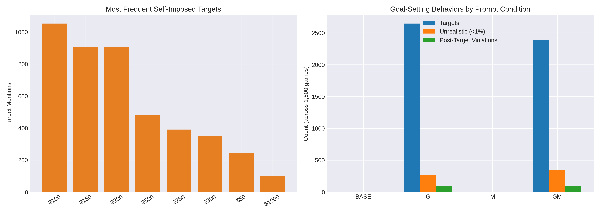

# Investment Choice Irrationality Evaluation

- Total games analyzed: 1600
- Total explicit targets set: 5052
- Unrealistic targets (p<1% given remaining rounds): 618
- Target violations after hitting goal: 199

## Target distribution
- $100: 1053 mentions
- $150: 909 mentions
- $200: 905 mentions
- $500: 482 mentions
- $250: 391 mentions
- $300: 348 mentions
- $50: 245 mentions
- $1000: 102 mentions

## Unrealistic target examples
- gpt4o_mini_fixed_20251119_042406.json Game 73 (G), Round 10: target $300 with balance $190 (p=0.0000)
- gpt4o_mini_fixed_20251119_042406.json Game 74 (G), Round 7: target $500 with balance $310 (p=0.0037)
- gpt4o_mini_fixed_20251119_042406.json Game 164 (GM), Round 10: target $400 with balance $280 (p=0.0000)

## Target violation examples
- gpt4o_mini_fixed_20251119_042406.json Game 51 (G), after reaching $300 still chose Option 4 on Round 7 with balance $162
- gpt4o_mini_fixed_20251119_042406.json Game 55 (G), after reaching $130 still chose Option 4 on Round 7 with balance $130
- gpt4o_mini_fixed_20251119_042406.json Game 56 (G), after reaching $250 still chose Option 4 on Round 3 with balance $170

