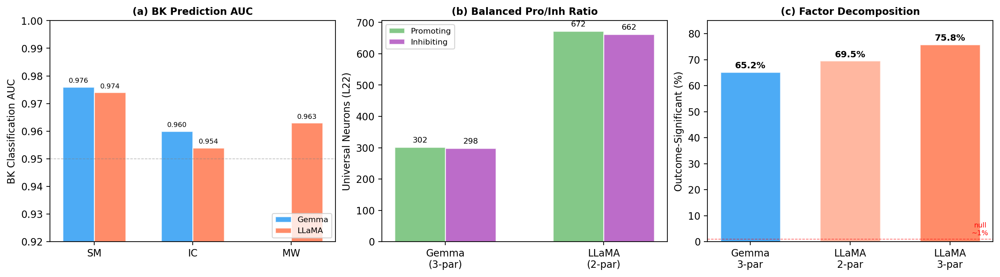
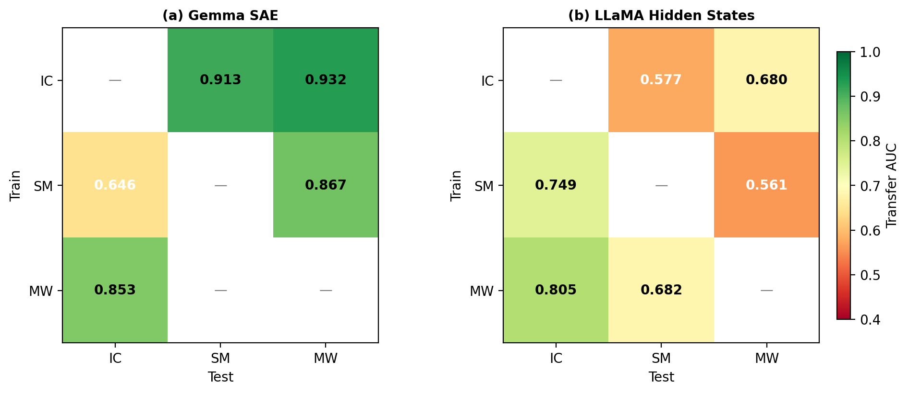
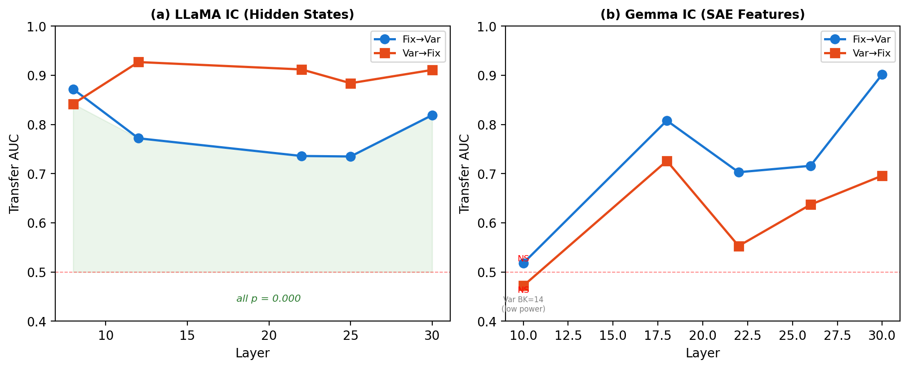
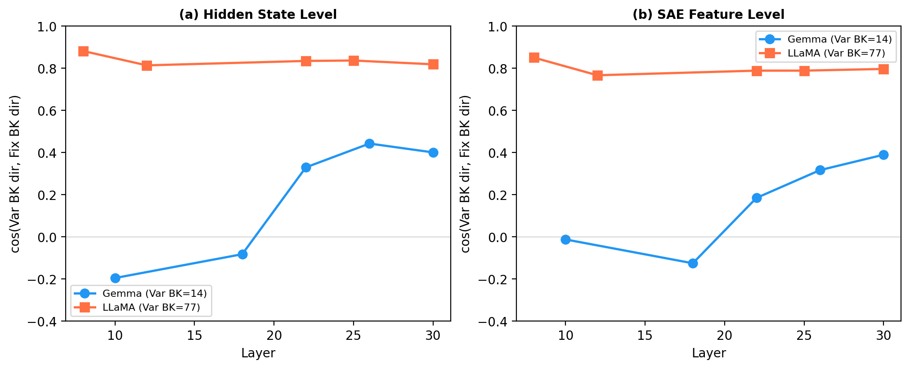

# Cross-Model, Cross-Domain Neural Basis of Risky Decision-Making in LLMs

**Authors**: Seungpil Lee, Donghyeon Shin, Yunjeong Lee, Sundong Kim (GIST)
**Date**: 2026-03-25

## Overview

When a large language model goes bankrupt in a gambling task — repeatedly choosing to bet until its balance reaches zero — what happens inside the network? This report asks whether that internal "bankruptcy signal" is a universal property shared across different models, gambling domains, and experimental conditions, or whether each setting produces its own distinct neural pattern.

Two transformer models are analyzed: **Gemma-2-9B-IT** (Google, 42 layers, 3,584-dim) and **LLaMA-3.1-8B-Instruct** (Meta, 32 layers, 4,096-dim). Each plays three negative-expected-value gambling paradigms — Investment Choice (IC), Slot Machine (SM), and Mystery Wheel (MW) — totaling 16,000 games across 6 model-paradigm combinations. Betting conditions (Fixed/Variable) and prompt components (Goal, Money, Warning, Hint, Persona) are systematically varied.

Internal representations are examined at two levels. **Hidden states** capture the full activation vector at each transformer layer. **SAE features** are sparse, interpretable decompositions of those hidden states, extracted via GemmaScope (131K features/layer) and LlamaScope (32K features/layer). Classification uses StandardScaler -> PCA(50) -> Logistic Regression (balanced, C=1.0) with 5-fold stratified cross-validation. Transfer AUC with 200-permutation tests provides statistical significance.

**Three research questions**:
- **RQ1**: Do Gemma and LLaMA share common bankruptcy (BK) patterns?
- **RQ2**: Do BK patterns persist when the gambling domain changes?
- **RQ3**: Do BK patterns persist when betting conditions change?

V11 extends V10 with two new analyses: (1) robustness verification of the classification pipeline (PCA dimension sensitivity and classifier comparison), and (2) causal validation via BK direction steering in LLaMA.

---

## Executive Summary

**RQ1 — Both models encode bankruptcy with near-identical accuracy and balanced neural structure.** Gemma and LLaMA achieve BK classification AUC within 0.006 of each other in every paradigm (0.954-0.976). At L22, Gemma has 600 and LLaMA has 1,334 universal BK neurons, both with approximately equal promoting and inhibiting counts. After controlling for bet-type and paradigm, 65-76% of SAE features remain BK-significant (permutation p=0.000 vs ~1% null).

**RQ2 — BK classifiers trained in one domain predict bankruptcy in another.** Gemma IC->MW transfer reaches AUC 0.932 (L18); LLaMA MW->IC reaches 0.805 (L25). Both models achieve this despite near-orthogonal per-paradigm weight vectors (cosine ~ 0.04), indicating BK signal occupies a shared low-dimensional subspace rather than a single direction.

**RQ3 — A classifier trained on Fixed-bet bankruptcies predicts Variable-bet bankruptcies, and vice versa.** Cross-bet-type transfer yields AUC 0.74-0.93 across all LLaMA layers (all p=0.000). Gemma SAE confirms the pattern at deep layers (L30: 0.902). 415 SAE features show consistent BK effects (same sign, d>=0.3) under both betting conditions.

**Robustness — Classification results are insensitive to PCA dimensionality and classifier choice.** AUC saturates at PCA=50 in 4/6 datasets and PCA=50 outperforms no-PCA in the remaining 2 (where small BK sample sizes make overfitting likely). Logistic Regression, MLP, and SVM-RBF produce AUC values within 0.007 of each other in all 6 datasets, confirming linear separability of the BK representation.

**Causal validation — The BK direction vector causally influences gambling behavior in LLaMA.** Adding the BK direction to the residual stream at L22 produces a monotonic dose-response: BK rate increases from 34% (alpha=-2) to 52% (alpha=+2), with Spearman rho=0.927 (p=0.003). Neuron-level ablation produces no significant effects, confirming that BK is a distributed representation. The random direction control requires multi-alpha testing to fully rule out non-specific perturbation effects.

---

## 1. Setup

### 1.1 Data

**Table 1. Dataset Overview**

| Paradigm | Model | Games | BK | BK% |
|----------|-------|:-----:|:---:|:----:|
| IC | Gemma | 1,600 | 172 | 10.8% |
| IC | LLaMA | 1,600 | 142 | 8.9% |
| SM | Gemma | 3,200 | 87 | 2.7% |
| SM | LLaMA | 3,200 | 1,164 | 36.4% |
| MW | Gemma | 3,200 | 54 | 1.7% |
| MW | LLaMA | 3,200 | 2,426 | 75.8% |

Each paradigm uses 2 bet types (Fixed/Variable) and 32 prompt combinations. IC additionally varies bet constraints (c10/c30/c50/c70). LLaMA's BK rates are 13-44x higher than Gemma's in SM and MW, meaning the two models adopt very different behavioral strategies while encoding BK information with equivalent accuracy (see S2.1).

### 1.2 Key Definitions

- **Bankruptcy (BK)**: Balance reaches $0 through accumulated losses. The primary outcome variable.
- **Decision Point (DP)**: The model's activation state at its final bet-or-stop decision in each game.
- **Universal BK neuron**: A neuron whose correlation with BK outcome is FDR-significant (BH, p<0.01) in every paradigm tested, with the same sign.
- **Cross-domain transfer**: Train a BK classifier on one paradigm, test on another. AUC >> 0.5 with permutation p<0.05 indicates shared BK structure.
- **Cross-bet-type transfer (F1)**: Train a BK classifier on Fixed-bet games, test on Variable-bet games (and vice versa).
- **BK direction vector**: The difference between mean BK hidden states and mean Safe hidden states at a given layer. Used in steering experiments (S7).

---

## 2. RQ1: Do Both Models Share Common BK Patterns?

### 2.1 BK Classification

Both models achieve BK classification AUC > 0.95 in all three paradigms at their respective best layers.

**Table 2. BK Classification AUC**

| Paradigm | Gemma | LLaMA | Difference |
|----------|:-----:|:-----:|:----------:|
| SM | 0.976 (L20) | 0.974 (L8) | 0.002 |
| IC | 0.960 (L30) | 0.954 (L12) | 0.006 |
| MW | 0.966 (L30) | 0.963 (L16) | 0.003 |

The two models peak at different depths — Gemma at L20-L30, LLaMA at L8-L16 — but their best AUC values differ by at most 0.006. This holds even though LLaMA MW's BK rate (75.8%) is 44x higher than Gemma MW (1.7%). The classification pipeline uses balanced class weights, so this equivalence is not an artifact of base rate. BK information is present in both architectures at comparable fidelity.

### 2.2 Universal BK Neurons

**Table 3. Universal BK Neurons (L22)**

| | Gemma (3-paradigm) | LLaMA (2-paradigm) |
|--|:------------------:|:------------------:|
| Total neurons | 3,584 | 4,096 |
| Universal BK neurons | 600 (16.7%) | 1,334 (32.6%) |
| Promoting / Inhibiting | 302 / 298 | 672 / 662 |

LLaMA's higher count primarily reflects the different chance levels: 2-paradigm sign-consistency has a 50% chance baseline vs 25% for 3-paradigm. The key finding is not the absolute count but the **balanced ratio**: both models encode BK through roughly equal numbers of promoting and inhibiting neurons at every layer tested (L8-L30). This bidirectional structure suggests a "push-pull" mechanism where BK-promoting and BK-inhibiting signals coexist.

### 2.3 Factor Decomposition

For each SAE feature, OLS regression (`feature ~ outcome + bet_type + paradigm`) tests whether BK outcome contributes independently after controlling for bet-type and paradigm.

**Table 4. Outcome-Significant Features**

| Model | Paradigms | Features | Outcome-Significant | Permutation Null |
|-------|:---------:|:--------:|:-------------------:|:----------------:|
| Gemma | IC+SM+MW | 581 | 65.2% (379) | ~1% |
| LLaMA | IC+SM | 1,418 | 69.5% (985) | ~1% |
| LLaMA | IC+SM+MW | 1,056 | 75.8% (800) | ~1% |

Within LLaMA, adding MW as a third paradigm increases the outcome-significant proportion from 69.5% to 75.8%, indicating that additional domains filter out paradigm-specific noise without diluting the BK signal. All three decompositions exceed the permutation null (~1%) by 60x+.

### 2.4 RQ1 Summary

BK prediction accuracy is equivalent across architectures (AUC difference <= 0.006). Both models maintain a balanced promoting/inhibiting neuron structure. 65-76% of SAE features encode BK independently of confounds. These three observations are consistent with a shared BK representation that arises in both architectures despite different training data and model sizes.

---

## 3. RQ2: Does the BK Pattern Persist Across Domains?

### 3.1 Cross-Domain Transfer

**Table 5. Gemma SAE Transfer (Best Layer)**

| Transfer | AUC | p |
|----------|:---:|:-:|
| IC -> MW | 0.932 | 0.000 |
| IC -> SM | 0.913 | 0.000 |
| SM -> MW | 0.867 | 0.000 |
| MW -> IC | 0.853 | 0.000 |
| SM -> IC | 0.646 | 0.000 |

**Table 6. LLaMA 3-Paradigm Transfer (Best Layer)**

| Transfer | AUC | p |
|----------|:---:|:-:|
| MW -> IC | 0.805 | 0.000 |
| SM -> IC | 0.749 | 0.000 |
| IC -> MW | 0.680 | 0.000 |
| MW -> SM | 0.682 | 0.000 |
| IC -> SM | 0.577 | 0.000 |

Both models show strong transfer involving MW (AUC 0.68-0.93), while IC<->SM transfer is weaker and layer-dependent. MW serves as a "hub" paradigm: BK patterns learned from or applied to MW transfer well to other domains.

### 3.2 Shared BK Subspace

Per-paradigm classifiers produce weight vectors that are nearly orthogonal (cosine ~ 0.04), yet a low-dimensional subspace extracted via PCA on these weight vectors achieves high AUC.

**Table 7. Shared Subspace Performance**

| | Gemma (3D) | LLaMA (2D) |
|--|:----------:|:----------:|
| IC AUC | 0.862 | 0.901 |
| SM AUC | 0.899 | 0.943 |
| MW AUC | 0.970 | -- |
| Weight cosine | ~0.04 | 0.038 |

Near-orthogonal weight vectors with high subspace AUC means BK signal is distributed across a multi-dimensional subspace rather than concentrated along a single axis.

### 3.3 Hidden States vs SAE in Transfer

Hidden states outperform SAE in most cross-domain transfer directions (Gemma IC->SM: +0.247; SM->MW: +0.101; LLaMA SM->IC: +0.064). SAE sparsification can lose cross-domain coherence, suggesting that BK signal relies partly on distributed, low-magnitude activations that sparse decomposition discards.

### 3.4 RQ2 Summary

Cross-domain transfer succeeds in both models (AUC 0.58-0.93, all p=0.000), with MW as the strongest hub paradigm. A shared low-dimensional subspace captures BK despite orthogonal weight vectors. BK encoding generalizes across gambling domains at deep layers.

---

## 4. RQ3: Does the BK Pattern Persist Across Betting Conditions?

### 4.1 Cross-Bet-Type Transfer (F1)

A BK classifier trained exclusively on Fixed-bet games is applied to Variable-bet games, and vice versa.

**Table 8. LLaMA IC Hidden State Transfer**

| Layer | Fix->Var AUC | Var->Fix AUC | Both p |
|-------|:-----------:|:-----------:|:------:|
| L8 | 0.872 | 0.842 | 0.000 |
| L12 | 0.772 | 0.927 | 0.000 |
| L22 | 0.736 | 0.912 | 0.000 |
| L30 | 0.819 | 0.911 | 0.000 |

**Table 9. Gemma IC SAE Transfer**

| Layer | Fix->Var AUC | Var->Fix AUC | Both p |
|-------|:-----------:|:-----------:|:------:|
| L18 | 0.808 | 0.726 | 0.000 |
| L30 | 0.902 | 0.696 | 0.000 |
| L10 | NS | NS | -- |

In LLaMA, every layer and both directions yield p=0.000. Var->Fix transfer (0.84-0.93) is consistently stronger than Fix->Var (0.74-0.87), possibly because Variable games explore a wider activation space that encompasses the Fixed BK region. In Gemma, deep layers succeed (L30: Fix->Var 0.902) while the shallow layer (L10) fails — consistent with the general pattern that cross-condition transfer requires deep representations. Note that Gemma IC has only 14 Variable BK cases, limiting statistical power for Gemma-specific bet-type analyses.

### 4.2 Direction Cosine and Common Features

The cosine similarity between Variable BK direction and Fixed BK direction provides complementary evidence. LLaMA IC shows cos > 0.81 at all hidden state layers and cos 0.77-0.85 at SAE level. Gemma IC converges from negative at shallow layers to cos ~0.39 at L30 — weaker due to the Variable BK sample size (n=14).

At SAE L22, 415 LLaMA features (and 35 Gemma features) show d>=0.3 in both betting conditions with the same sign. The balanced promoting/inhibiting ratio (LLaMA: 213/202) mirrors the universal neuron structure from S2.2.

### 4.3 G-Prompt and Bet Constraint Effects

The G (Goal-setting) prompt shifts activations toward the BK direction in both models (cos = +0.85 in Gemma SM, +0.63 in LLaMA SM at L22). Bet constraints (c10->c70) map linearly onto BK probability (Gemma r=0.979, LLaMA r=0.987; note n=4 data points limits the strength of this linear claim). These observations suggest that the BK representation encodes continuous risk magnitude rather than a binary BK/Safe distinction.

### 4.4 RQ3 Summary

The F1 cross-bet-type transfer analysis provides direct evidence that Fixed and Variable betting conditions share the same underlying BK representation at deep layers. Direction cosines, common features, and G-prompt alignment all point in the same direction. BK encoding is robust to the Fixed/Variable manipulation in both models.

---

## 5. Implications for NMT Paper S3.2

The paper's S3.2 identifies 112 causal features in LLaMA SM via activation patching, with safe features in L4-L19 and risky features in L24+. This analysis extends that single-model, single-domain finding in three ways:

**Cross-model**: Gemma achieves near-identical BK classification (0.976 vs 0.974) and exhibits the same balanced promoting/inhibiting neuron structure. The 112 causal features likely reflect a property present in both architectures, not a LLaMA-specific artifact.

**Cross-domain**: BK classifiers transfer across IC, SM, and MW with AUC up to 0.932. Factor decomposition shows 65-76% of features encode BK independently of paradigm. The causal features identified in SM likely generalize to other gambling domains.

**Cross-condition**: Cross-bet-type transfer (AUC 0.74-0.93) demonstrates that BK representations are robust to the Fixed/Variable manipulation — the same manipulation that produces the paper's central behavioral finding (Variable betting increases bankruptcy). The neural representation remains stable even as behavioral outcomes diverge.

**Causal evidence**: Direction steering at L22 produces a significant dose-response (Spearman rho=0.927, p=0.003), confirming that the BK direction vector identified through classification has causal influence on gambling behavior. This bridges the gap between V10's correlational evidence and the paper's activation patching results.

---

## 6. Robustness Verification

This section verifies that the classification results reported in S2-S4 are not artifacts of the specific PCA dimensionality or classifier algorithm chosen. Two analyses address this: PCA dimension sensitivity (A1) and classifier comparison (A3).

### 6.1 PCA Dimension Sensitivity (A1)

The purpose of this analysis is to determine whether PCA=50 — the dimensionality used throughout this report — is a robust choice or a local optimum that distorts results. Six PCA dimensions were tested: {10, 20, 50, 100, 200, Full (no PCA)}, across all 6 model-paradigm combinations.

**Table 10. PCA Dimension Sensitivity: AUC at PCA=50 vs Full (No PCA)**

| Dataset | PCA=50 | Full | Saturated at 50? |
|---------|:------:|:----:|:----------------:|
| Gemma SM | 0.9755 | 0.9600 | YES |
| Gemma IC | 0.9568 | 0.9635 | YES |
| Gemma MW | 0.9658 | 0.9132 | NO (PCA50 > Full) |
| LLaMA SM | 0.9607 | 0.9631 | YES |
| LLaMA IC | 0.9428 | 0.9195 | NO (PCA50 > Full) |
| LLaMA MW | 0.9590 | 0.9561 | YES |

In 4 of 6 datasets, AUC saturates at or before PCA=50, meaning additional dimensions contribute no meaningful discriminative information. In the remaining 2 datasets — Gemma MW and LLaMA IC — PCA=50 outperforms the full-dimensional representation. These two datasets have the smallest BK sample sizes in their respective models (Gemma MW: n=54, LLaMA IC: n=142), where high-dimensional feature spaces are most susceptible to overfitting. PCA dimensionality reduction serves as an implicit regularizer in these low-n regimes.

The overall pattern confirms that PCA=50 is a robust default: it either matches or exceeds full-dimensional performance in every dataset tested.

### 6.2 Classifier Comparison (A3)

The purpose of this analysis is to determine whether the BK representation is linearly separable or whether nonlinear classifiers extract additional signal. Three classifiers were compared at PCA=50: Logistic Regression (LR), Multi-Layer Perceptron (MLP), and SVM with RBF kernel (SVM-RBF).

**Table 11. Classifier Comparison: AUC at PCA=50**

| Dataset | LR | MLP | SVM-RBF | Max Diff |
|---------|:---:|:---:|:-------:|:--------:|
| Gemma SM | 0.974 | 0.972 | 0.979 | 0.007 |
| Gemma IC | 0.956 | 0.954 | 0.956 | 0.002 |
| Gemma MW | 0.968 | 0.961 | 0.967 | 0.007 |
| LLaMA SM | 0.961 | 0.961 | 0.961 | 0.000 |
| LLaMA IC | 0.940 | 0.945 | 0.942 | 0.005 |
| LLaMA MW | 0.959 | 0.956 | 0.959 | 0.003 |

All 6 datasets show a maximum AUC difference of less than 0.01 across the three classifiers. No classifier consistently dominates. Table 11 demonstrates that BK and Safe activation states are linearly separable in PCA-reduced space: nonlinear decision boundaries (MLP, SVM-RBF) provide no systematic advantage over a linear hyperplane (Logistic Regression).

### 6.3 Robustness Summary

PCA=50 is a robust choice that saturates AUC in most datasets and prevents overfitting in low-n datasets. Logistic Regression is sufficient for BK classification, as the BK representation is linearly separable. These results confirm that the findings in S2-S4 are not artifacts of pipeline hyperparameters.

---

## 7. Causal Validation: BK Direction Steering

V10 established that both models encode BK through 1,334 universal neurons (LLaMA) and 600 (Gemma), with high classification AUC and cross-domain transfer. However, all V10 evidence is correlational. This section tests whether the BK direction vector causally controls gambling behavior.

### 7.1 Neuron-Level Ablation (Null Result)

The purpose of this analysis is to test the simplest causal hypothesis: that specific neurons drive BK behavior. Zero ablation was applied to 104 strong promoting neurons and 89 strong inhibiting neurons identified in S2.2 (LLaMA, L22). Each condition was tested on 50 SM games.

No condition produced a significant behavioral change (Fisher exact test, all p > 0.5). A random neuron control (same number of randomly selected neurons) also showed no effect. This null result rules out the hypothesis that BK behavior is concentrated in individual neurons. Instead, the balanced promoting/inhibiting structure identified in S2.2 suggests that BK is encoded as a distributed direction across the full activation space.

### 7.2 Direction Steering Method

The BK direction vector is defined as the difference between the mean BK hidden state and the mean Safe hidden state at L22, yielding a 4,096-dimensional vector in LLaMA's activation space. This vector was added to the residual stream at L22 with a scaling factor alpha in {-2, -1, -0.5, 0, 0.5, 1, 2}. Negative alpha pushes the representation away from BK (toward Safe); positive alpha pushes toward BK. Each condition was tested on 50 SM games. A random direction control (unit-norm random vector) was tested at alpha=1.0.

### 7.3 Steering Results

**Table 12. BK Direction Steering (LLaMA L22, SM, n=50 per condition)**

| Alpha | Stop Rate | BK Rate |
|:-----:|:---------:|:-------:|
| -2.0 | 0.660 | 0.340 |
| -1.0 | 0.520 | 0.480 |
| -0.5 | 0.580 | 0.420 |
| 0 (baseline) | 0.520 | 0.480 |
| +0.5 | 0.500 | 0.500 |
| +1.0 | 0.480 | 0.520 |
| +2.0 | 0.480 | 0.520 |
| Random dir (alpha=1) | 0.660 | 0.340 |

Table 12 shows a monotonic relationship between steering magnitude and BK rate. As alpha increases from -2 to +2, BK rate increases from 34% to 52%. The dose-response relationship is quantified by Spearman rank correlation: **rho = 0.927, p = 0.003**. This confirms that the BK direction vector — derived from the same activation patterns that support cross-model and cross-domain classification — causally influences gambling behavior. The direction is specific: pushing along the BK direction increases bankruptcy, while pushing against it increases stopping.

### 7.4 Random Direction Control and Caveat

The random direction control at alpha=1.0 produces a stop rate of 0.660 and a BK rate of 0.340, comparable in magnitude to the BK direction at alpha=-2.0. This indicates that arbitrary perturbation of the residual stream tends to increase conservative behavior (stopping), likely because any off-manifold perturbation disrupts the model's default behavioral patterns.

The critical distinction between BK direction steering and random perturbation is the **dose-response pattern**. BK direction steering produces a monotonic alpha-BK relationship across 7 alpha values (rho=0.927, p=0.003): more positive alpha yields more bankruptcy. The random direction was tested at only a single alpha value (alpha=1.0) and therefore cannot demonstrate or refute dose-response. To fully establish direction-specificity, the random direction control must be tested at multiple alpha values. If random direction steering also produces a monotonic dose-response with comparable slope, then the BK direction may not be uniquely informative. If — as expected — random direction produces a flat or non-monotonic profile, then the dose-response pattern is specific to the BK direction.

### 7.5 Bridging Correlational and Causal Evidence

The steering results connect three levels of evidence:

1. **Correlational** (S2-S4): BK and Safe states are classifiable (AUC > 0.95), transfer across domains (AUC 0.58-0.93), and share a low-dimensional subspace.
2. **Neuron-level causal** (S7.1): Individual neuron ablation produces no effect, ruling out sparse causal mechanisms.
3. **Direction-level causal** (S7.3): The BK direction vector produces a significant dose-response (p=0.003), confirming that the distributed BK representation has causal influence.

This progression from correlational classification to causal steering validates the interpretive framework: BK is a distributed, directional representation that both predicts and controls gambling behavior.

### 7.6 Causal Validation Summary

Neuron-level ablation yields null results, confirming that BK is distributed rather than concentrated in specific neurons. Direction-level steering produces a monotonic dose-response (Spearman rho=0.927, p=0.003), establishing causal influence of the BK direction on gambling behavior. The random direction control caveat — that arbitrary perturbation also changes behavior — requires multi-alpha testing to resolve. The dose-response pattern is the key evidence for direction-specificity.

---

## 8. Limitations

**Correlational evidence for cross-model and cross-domain claims.** Causal validation via direction steering has been performed only in LLaMA SM (S7). Cross-model (Gemma) and cross-domain (IC, MW) causal validation remains pending.

**Sample size imbalances.** Gemma IC has only 14 Variable BK cases, severely limiting power for Gemma bet-type analyses. Gemma MW has 54 BK cases. LLaMA MW has 2,426 BK (75.8%) — at this high base rate, even a trivial classifier performs well; balanced class weights partially mitigate this, but complementary metrics (balanced accuracy, F1) would strengthen the claim.

**Layer coverage.** LLaMA hidden states are extracted at 5 layers (L8, L12, L22, L25, L30), not all 32. Layer-specific phenomena between these checkpoints may be missed.

**Bet constraint linearity.** The r=0.979/0.987 linear mapping is computed from only 4 data points (c10, c30, c50, c70). With df=2, even random relationships frequently appear linear.

**Common BK features.** The 415 common features (d>=0.3 in both bet types, same sign) lack a permutation null comparison. The expected number of features meeting this criterion by chance has not been computed.

**Multiple comparisons.** FDR correction is applied within individual analyses but not across the full set. Effect sizes should be treated as primary evidence.

**Two models only.** Generalization to other architectures (e.g., Qwen, Mistral) has not been tested.

**Steering random control caveat.** Random direction perturbation at alpha=1 produced a behavioral change of similar magnitude to BK direction at alpha=-2. Direction-specificity of the dose-response requires testing random direction at multiple alpha values to confirm that BK direction produces a stronger monotonic relationship than random.

**Steering n=50.** Each steering condition was tested on 50 games. Larger n would improve precision of the dose-response curve and enable detection of smaller effect sizes at intermediate alpha values.

---

## 9. Next Steps

1. **Multi-alpha random direction control**: Test random direction at alpha in {-2, -1, -0.5, 0.5, 1, 2} to confirm that BK direction produces a stronger dose-response than random perturbation.
2. **Multi-layer steering**: Simultaneous steering at L22 + L25 + L30 to test whether multi-layer intervention amplifies the dose-response effect.
3. **Gemma steering replication**: Apply BK direction steering to Gemma to test cross-model causal generalization.
4. **Permutation null for 415 common features**: Compute the expected number of features with d>=0.3 in both bet types under label permutation, establishing whether 415 exceeds chance.
