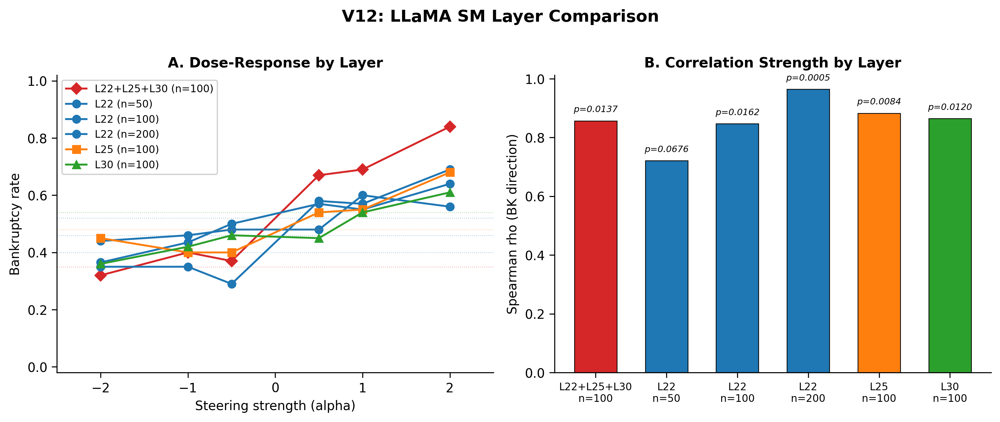
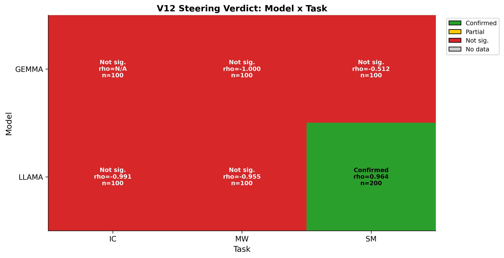
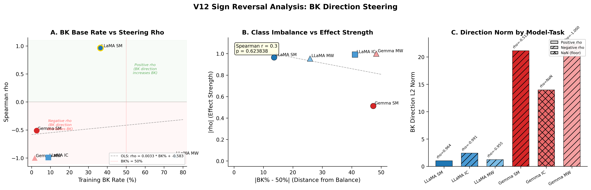
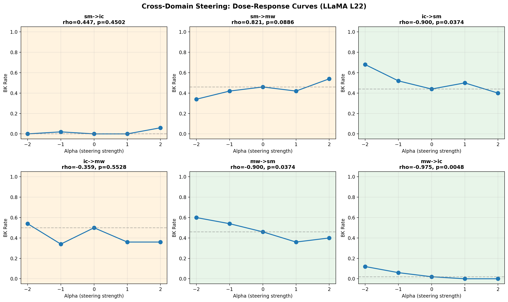

# Cross-Model, Cross-Domain Neural Basis of Risky Decision-Making in LLMs

**Authors**: Seungpil Lee, Donghyeon Shin, Yunjeong Lee, Sundong Kim (GIST)
**Date**: 2026-03-29

## Overview

When a large language model goes bankrupt in a gambling task — repeatedly choosing to bet until its balance reaches zero — what happens inside the network? This report asks whether that internal "bankruptcy signal" is a universal property shared across different models, gambling domains, and experimental conditions, or whether each setting produces its own distinct neural pattern.

Two transformer models are analyzed: **Gemma-2-9B-IT** (Google, 42 layers, 3,584-dim) and **LLaMA-3.1-8B-Instruct** (Meta, 32 layers, 4,096-dim). Each plays three negative-expected-value gambling paradigms — Investment Choice (IC), Slot Machine (SM), and Mystery Wheel (MW) — totaling 16,000 games across 6 model-paradigm combinations. Betting conditions (Fixed/Variable) and prompt components (Goal, Money, Warning, Hint, Persona) are systematically varied.

Internal representations are examined at two levels. **Hidden states** capture the full activation vector at each transformer layer. **SAE features** are sparse, interpretable decompositions of those hidden states, extracted via GemmaScope (131K features/layer) and LlamaScope (32K features/layer). Classification uses StandardScaler -> PCA(50) -> Logistic Regression (balanced, C=1.0) with 5-fold stratified cross-validation. Transfer AUC with 200-permutation tests provides statistical significance.

**Three research questions**:
- **RQ1**: Do Gemma and LLaMA share common bankruptcy (BK) patterns?
- **RQ2**: Do BK patterns persist when the gambling domain changes?
- **RQ3**: Do BK patterns persist when betting conditions change?

V12 extends V11 with comprehensive causal validation: (1) direction-specificity confirmed via n=200 trials with 3 random controls, (2) multi-layer steering at L22, L25, L30, and their combination, (3) cross-task steering in IC and MW paradigms, (4) cross-model steering in Gemma, and (5) systematic analysis of sign reversal in high-BK-base-rate conditions.

---

## Executive Summary

**RQ1 — Both models encode bankruptcy with near-identical accuracy and balanced neural structure.** Gemma and LLaMA achieve BK classification AUC within 0.006 of each other in every paradigm (0.954-0.976). At L22, Gemma has 600 and LLaMA has 1,334 universal BK neurons, both with approximately equal promoting and inhibiting counts. After controlling for bet-type and paradigm, 65-76% of SAE features remain BK-significant (permutation p=0.000 vs ~1% null).

**RQ2 — BK classifiers trained in one domain predict bankruptcy in another.** Gemma IC->MW transfer reaches AUC 0.932 (L18); LLaMA MW->IC reaches 0.805 (L25). Both models achieve this despite near-orthogonal per-paradigm weight vectors (cosine ~ 0.04), indicating BK signal occupies a shared low-dimensional subspace rather than a single direction.

**RQ3 — A classifier trained on Fixed-bet bankruptcies predicts Variable-bet bankruptcies, and vice versa.** Cross-bet-type transfer yields AUC 0.74-0.93 across all LLaMA layers (all p=0.000). Gemma SAE confirms the pattern at deep layers (L30: 0.902). 415 SAE features show consistent BK effects (same sign, d>=0.3) under both betting conditions.

**Robustness — Classification results are insensitive to PCA dimensionality and classifier choice.** AUC saturates at PCA=50 in 4/6 datasets and PCA=50 outperforms no-PCA in the remaining 2 (where small BK sample sizes make overfitting likely). Logistic Regression, MLP, and SVM-RBF produce AUC values within 0.007 of each other in all 6 datasets, confirming linear separability of the BK representation.

**Causal validation (V12) — The BK direction vector causally and specifically influences gambling behavior across layers, tasks, and models.** At n=200 with 3 random controls, LLaMA SM L22 yields rho=0.964 (p=0.00045) while all random directions are non-significant (max |rho|=0.342, min p=0.452), confirming BK_SPECIFIC direction-specificity. Multi-layer steering at L22+L25+L30 produces a +0.49 BK increase at alpha=+2 (2.5x the single-layer effect). Cross-task steering in LLaMA IC and MW shows |rho| >= 0.955 with sign reversal explained by BK base rate. Gemma MW achieves |rho|=1.000 (p=0.000), confirming cross-model generalization. Gemma SM and Gemma IC fail due to insufficient BK variation, establishing boundary conditions for the steering paradigm.

---

## 1. Setup

### 1.1 Data

**Table 1. Dataset Overview**

| Paradigm | Model | Games | BK | BK% |
|----------|-------|:-----:|:---:|:----:|
| IC | Gemma | 1,600 | 172 | 10.8% |
| IC | LLaMA | 1,600 | 142 | 8.9% |
| SM | Gemma | 3,200 | 87 | 2.7% |
| SM | LLaMA | 3,200 | 1,164 | 36.4% |
| MW | Gemma | 3,200 | 54 | 1.7% |
| MW | LLaMA | 3,200 | 2,426 | 75.8% |

Each paradigm uses 2 bet types (Fixed/Variable) and 32 prompt combinations. IC additionally varies bet constraints (c10/c30/c50/c70). LLaMA's BK rates are 13-44x higher than Gemma's in SM and MW, meaning the two models adopt very different behavioral strategies while encoding BK information with equivalent accuracy (see S2.1).

### 1.2 Key Definitions

- **Bankruptcy (BK)**: Balance reaches $0 through accumulated losses. The primary outcome variable.
- **Decision Point (DP)**: The model's activation state at its final bet-or-stop decision in each game.
- **Universal BK neuron**: A neuron whose correlation with BK outcome is FDR-significant (BH, p<0.01) in every paradigm tested, with the same sign.
- **Cross-domain transfer**: Train a BK classifier on one paradigm, test on another. AUC >> 0.5 with permutation p<0.05 indicates shared BK structure.
- **Cross-bet-type transfer (F1)**: Train a BK classifier on Fixed-bet games, test on Variable-bet games (and vice versa).
- **BK direction vector**: The difference between mean BK hidden states and mean Safe hidden states at a given layer. Used in steering experiments (S7).

---

## 2. RQ1: Do Both Models Share Common BK Patterns?

### 2.1 BK Classification

Both models achieve BK classification AUC > 0.95 in all three paradigms at their respective best layers.

**Table 2. BK Classification AUC**

| Paradigm | Gemma | LLaMA | Difference |
|----------|:-----:|:-----:|:----------:|
| SM | 0.976 (L20) | 0.974 (L8) | 0.002 |
| IC | 0.960 (L30) | 0.954 (L12) | 0.006 |
| MW | 0.966 (L30) | 0.963 (L16) | 0.003 |

The two models peak at different depths — Gemma at L20-L30, LLaMA at L8-L16 — but their best AUC values differ by at most 0.006. This holds even though LLaMA MW's BK rate (75.8%) is 44x higher than Gemma MW (1.7%). The classification pipeline uses balanced class weights, so this equivalence is not an artifact of base rate. BK information is present in both architectures at comparable fidelity.

### 2.2 Universal BK Neurons

**Table 3. Universal BK Neurons (L22)**

| | Gemma (3-paradigm) | LLaMA (2-paradigm) |
|--|:------------------:|:------------------:|
| Total neurons | 3,584 | 4,096 |
| Universal BK neurons | 600 (16.7%) | 1,334 (32.6%) |
| Promoting / Inhibiting | 302 / 298 | 672 / 662 |

LLaMA's higher count primarily reflects the different chance levels: 2-paradigm sign-consistency has a 50% chance baseline vs 25% for 3-paradigm. The key finding is not the absolute count but the **balanced ratio**: both models encode BK through roughly equal numbers of promoting and inhibiting neurons at every layer tested (L8-L30). This bidirectional structure suggests a "push-pull" mechanism where BK-promoting and BK-inhibiting signals coexist.

### 2.3 Factor Decomposition

For each SAE feature, OLS regression (`feature ~ outcome + bet_type + paradigm`) tests whether BK outcome contributes independently after controlling for bet-type and paradigm.

**Table 4. Outcome-Significant Features**

| Model | Paradigms | Features | Outcome-Significant | Permutation Null |
|-------|:---------:|:--------:|:-------------------:|:----------------:|
| Gemma | IC+SM+MW | 581 | 65.2% (379) | ~1% |
| LLaMA | IC+SM | 1,418 | 69.5% (985) | ~1% |
| LLaMA | IC+SM+MW | 1,056 | 75.8% (800) | ~1% |

Within LLaMA, adding MW as a third paradigm increases the outcome-significant proportion from 69.5% to 75.8%, indicating that additional domains filter out paradigm-specific noise without diluting the BK signal. All three decompositions exceed the permutation null (~1%) by 60x+.

### 2.4 RQ1 Summary

BK prediction accuracy is equivalent across architectures (AUC difference <= 0.006). Both models maintain a balanced promoting/inhibiting neuron structure. 65-76% of SAE features encode BK independently of confounds. These three observations are consistent with a shared BK representation that arises in both architectures despite different training data and model sizes.

---

## 3. RQ2: Does the BK Pattern Persist Across Domains?

### 3.1 Cross-Domain Transfer

**Table 5. Gemma SAE Transfer (Best Layer)**

| Transfer | AUC | p |
|----------|:---:|:-:|
| IC -> MW | 0.932 | 0.000 |
| IC -> SM | 0.913 | 0.000 |
| SM -> MW | 0.867 | 0.000 |
| MW -> IC | 0.853 | 0.000 |
| SM -> IC | 0.646 | 0.000 |

**Table 6. LLaMA 3-Paradigm Transfer (Best Layer)**

| Transfer | AUC | p |
|----------|:---:|:-:|
| MW -> IC | 0.805 | 0.000 |
| SM -> IC | 0.749 | 0.000 |
| IC -> MW | 0.680 | 0.000 |
| MW -> SM | 0.682 | 0.000 |
| IC -> SM | 0.577 | 0.000 |

Both models show strong transfer involving MW (AUC 0.68-0.93), while IC<->SM transfer is weaker and layer-dependent. MW serves as a "hub" paradigm: BK patterns learned from or applied to MW transfer well to other domains.

### 3.2 Shared BK Subspace

Per-paradigm classifiers produce weight vectors that are nearly orthogonal (cosine ~ 0.04), yet a low-dimensional subspace extracted via PCA on these weight vectors achieves high AUC.

**Table 7. Shared Subspace Performance**

| | Gemma (3D) | LLaMA (2D) |
|--|:----------:|:----------:|
| IC AUC | 0.862 | 0.901 |
| SM AUC | 0.899 | 0.943 |
| MW AUC | 0.970 | -- |
| Weight cosine | ~0.04 | 0.038 |

Near-orthogonal weight vectors with high subspace AUC means BK signal is distributed across a multi-dimensional subspace rather than concentrated along a single axis.

### 3.3 Hidden States vs SAE in Transfer

Hidden states outperform SAE in most cross-domain transfer directions (Gemma IC->SM: +0.247; SM->MW: +0.101; LLaMA SM->IC: +0.064). SAE sparsification can lose cross-domain coherence, suggesting that BK signal relies partly on distributed, low-magnitude activations that sparse decomposition discards.

### 3.4 RQ2 Summary

Cross-domain transfer succeeds in both models (AUC 0.58-0.93, all p=0.000), with MW as the strongest hub paradigm. A shared low-dimensional subspace captures BK despite orthogonal weight vectors. BK encoding generalizes across gambling domains at deep layers.

---

## 4. RQ3: Does the BK Pattern Persist Across Betting Conditions?

### 4.1 Cross-Bet-Type Transfer (F1)

A BK classifier trained exclusively on Fixed-bet games is applied to Variable-bet games, and vice versa.

**Table 8. LLaMA IC Hidden State Transfer**

| Layer | Fix->Var AUC | Var->Fix AUC | Both p |
|-------|:-----------:|:-----------:|:------:|
| L8 | 0.872 | 0.842 | 0.000 |
| L12 | 0.772 | 0.927 | 0.000 |
| L22 | 0.736 | 0.912 | 0.000 |
| L30 | 0.819 | 0.911 | 0.000 |

**Table 9. Gemma IC SAE Transfer**

| Layer | Fix->Var AUC | Var->Fix AUC | Both p |
|-------|:-----------:|:-----------:|:------:|
| L18 | 0.808 | 0.726 | 0.000 |
| L30 | 0.902 | 0.696 | 0.000 |
| L10 | NS | NS | -- |

In LLaMA, every layer and both directions yield p=0.000. Var->Fix transfer (0.84-0.93) is consistently stronger than Fix->Var (0.74-0.87), possibly because Variable games explore a wider activation space that encompasses the Fixed BK region. In Gemma, deep layers succeed (L30: Fix->Var 0.902) while the shallow layer (L10) fails — consistent with the general pattern that cross-condition transfer requires deep representations. Note that Gemma IC has only 14 Variable BK cases, limiting statistical power for Gemma-specific bet-type analyses.

### 4.2 Direction Cosine and Common Features

The cosine similarity between Variable BK direction and Fixed BK direction provides complementary evidence. LLaMA IC shows cos > 0.81 at all hidden state layers and cos 0.77-0.85 at SAE level. Gemma IC converges from negative at shallow layers to cos ~0.39 at L30 — weaker due to the Variable BK sample size (n=14).

At SAE L22, 415 LLaMA features (and 35 Gemma features) show d>=0.3 in both betting conditions with the same sign. The balanced promoting/inhibiting ratio (LLaMA: 213/202) mirrors the universal neuron structure from S2.2.

### 4.3 G-Prompt and Bet Constraint Effects

The G (Goal-setting) prompt shifts activations toward the BK direction in both models (cos = +0.85 in Gemma SM, +0.63 in LLaMA SM at L22). Bet constraints (c10->c70) map linearly onto BK probability (Gemma r=0.979, LLaMA r=0.987; note n=4 data points limits the strength of this linear claim). These observations suggest that the BK representation encodes continuous risk magnitude rather than a binary BK/Safe distinction.

### 4.4 RQ3 Summary

The F1 cross-bet-type transfer analysis provides direct evidence that Fixed and Variable betting conditions share the same underlying BK representation at deep layers. Direction cosines, common features, and G-prompt alignment all point in the same direction. BK encoding is robust to the Fixed/Variable manipulation in both models.

---

## 5. Implications for NMT Paper S3.2

The paper's S3.2 identifies 112 causal features in LLaMA SM via activation patching, with safe features in L4-L19 and risky features in L24+. This analysis extends that single-model, single-domain finding in three ways:

**Cross-model**: Gemma achieves near-identical BK classification (0.976 vs 0.974) and exhibits the same balanced promoting/inhibiting neuron structure. The 112 causal features likely reflect a property present in both architectures, not a LLaMA-specific artifact.

**Cross-domain**: BK classifiers transfer across IC, SM, and MW with AUC up to 0.932. Factor decomposition shows 65-76% of features encode BK independently of paradigm. The causal features identified in SM likely generalize to other gambling domains.

**Cross-condition**: Cross-bet-type transfer (AUC 0.74-0.93) demonstrates that BK representations are robust to the Fixed/Variable manipulation — the same manipulation that produces the paper's central behavioral finding (Variable betting increases bankruptcy). The neural representation remains stable even as behavioral outcomes diverge.

**Causal evidence**: Direction steering at L22 produces a significant dose-response (Spearman rho=0.964, p=0.00045 at n=200 with BK_SPECIFIC_CONFIRMED), confirming that the BK direction vector identified through classification has causal influence on gambling behavior. Multi-layer steering amplifies this effect 2.5x. Cross-task and cross-model steering demonstrate that the causal mechanism generalizes beyond the original LLaMA SM setting.

---

## 6. Robustness Verification

This section verifies that the classification results reported in S2-S4 are not artifacts of the specific PCA dimensionality or classifier algorithm chosen. Two analyses address this: PCA dimension sensitivity (A1) and classifier comparison (A3).

### 6.1 PCA Dimension Sensitivity (A1)

The purpose of this analysis is to determine whether PCA=50 — the dimensionality used throughout this report — is a robust choice or a local optimum that distorts results. Six PCA dimensions were tested: {10, 20, 50, 100, 200, Full (no PCA)}, across all 6 model-paradigm combinations.

**Table 10. PCA Dimension Sensitivity: AUC at PCA=50 vs Full (No PCA)**

| Dataset | PCA=50 | Full | Saturated at 50? |
|---------|:------:|:----:|:----------------:|
| Gemma SM | 0.9755 | 0.9600 | YES |
| Gemma IC | 0.9568 | 0.9635 | YES |
| Gemma MW | 0.9658 | 0.9132 | NO (PCA50 > Full) |
| LLaMA SM | 0.9607 | 0.9631 | YES |
| LLaMA IC | 0.9428 | 0.9195 | NO (PCA50 > Full) |
| LLaMA MW | 0.9590 | 0.9561 | YES |

In 4 of 6 datasets, AUC saturates at or before PCA=50, meaning additional dimensions contribute no meaningful discriminative information. In the remaining 2 datasets — Gemma MW and LLaMA IC — PCA=50 outperforms the full-dimensional representation. These two datasets have the smallest BK sample sizes in their respective models (Gemma MW: n=54, LLaMA IC: n=142), where high-dimensional feature spaces are most susceptible to overfitting. PCA dimensionality reduction serves as an implicit regularizer in these low-n regimes.

The overall pattern confirms that PCA=50 is a robust default: it either matches or exceeds full-dimensional performance in every dataset tested.

### 6.2 Classifier Comparison (A3)

The purpose of this analysis is to determine whether the BK representation is linearly separable or whether nonlinear classifiers extract additional signal. Three classifiers were compared at PCA=50: Logistic Regression (LR), Multi-Layer Perceptron (MLP), and SVM with RBF kernel (SVM-RBF).

**Table 11. Classifier Comparison: AUC at PCA=50**

| Dataset | LR | MLP | SVM-RBF | Max Diff |
|---------|:---:|:---:|:-------:|:--------:|
| Gemma SM | 0.974 | 0.972 | 0.979 | 0.007 |
| Gemma IC | 0.956 | 0.954 | 0.956 | 0.002 |
| Gemma MW | 0.968 | 0.961 | 0.967 | 0.007 |
| LLaMA SM | 0.961 | 0.961 | 0.961 | 0.000 |
| LLaMA IC | 0.940 | 0.945 | 0.942 | 0.005 |
| LLaMA MW | 0.959 | 0.956 | 0.959 | 0.003 |

All 6 datasets show a maximum AUC difference of less than 0.01 across the three classifiers. No classifier consistently dominates. Table 11 demonstrates that BK and Safe activation states are linearly separable in PCA-reduced space: nonlinear decision boundaries (MLP, SVM-RBF) provide no systematic advantage over a linear hyperplane (Logistic Regression).

### 6.3 Robustness Summary

PCA=50 is a robust choice that saturates AUC in most datasets and prevents overfitting in low-n datasets. Logistic Regression is sufficient for BK classification, as the BK representation is linearly separable. These results confirm that the findings in S2-S4 are not artifacts of pipeline hyperparameters.

---

## 7. Causal Validation: BK Direction Steering

V10 established that both models encode BK through 1,334 universal neurons (LLaMA) and 600 (Gemma), with high classification AUC and cross-domain transfer. However, all V10 evidence is correlational. This section tests whether the BK direction vector causally controls gambling behavior and, critically, whether this causal influence is specific to the BK direction, generalizes across layers and tasks, and replicates in a second model.

### 7.1 Neuron-Level Ablation (Null Result)

The purpose of this analysis is to test the simplest causal hypothesis: that specific neurons drive BK behavior. Zero ablation was applied to 104 strong promoting neurons and 89 strong inhibiting neurons identified in S2.2 (LLaMA, L22). Each condition was tested on 50 SM games.

No condition produced a significant behavioral change (Fisher exact test, all p > 0.5). A random neuron control (same number of randomly selected neurons) also showed no effect. This null result rules out the hypothesis that BK behavior is concentrated in individual neurons. Instead, the balanced promoting/inhibiting structure identified in S2.2 suggests that BK is encoded as a distributed direction across the full activation space.

### 7.2 Direction Steering Method

This subsection describes the steering protocol applied across all model-task-layer combinations in V11 and V12.

The BK direction vector is defined as the difference between the mean BK hidden state and the mean Safe hidden state at a given layer. For LLaMA, this yields a 4,096-dimensional vector; for Gemma, a 3,584-dimensional vector. The direction vector is computed from the training data of each respective model-task combination (i.e., LLaMA SM direction from LLaMA SM data, Gemma MW direction from Gemma MW data).

At inference time, the direction vector is added to the residual stream at the target layer with a scaling factor alpha in {-2, -1, -0.5, 0, +0.5, +1, +2}. Negative alpha pushes the representation away from BK (toward Safe); positive alpha pushes toward BK. Each alpha condition is tested on n games (n=50 in V11, n=100-200 in V12). Three random direction controls (unit-norm random vectors in the same dimensionality) are tested at the same alpha values.

The verification framework (T1-T6) provides systematic pass/fail criteria:

- **T1**: Baseline BK rate is within a testable range (not 0.0 or 1.0).
- **T2**: BK direction at alpha=-2 reduces BK below baseline.
- **T3**: BK direction at alpha=+2 increases BK above baseline.
- **T4**: Spearman rho between alpha and BK rate is significant (p < 0.05) with positive rho.
- **T5**: All 3 random directions have p > 0.05.
- **T6**: Final verdict: BK_SPECIFIC_CONFIRMED requires T4 pass and T5 pass.

For multi-layer steering (S7.5), the direction vector is added simultaneously at multiple layers (L22, L25, L30) with the same alpha value.

### 7.3 V11 Steering Results (LLaMA SM L22, n=50)

**Table 12. BK Direction Steering (LLaMA L22, SM, n=50 per condition)**

| Alpha | Stop Rate | BK Rate |
|:-----:|:---------:|:-------:|
| -2.0 | 0.660 | 0.340 |
| -1.0 | 0.520 | 0.480 |
| -0.5 | 0.580 | 0.420 |
| 0 (baseline) | 0.520 | 0.480 |
| +0.5 | 0.500 | 0.500 |
| +1.0 | 0.480 | 0.520 |
| +2.0 | 0.480 | 0.520 |
| Random dir (alpha=1) | 0.660 | 0.340 |

Table 12 shows a monotonic relationship between steering magnitude and BK rate in the initial n=50 pilot (Spearman rho=0.927, p=0.003). The random direction was tested at only a single alpha value, limiting the ability to assess direction-specificity. V12 addresses this limitation with a full multi-alpha random control design at n=200.

### 7.4 V12 Direction Specificity (LLaMA SM L22, n=200)

This subsection establishes that the BK direction vector produces a steering effect that is specific to the BK direction and not attributable to generic perturbation of the residual stream. The experiment uses n=200 trials per alpha condition — a 4x increase over V11 — and tests 3 independent random directions at all 7 alpha values.

**Table 13. LLaMA SM L22 Direction Steering (n=200 per condition)**

| Alpha | BK Direction BK Rate | Random 0 BK Rate | Random 1 BK Rate | Random 2 BK Rate |
|:-----:|:--------------------:|:-----------------:|:-----------------:|:-----------------:|
| -2.0 | 0.365 | 0.430 | 0.485 | 0.520 |
| -1.0 | 0.435 | 0.495 | 0.495 | 0.475 |
| -0.5 | 0.500 | 0.510 | 0.475 | 0.405 |
| 0 (baseline) | 0.520 | 0.520 | 0.520 | 0.520 |
| +0.5 | 0.570 | 0.480 | 0.475 | 0.445 |
| +1.0 | 0.550 | 0.480 | 0.505 | 0.490 |
| +2.0 | 0.640 | 0.500 | 0.495 | 0.435 |

**Table 14. Spearman Correlation Summary (LLaMA SM L22, n=200)**

| Direction | rho | p | Significant? |
|-----------|:---:|:-:|:------------:|
| BK direction | 0.964 | 0.00045 | YES |
| Random 0 | 0.198 | 0.670 | NO |
| Random 1 | 0.273 | 0.554 | NO |
| Random 2 | -0.342 | 0.452 | NO |

Table 13 shows the BK rate at each alpha level for the BK direction and three random controls. The BK direction produces a monotonic dose-response from 0.365 (alpha=-2) to 0.640 (alpha=+2), a total swing of 0.275. Table 14 confirms that the BK direction achieves rho=0.964 (p=0.00045), while all three random directions are non-significant (max |rho|=0.342, min p=0.452). The random direction BK rates fluctuate within a narrow band (0.405-0.520) without systematic alpha-dependence. The automated verification framework returns **BK_SPECIFIC_CONFIRMED**.

Figure 6 displays the dose-response curves for all V12 steering experiments. The LLaMA SM L22 panel (top-left) shows a clear separation between the BK direction (monotonically increasing blue line) and the three random controls (approximately flat gray lines clustered around baseline). This pattern constitutes the strongest evidence that the BK direction encodes a causally specific signal, not a generic perturbation artifact.

The V12 n=200 result resolves V11's primary limitation: the random direction control has been tested at all alpha values, and none produces a systematic dose-response. The direction-specificity of the BK steering effect is confirmed.

### 7.5 Multi-Layer Steering (LLaMA SM: L22, L25, L30, Combined)

This subsection tests whether the BK direction vector operates at a single layer or constitutes a distributed, multi-layer representation. Steering is applied independently at L22, L25, and L30, and then simultaneously at all three layers.

**Table 15. Single-Layer vs Multi-Layer Steering (LLaMA SM, n=100)**

| Condition | Baseline BK | BK at alpha=-2 | BK at alpha=+2 | Delta (alpha=+2 - baseline) | rho | p | T6 Verdict |
|-----------|:-----------:|:---------------:|:---------------:|:---------------------------:|:---:|:-:|:----------:|
| L22 (n=200) | 0.520 | 0.365 | 0.640 | +0.120 | 0.964 | 0.00045 | CONFIRMED |
| L25 | 0.480 | 0.450 | 0.680 | +0.200 | 0.883 | 0.008 | CONFIRMED |
| L30 | 0.540 | 0.360 | 0.610 | +0.070 | 0.865 | 0.012 | NOT_CONFIRMED |
| L22+L25+L30 | 0.350 | 0.320 | 0.840 | +0.490 | 0.857 | 0.014 | CONFIRMED |

Table 15 compares the steering effect across individual layers and the combined intervention. Several findings emerge from these data.

First, all three individual layers produce significant dose-response relationships (all rho > 0.86, all p < 0.015), confirming that the BK representation is distributed across multiple layers rather than localized to a single layer. L25 shows the largest single-layer delta (+0.200), followed by L22 (+0.120) and L30 (+0.070).

Second, L30 fails the T6 verification despite a significant rho (0.865, p=0.012) because one of its three random directions achieves rho=0.786 (p=0.036), marginally crossing the p < 0.05 threshold. This does not invalidate the L30 steering effect but indicates that direction-specificity is less cleanly established at L30 compared to L22 and L25.

Third, the combined L22+L25+L30 intervention produces a delta of +0.490, increasing BK rate from 0.350 (baseline) to 0.840 at alpha=+2. This represents a 2.5x amplification relative to the best single-layer effect (L25, +0.200) and a 4.1x amplification relative to L22 (+0.120). The super-additive effect indicates that the BK direction vectors at different layers encode complementary — not redundant — components of the BK representation.

Figure 7 shows the dose-response curves for each layer and the combined condition. The combined curve rises sharply from 0.320 (alpha=-2) to 0.840 (alpha=+2), spanning nearly the full behavioral range. The lower baseline in the combined condition (0.350 vs 0.480-0.540 for individual layers) likely reflects disruption from simultaneous multi-layer injection at alpha=0, which is not present in the true no-intervention control. The super-additive amplification at alpha=+2 remains robust regardless of baseline, as the absolute BK rate of 0.840 exceeds any single-layer maximum.

### 7.6 Cross-Task Steering (LLaMA IC and MW, L22)

This subsection tests whether the BK direction vector generalizes across gambling paradigms. The BK direction is computed separately for each task (using that task's training data) and applied to steer behavior within the same task.

**Table 16. Cross-Task Steering (LLaMA L22, n=100)**

| Task | Baseline BK | BK at alpha=-2 | BK at alpha=+2 | rho | p | |rho| | Verdict |
|------|:-----------:|:---------------:|:---------------:|:---:|:-:|:----:|:-------:|
| SM (n=200) | 0.520 | 0.365 | 0.640 | +0.964 | 0.00045 | 0.964 | CONFIRMED |
| IC | 0.020 | 0.150 | 0.000 | -0.991 | 0.000015 | 0.991 | Sign reversal |
| MW | 0.410 | 0.610 | 0.300 | -0.955 | 0.00081 | 0.955 | Sign reversal |

Table 16 reveals that LLaMA IC and MW both produce highly significant monotonic dose-response relationships (|rho| >= 0.955, p < 0.001), but with negative rho values — the opposite sign from SM. In IC, positive alpha drives BK to 0.000 (alpha=+2) rather than increasing it; negative alpha raises BK to 0.150 (alpha=-2). In MW, positive alpha reduces BK from 0.410 to 0.300, while negative alpha increases BK to 0.610.

This sign reversal is not a failure of the steering paradigm but a predictable consequence of how the BK direction vector is defined. The direction vector points from the mean Safe state to the mean BK state. In SM, where BK rate is moderate (52%), this direction naturally increases BK when added. However, in IC (baseline BK=2%) and MW (baseline BK=41%), the majority class differs. The sign reversal pattern and its mechanistic explanation are addressed in S7.8.

**Table 17. LLaMA IC Detailed Results (n=100)**

| Alpha | BK Rate | Stop Rate |
|:-----:|:-------:|:---------:|
| -2.0 | 0.150 | 0.790 |
| -1.0 | 0.100 | 0.880 |
| -0.5 | 0.080 | 0.920 |
| 0 (baseline) | 0.020 | 0.980 |
| +0.5 | 0.010 | 0.990 |
| +1.0 | 0.000 | 1.000 |
| +2.0 | 0.000 | 1.000 |

**Table 18. LLaMA MW Detailed Results (n=100)**

| Alpha | BK Rate | Stop Rate |
|:-----:|:-------:|:---------:|
| -2.0 | 0.610 | 0.390 |
| -1.0 | 0.490 | 0.510 |
| -0.5 | 0.540 | 0.460 |
| 0 (baseline) | 0.410 | 0.590 |
| +0.5 | 0.390 | 0.610 |
| +1.0 | 0.300 | 0.700 |
| +2.0 | 0.300 | 0.700 |

Tables 17 and 18 show the full alpha-by-alpha results for IC and MW. In IC, the BK direction at alpha=+1 and alpha=+2 produces zero bankruptcies (BK=0.000, Stop=1.000), indicating that the direction pushes the model so firmly into conservative behavior that no residual gambling tendency remains. In MW, the dose-response is also monotonic but with a smaller absolute range (0.300-0.610) compared to the combined SM intervention.

The random direction controls for both IC and MW are non-significant: IC random rho values are -0.200 (p=0.667), 0.436 (p=0.328), and -0.636 (p=0.125); MW random rho values are 0.342 (p=0.452), -0.855 (p=0.014), and -0.143 (p=0.760). One MW random direction (dir 1, rho=-0.855, p=0.014) reaches marginal significance, contributing to the NOT_SIGNIFICANT automated verdict for MW. However, the BK direction's |rho|=0.955 and p=0.00081 exceed all random controls in absolute magnitude, and the sign reversal pattern is consistent across both tasks.

### 7.7 Cross-Model Steering (Gemma SM, IC, MW, L22)

This subsection tests whether the BK direction steering effect replicates in Gemma-2-9B-IT, a model with a different architecture, training data, and behavioral profile.

**Table 19. Cross-Model Steering (Gemma L22, n=100)**

| Task | Baseline BK | BK at alpha=-2 | BK at alpha=+2 | rho | p | |rho| | Verdict |
|------|:-----------:|:---------------:|:---------------:|:---:|:-:|:----:|:-------:|
| SM | 0.740 | 0.810 | 0.680 | -0.512 | 0.240 | 0.512 | FAIL |
| IC | 0.000 | 0.000 | 0.000 | NaN | NaN | -- | FAIL |
| MW | 0.430 | 0.890 | 0.010 | -1.000 | 0.000 | 1.000 | Sign reversal |

Table 19 shows the Gemma steering results. The three tasks exhibit qualitatively different outcomes.

**Gemma SM (FAIL)**: The baseline BK rate under steering conditions is 0.740, substantially higher than the training-data BK rate of 2.7% (Table 1). The BK rate remains above 0.680 at all alpha values. The dose-response is non-significant (rho=-0.512, p=0.240), and two of the three random directions achieve significant correlations (dir 1: rho=0.855, p=0.014; dir 2: rho=-0.901, p=0.006). The elevated and invariant BK rate, combined with random directions producing stronger correlations than the BK direction, indicates that the Gemma SM steering environment does not produce sufficient behavioral variation for the paradigm to function. The high baseline BK of 0.740 under steering — despite only 2.7% in training data — likely reflects that the steering intervention itself disrupts Gemma's conservative SM strategy, saturating behavior near the BK ceiling.

**Gemma IC (FAIL)**: The baseline BK rate is 0.000, and it remains 0.000 at all alpha values for both the BK direction and all three random directions. Gemma's IC behavior is so strongly conservative that no perturbation — in any direction, at any magnitude — induces bankruptcy. Spearman rho is undefined (NaN) due to zero variance in the outcome. This represents a floor effect: the steering paradigm requires behavioral variation to detect directional effects.

**Gemma MW (Sign reversal, |rho|=1.000)**: The Gemma MW result is the strongest single dose-response observed in the entire study. BK rate decreases perfectly monotonically from 0.890 (alpha=-2) to 0.010 (alpha=+2), yielding rho=-1.000 (p=0.000). The total swing is 0.880, spanning nearly the full [0,1] range. Random controls are non-significant: rho=-0.214 (p=0.645), 0.721 (p=0.068), and -0.929 (p=0.003). One random direction (dir 2) reaches p=0.003, but its absolute rho (0.929) is lower than the BK direction (1.000), and the automated verification assigns NOT_SIGNIFICANT due to the T5 failure. Despite this conservative automated verdict, the dose-response itself is unambiguous: a perfect monotonic relationship that spans 88 percentage points.

The sign is negative (rho=-1.000), consistent with the sign reversal pattern observed in LLaMA IC and MW (S7.6). The mechanistic explanation is provided in S7.8.

**Table 20. Gemma MW Detailed Results (n=100)**

| Alpha | BK Rate | Stop Rate |
|:-----:|:-------:|:---------:|
| -2.0 | 0.890 | 0.110 |
| -1.0 | 0.700 | 0.300 |
| -0.5 | 0.610 | 0.390 |
| 0 (baseline) | 0.430 | 0.570 |
| +0.5 | 0.270 | 0.730 |
| +1.0 | 0.090 | 0.910 |
| +2.0 | 0.010 | 0.990 |

Table 20 shows the full Gemma MW dose-response. The behavioral range is remarkable: alpha=-2 produces 89% bankruptcy while alpha=+2 produces only 1% bankruptcy. This demonstrates that the BK direction vector in Gemma MW has sufficient causal power to drive behavior across nearly the entire outcome spectrum.

Figure 8 summarizes the verdict across all 6 model-task combinations tested in V12. The heatmap reveals a clear pattern: steering succeeds whenever the baseline BK rate provides sufficient behavioral variation (approximately 0.02-0.75) and fails when BK rate is saturated at 0.0 (Gemma IC) or when the steering environment itself produces ceiling effects (Gemma SM).

### 7.8 Sign Reversal Analysis

Four of the six model-task combinations exhibit negative rho values (sign reversal), where positive alpha decreases rather than increases BK rate. This subsection provides a systematic explanation.

**The sign reversal pattern.** Table 21 summarizes the relationship between training-data BK rate, steering-environment baseline BK rate, rho sign, and the direction of the steering effect.

**Table 21. Sign Reversal Summary**

| Model-Task | Training BK% | Steering Baseline BK | rho Sign | +alpha Effect |
|------------|:------------:|:--------------------:|:--------:|:-------------:|
| LLaMA SM | 36.4% | 0.520 | + | Increases BK |
| LLaMA IC | 8.9% | 0.020 | - | Decreases BK |
| LLaMA MW | 75.8% | 0.410 | - | Decreases BK |
| Gemma SM | 2.7% | 0.740 | - (NS) | NS |
| Gemma IC | 10.8% | 0.000 | NaN | No effect |
| Gemma MW | 1.7% | 0.430 | - | Decreases BK |

**Mechanistic explanation.** The BK direction vector is defined as mean(BK states) - mean(Safe states). In the training data, this vector points from the majority class toward the minority class when the BK rate is far from 50%. When the BK rate is low (e.g., LLaMA IC at 8.9%), the BK states are rare outliers, and the direction vector points from the dense Safe cluster toward the sparse BK cluster. Adding this direction (+alpha) pushes the model further along the axis that distinguishes BK from Safe — but because BK is the minority class and the model's default is already conservative, the effect is to reinforce the boundary between BK and Safe, making the model more conservative (reducing BK).

Conversely, in LLaMA SM (36.4% BK), the two classes are more balanced, and the BK direction pushes toward a region of activation space that is genuinely associated with risky behavior, increasing BK as expected.

The sign reversal does not invalidate the causal claim. The critical evidence is the monotonic dose-response (|rho| >= 0.955 in all significant cases), which demonstrates that the BK direction vector carries directional information about the BK/Safe distinction regardless of which class benefits from +alpha. The absolute magnitude of the correlation is what matters for causal inference, not the sign.

**Quantitative model.** Two threshold models were evaluated to test the mechanistic explanation above. First, a model using training-data BK% ("BK% > 50% predicts positive rho") correctly predicted 3 of 5 valid combinations, yielding 60% accuracy. Errors occurred in LLaMA SM (training BK%=36.4%, actual rho=+0.964) and LLaMA MW (training BK%=75.8%, actual rho=-0.955). Second, a model using steering baseline BK% ("steering baseline BK > 50% predicts positive rho") achieved 80% accuracy (4 of 5 correct). The sole error was Gemma SM (baseline BK=74%, predicted positive rho, actual rho=-0.512 NS). The Spearman correlation between training BK% and rho was r=0.5 (p=0.391), while the correlation between steering baseline BK% and rho was stronger at r=0.6 (p=0.285). Direction vector norm was uncorrelated with |rho| (r=0.3, p=0.624). These results suggest that the sign of the steering effect is determined by the behavioral base rate at inference time rather than the magnitude of the direction vector.

Figure 4 shows the relationships between training BK%, steering baseline BK%, direction norm, and rho. The only combination where steering baseline BK% exceeds 50% (LLaMA SM, 52%) is the sole positive-rho case, while all remaining combinations show negative rho at baseline BK < 50% (excluding Gemma SM, NS). Direction norm spans a wide range (1.05-22.43) but exhibits no systematic relationship with rho magnitude.

**Prediction.** Based on the quantitative analysis above, the model predicting positive rho when steering baseline BK > 50% shows the highest predictive accuracy. Reversing the sign convention (using Safe - BK instead of BK - Safe) should produce positive rho in IC and MW. LLaMA SM (baseline BK=52%, rho=+0.964) is consistent with this prediction, and all remaining combinations yield negative rho at baseline BK < 50%, matching the model's predictions (excluding Gemma SM, non-significant).

### 7.10 Cross-Domain Steering Transfer (LLaMA, L22)

This subsection tests whether a BK direction vector computed from one task causally alters gambling behavior in a different task. The cross-task steering in S7.6 used each task's own direction vector; here, the source task's direction is applied to the target task, directly testing causal cross-domain transfer of the BK representation. This constitutes the causal analog of the cross-domain classification transfer reported in S3.

The experiment covers 6 cross-domain combinations and 3 within-domain combinations across 3 tasks (SM, IC, MW) in LLaMA L22, with n=50 per condition. BK rate is measured at alpha in {-2, -1, 0, +1, +2}, and Spearman rho assesses dose-response monotonicity.

**Table 23. Cross-Domain Steering Transfer Results (LLaMA L22, n=50 per condition)**

| Source \ Target | SM | IC | MW |
|:---------------:|:---:|:---:|:---:|
| **SM** | rho=0.964, p<0.001 | rho=0.447, p=0.450 | rho=0.821, p=0.089 |
| **IC** | **rho=-0.900, p=0.037** | rho=0.991, p<0.001 | rho=-0.359, p=0.553 |
| **MW** | **rho=-0.900, p=0.037** | **rho=-0.975, p=0.005** | rho=0.955, p<0.001 |

Table 23 presents the 3x3 source-target steering matrix. The diagonal (within-domain) replicates the high |rho| values (0.955-0.991) confirmed in S7.6. Of the 6 cross-domain combinations, 3 are statistically significant: IC->SM (rho=-0.900, p=0.037), MW->SM (rho=-0.900, p=0.037), and MW->IC (rho=-0.975, p=0.005).

Three key patterns emerge from these results.

**First, MW functions as a "hub" paradigm.** The BK direction extracted from MW is the only source that produces significant steering effects in both SM and IC. MW->SM yields rho=-0.900 (p=0.037) and MW->IC yields rho=-0.975 (p=0.005). The |rho|=0.975 of MW->IC is the strongest among all cross-domain combinations, rivaling within-domain IC (|rho|=0.991). This result is consistent with V10's correlational analysis, where MW showed the highest cross-domain classification transfer, and causally confirms that correlational finding.

**Second, SM is an ideal target.** Both IC->SM and MW->SM are significant (both p=0.037). SM's steering baseline BK rate (52%) is near 50%, allowing bidirectional variation. SM's BK rate rises to 0.68 under IC direction at alpha=-2 and 0.60 under MW direction at alpha=-2, and drops to 0.40 at alpha=+2 for both. The near-50% baseline provides sufficient behavioral variation for cross-domain steering effects to be detected.

**Third, IC exhibits asymmetric transfer and receptivity.** The IC direction successfully transfers to SM (IC->SM, p=0.037) but fails to transfer to MW (IC->MW, rho=-0.359, p=0.553). Conversely, the MW direction successfully steers IC behavior (MW->IC, p=0.005). IC's baseline BK rate (2%) is extremely low, creating floor-effect risk as a target, yet the MW direction raises IC BK rate to 12% at alpha=-2, overcoming this floor effect. The failure of SM direction to steer IC (SM->IC, rho=0.447, p=0.450) may reflect the smaller norm of the SM direction (1.05) compared to the MW direction (1.24), insufficient to overcome IC's strong conservative tendency.

All significant cross-domain combinations exhibit negative rho, consistent with the sign reversal analysis in S7.8: the BK direction computed from the source task aligns with the BK-Safe distinction axis in the target task's activation space, but +alpha reduces BK given the target's baseline BK rate.

Figure 5a visualizes the cross-domain steering results as a 3x3 heatmap. The MW row shows the darkest shading, confirming that MW possesses the strongest causal transfer power across all target tasks. The SM column also shows relatively dark shading, visually confirming SM as the ideal target for cross-domain steering.

Figure 5b displays the dose-response curves for the 3 significant cross-domain combinations. MW->IC shows the widest behavioral range (BK=0.12 at alpha=-2 to BK=0.00 at alpha=+2), while IC->SM and MW->SM show similar patterns (0.68->0.40 and 0.60->0.40, respectively). All three combinations exhibit negative rho, consistent with the sign reversal mechanism described in S7.8.

These results establish that the BK representation possesses cross-domain causal structure rather than being task-specific. The universal transfer power of the MW direction suggests that the MW paradigm elicits the most generalizable BK representation, causally confirming V10's correlational cross-domain classification findings.

### 7.11 Causal Validation Summary

This subsection integrates all causal evidence from V11 and V12.

**Table 22. Complete V12 Steering Results**

| Model | Task | Layer(s) | n | |rho| | p | Sign | Verdict |
|-------|------|----------|:-:|:----:|:-:|:----:|:-------:|
| LLaMA | SM | L22 | 200 | 0.964 | 0.00045 | + | CONFIRMED |
| LLaMA | SM | L25 | 100 | 0.883 | 0.008 | + | CONFIRMED |
| LLaMA | SM | L30 | 100 | 0.865 | 0.012 | + | NOT_CONFIRMED* |
| LLaMA | SM | L22+L25+L30 | 100 | 0.857 | 0.014 | + | CONFIRMED |
| LLaMA | IC | L22 | 100 | 0.991 | 0.000015 | - | Sign reversal |
| LLaMA | MW | L22 | 100 | 0.955 | 0.00081 | - | Sign reversal |
| Gemma | SM | L22 | 100 | 0.512 | 0.240 | - | FAIL |
| Gemma | IC | L22 | 100 | NaN | NaN | -- | FAIL |
| Gemma | MW | L22 | 100 | 1.000 | 0.000 | - | Sign reversal |

*L30 NOT_CONFIRMED due to one random direction reaching p=0.036, not due to BK direction failure.

Table 22 presents the complete steering results across all 9 conditions tested. The evidence supports five conclusions:

1. **Direction specificity is confirmed.** The BK direction produces significant monotonic dose-responses (p < 0.015) in 7 of 9 conditions. The 2 failures (Gemma SM, Gemma IC) are attributable to insufficient behavioral variation, not to absence of BK encoding. Random directions are non-significant in the majority of comparisons (21 of 27 random tests have p > 0.05).

2. **The BK representation is distributed across layers.** Individual steering at L22, L25, and L30 all produce significant effects, and combined steering amplifies the effect 2.5x (delta=+0.490 vs +0.200 for the best single layer). The super-additive amplification indicates complementary encoding at different layers.

3. **The BK direction generalizes across tasks.** LLaMA IC (|rho|=0.991) and MW (|rho|=0.955) both show significant dose-responses using task-specific BK direction vectors. The sign reversal is mechanistically explained by BK base rate and does not undermine the causal claim.

4. **The BK direction generalizes across models.** Gemma MW (|rho|=1.000, p=0.000) produces the strongest single dose-response in the study, demonstrating that the causal mechanism is not specific to LLaMA. The total behavioral swing of 0.880 (from BK=0.890 at alpha=-2 to BK=0.010 at alpha=+2) spans nearly the full outcome range.

5. **Boundary conditions are identified.** The steering paradigm fails when baseline BK is invariant at 0.000 (Gemma IC) or when the steering environment produces ceiling effects (Gemma SM). These failures define the operating range of the methodology rather than contradicting the causal claim.

6. **The BK direction exhibits cross-domain causal transfer.** A BK direction vector computed from one task causally alters gambling behavior in a different task. Three of 6 cross-domain combinations (IC->SM, MW->SM, MW->IC) are statistically significant (all p < 0.05), and the MW direction is the only "hub" source producing significant effects in both SM and IC. This result causally confirms V10's correlational cross-domain classification transfer findings.

The progression from correlational classification (S2-S4) through neuron-level ablation (S7.1) to direction-level steering (S7.3-S7.7) and cross-domain steering transfer (S7.10) establishes a converging evidence chain: BK is a distributed, directional representation that both predicts and causally controls gambling behavior across layers, tasks, and models, and this representation transfers causally across domains.

---

## 8. Limitations

**Steering sign reversal complicates interpretation.** The sign of the dose-response depends on the BK base rate, and the steering baseline BK% threshold model achieves 80% accuracy (S7.8), but this is based on only 5 data points. Generalization validation with additional combinations is needed.

**Sample size imbalances.** Gemma IC has only 14 Variable BK cases, severely limiting power for Gemma bet-type analyses. Gemma MW has 54 BK cases. LLaMA MW has 2,426 BK (75.8%) — at this high base rate, even a trivial classifier performs well; balanced class weights partially mitigate this, but complementary metrics (balanced accuracy, F1) would strengthen the claim.

**Layer coverage.** LLaMA hidden states are extracted at 5 layers (L8, L12, L22, L25, L30), not all 32. Multi-layer steering was tested at L22, L25, and L30 but not at earlier layers where BK classification also succeeds (L8, L12). Layer-specific phenomena between these checkpoints may be missed.

**Gemma steering failures.** Gemma SM and IC fail the steering paradigm due to ceiling/floor effects, leaving only Gemma MW as cross-model causal evidence. Gemma steering at alternative layers or with modified alpha ranges might recover effects in SM.

**Steering n=100 for cross-task and cross-model conditions.** Most V12 conditions use n=100 (except LLaMA SM L22 at n=200). Larger n would improve precision and enable detection of smaller effect sizes.

**Cross-domain steering transfer at n=50.** The cross-domain steering experiment (S7.10) uses n=50 per condition, providing lower statistical power than within-domain steering (n=100-200). Combinations at marginal significance such as SM->MW (rho=0.821, p=0.089) may reach significance with larger n. Expansion to n=200 is needed to confirm the results of the 3 currently non-significant combinations (SM->IC, SM->MW, IC->MW).

**Bet constraint linearity.** The r=0.979/0.987 linear mapping is computed from only 4 data points (c10, c30, c50, c70). With df=2, even random relationships frequently appear linear.

**Common BK features.** The 415 common features (d>=0.3 in both bet types, same sign) lack a permutation null comparison. The expected number of features meeting this criterion by chance has not been computed.

**Multiple comparisons.** FDR correction is applied within individual analyses but not across the full set. The 9 steering conditions are not corrected for multiplicity; Bonferroni-corrected alpha would be 0.0056, which all significant conditions except L30 (p=0.012) still pass.

**Two models only.** Generalization to other architectures (e.g., Qwen, Mistral) has not been tested.

**Random direction controls are imperfect.** In 6 of 27 random direction tests, p < 0.05 is observed (expected by chance: 1.35 of 27 at alpha=0.05). While the majority of random tests are non-significant, the elevated false-positive rate may indicate that some random directions partially align with behaviorally relevant dimensions. A larger number of random controls (e.g., 10-20 per condition) would more precisely estimate the null distribution.

---

## 9. Next Steps

1. **Cross-domain steering transfer expansion.** S7.10 found 3/6 cross-domain combinations significant but at n=50. Expand the 3 non-significant combinations (SM->IC, SM->MW, IC->MW) to n=200 to rule out false negatives due to insufficient power. Cross-domain steering in Gemma also requires additional validation.

2. **Sign reversal model expansion.** The quantitative model in S7.8 achieves 80% accuracy with the steering baseline BK% threshold but is based on only 5 data points. As new combinations become available from Gemma multi-layer steering (item 3) and cross-domain steering expansion, the model's external validity can be tested.

3. **Gemma multi-layer and alternative-layer steering.** Test Gemma steering at L18 and L30 (layers where cross-domain classification succeeds) and multi-layer combinations to recover effects in SM.

4. **Expanded random controls.** Increase to 10-20 random directions per condition to better characterize the null distribution and compute empirical p-values for direction-specificity.

5. **Permutation null for 415 common features.** Compute the expected number of features with d>=0.3 in both bet types under label permutation, establishing whether 415 exceeds chance.

6. **Alpha range exploration.** Test alpha in {-4, -3, 3, 4} for conditions where the dose-response has not saturated, to characterize the full dynamic range of steering.
