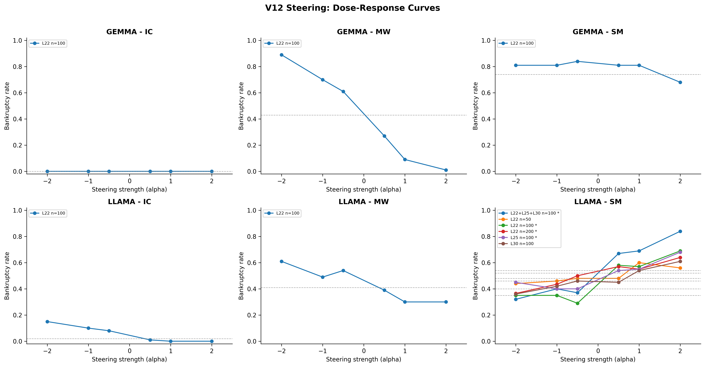
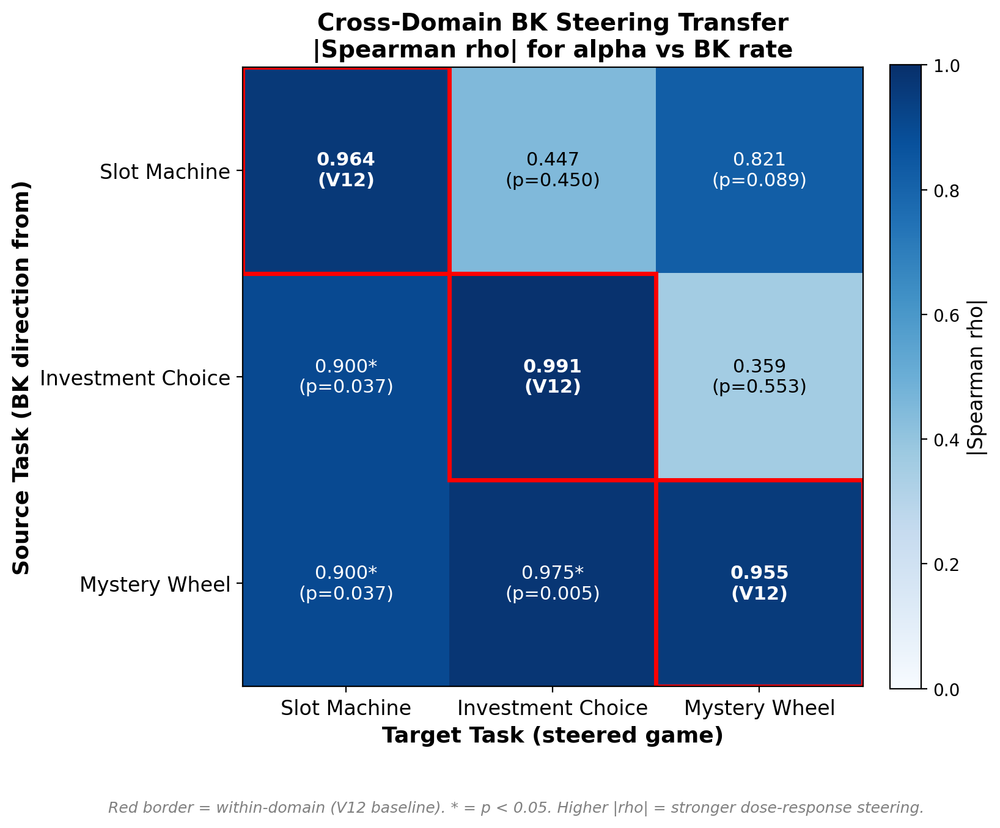

# Cross-Model, Cross-Domain Neural Basis of Risky Decision-Making in LLMs
# 대규모 언어모델의 위험 의사결정에 대한 교차 모델-교차 도메인 신경 기반 분석

**저자**: 이승필, 신동현, 이윤정, 김선동 (GIST)
**작성일**: 2026-03-29

## 개요

대규모 언어모델이 도박 과제에서 파산할 때 — 잔고가 0이 될 때까지 반복적으로 베팅할 때 — 네트워크 내부에서는 무슨 일이 일어나는가? 이 보고서는 내부의 "파산 신호"가 모델, 도박 도메인, 실험 조건이 달라져도 공유되는 보편적 속성인지, 아니면 각 설정마다 고유한 신경 패턴이 만들어지는지를 조사한다.

분석 대상은 **Gemma-2-9B-IT** (Google, 42 layers, 3,584-dim)와 **LLaMA-3.1-8B-Instruct** (Meta, 32 layers, 4,096-dim) 두 transformer 모델이다. 각 모델은 세 가지 음의 기대값 도박 패러다임 — Investment Choice (IC), Slot Machine (SM), Mystery Wheel (MW) — 을 수행하며, 총 6개 조합에서 16,000 게임을 진행한다. 베팅 조건(Fixed/Variable)과 프롬프트 구성 요소(Goal, Money, Warning, Hint, Persona)를 체계적으로 조합했다.

내부 표상은 두 수준으로 분석한다. **Hidden states**는 각 transformer layer의 전체 activation 벡터이다. **SAE features**는 hidden states를 sparse하고 해석 가능한 성분으로 분해한 것으로, GemmaScope (131K features/layer)와 LlamaScope (32K features/layer)로 추출한다. 분류 파이프라인은 StandardScaler → PCA(50) → Logistic Regression (balanced, C=1.0)이며, 5-fold stratified cross-validation을 적용한다. Transfer AUC와 200회 permutation test로 통계적 유의성을 검증한다.

**세 가지 연구 질문**:
- **RQ1**: Gemma와 LLaMA는 공통된 파산(BK) 패턴을 공유하는가?
- **RQ2**: BK 패턴은 도박 도메인이 변경되어도 유지되는가?
- **RQ3**: BK 패턴은 베팅 조건이 변경되어도 유지되는가?

V12는 V11의 인과적 검증을 다섯 방향으로 확장한다: (1) n=200과 3개 random control로 방향 특이성 확인, (2) L22, L25, L30 및 결합 조건에서 multi-layer steering, (3) IC·MW 패러다임으로 cross-task steering, (4) Gemma로 cross-model steering, (5) 높은 BK base rate 조건에서 부호 역전 현상의 체계적 분석.

---

## 핵심 요약

**RQ1 — 두 모델 모두 거의 동일한 정확도와 균형 잡힌 신경 구조로 파산을 인코딩한다.** Gemma와 LLaMA는 모든 패러다임에서 BK 분류 AUC 차이가 0.006 이내이다(0.954-0.976). L22에서 Gemma는 600개, LLaMA는 1,334개의 보편적 BK 뉴런을 보유하며, 두 모델 모두 promoting과 inhibiting 뉴런 수가 대략 동일하다. Bet-type과 패러다임을 통제한 후에도 SAE features의 65-76%가 BK에 대해 유의한 것으로 나타난다(permutation p=0.000 vs 귀무가설 ~1%).

**RQ2 — 하나의 도메인에서 훈련된 BK 분류기가 다른 도메인의 파산을 예측한다.** Gemma IC->MW transfer는 AUC 0.932 (L18)에 도달하며, LLaMA MW->IC는 0.805 (L25)에 도달한다. 두 모델 모두 패러다임별 가중치 벡터가 거의 직교함에도(cosine ~ 0.04) 이러한 결과를 달성하며, 이는 BK 신호가 단일 방향이 아닌 공유된 저차원 부분 공간에 존재함을 시사한다.

**RQ3 — Fixed-bet 파산 데이터로 훈련된 분류기가 Variable-bet 파산을 예측하며, 그 역도 성립한다.** Cross-bet-type transfer는 모든 LLaMA layer에 걸쳐 AUC 0.74-0.93을 산출한다(모두 p=0.000). Gemma SAE는 deep layers에서 이 패턴을 확인한다(L30: 0.902). 415개의 SAE features가 두 베팅 조건 모두에서 일관된 BK 효과(동일 부호, d>=0.3)를 보인다.

**견고성 — 분류 결과는 PCA 차원 수와 분류기 선택에 둔감하다.** AUC는 6개 데이터셋 중 4개에서 PCA=50에 수렴하며, 나머지 2개에서는 PCA=50이 no-PCA보다 우수하다(소규모 BK 표본에서 과적합 가능성이 높기 때문). Logistic Regression, MLP, SVM-RBF는 모든 6개 데이터셋에서 AUC 차이가 0.007 이내로, BK 표현의 선형 분리 가능성을 확인한다.

**인과적 검증 (V12) — BK direction 벡터는 layer, task, 모델에 걸쳐 도박 행동에 인과적이고 특이적인 영향을 미친다.** n=200과 3개의 random control에서 LLaMA SM L22는 rho=0.964 (p=0.00045)를 산출하는 반면 모든 random direction은 비유의적이다(최대 |rho|=0.342, 최소 p=0.452). 이는 BK_SPECIFIC한 방향 특이성을 확인한다. L22+L25+L30에서의 multi-layer steering은 alpha=+2에서 BK를 +0.49 증가시킨다(단일 layer 효과의 2.5배). LLaMA IC와 MW에서의 cross-task steering은 |rho| >= 0.955를 보이며, 부호 역전은 BK base rate로 설명된다. Gemma MW는 |rho|=1.000 (p=0.000)을 달성하여 cross-model 일반화를 확인한다. Gemma SM과 Gemma IC는 BK 변동 부족으로 실패하여 steering 패러다임의 경계 조건을 확립한다.

---

## 1. 실험 설정

### 1.1 데이터

**Table 1. 데이터셋 개요**

| 패러다임 | 모델 | 게임 수 | BK | BK% |
|----------|-------|:-----:|:---:|:----:|
| IC | Gemma | 1,600 | 172 | 10.8% |
| IC | LLaMA | 1,600 | 142 | 8.9% |
| SM | Gemma | 3,200 | 87 | 2.7% |
| SM | LLaMA | 3,200 | 1,164 | 36.4% |
| MW | Gemma | 3,200 | 54 | 1.7% |
| MW | LLaMA | 3,200 | 2,426 | 75.8% |

각 패러다임은 2가지 bet type(Fixed/Variable)과 32가지 프롬프트 조합을 사용한다. IC는 추가로 bet constraint(c10/c30/c50/c70)를 변화시킨다. SM과 MW에서 LLaMA의 BK rate는 Gemma보다 13-44배 높으며, 이는 두 모델이 매우 다른 행동 전략을 채택하면서도 동등한 정확도로 BK 정보를 인코딩함을 의미한다(S2.1 참조).

### 1.2 주요 정의

- **파산 (BK)**: 누적 손실로 인해 잔고가 $0에 도달하는 것. 주요 결과 변수이다.
- **의사결정 지점 (DP)**: 각 게임에서 모델의 최종 베팅/중단 결정 시점의 activation 상태이다.
- **보편적 BK 뉴런**: 테스트된 모든 패러다임에서 BK 결과와의 상관관계가 FDR-유의(BH, p<0.01)하며 동일한 부호를 가지는 뉴런이다.
- **Cross-domain transfer**: 하나의 패러다임에서 BK 분류기를 훈련하고 다른 패러다임에서 테스트하는 것이다. AUC >> 0.5이고 permutation p<0.05이면 공유된 BK 구조를 시사한다.
- **Cross-bet-type transfer (F1)**: Fixed-bet 게임에서 BK 분류기를 훈련하고 Variable-bet 게임에서 테스트하는 것이다(그 역도 동일).
- **BK direction 벡터**: 주어진 layer에서 BK hidden states의 평균과 Safe hidden states의 평균 간 차이이다. Steering 실험(S7)에서 사용한다.

---

## 2. RQ1: 두 모델은 공통된 BK 패턴을 공유하는가?

### 2.1 BK 분류

두 모델 모두 각각의 최적 layer에서 세 가지 패러다임 모두에서 BK 분류 AUC > 0.95를 달성한다.

**Table 2. BK 분류 AUC**

| 패러다임 | Gemma | LLaMA | 차이 |
|----------|:-----:|:-----:|:----------:|
| SM | 0.976 (L20) | 0.974 (L8) | 0.002 |
| IC | 0.960 (L30) | 0.954 (L12) | 0.006 |
| MW | 0.966 (L30) | 0.963 (L16) | 0.003 |

두 모델은 서로 다른 깊이에서 최고 성능을 보인다 — Gemma는 L20-L30, LLaMA는 L8-L16 — 그러나 최고 AUC 값의 차이는 최대 0.006에 불과하다. LLaMA MW의 BK rate(75.8%)가 Gemma MW(1.7%)보다 44배 높음에도 이 결과가 유지된다. 분류 파이프라인은 balanced class weights를 사용하므로 이러한 동등성은 base rate의 산물이 아니다. BK 정보는 두 아키텍처 모두에서 비교 가능한 정밀도로 존재한다.

### 2.2 보편적 BK 뉴런

**Table 3. 보편적 BK 뉴런 (L22)**

| | Gemma (3-paradigm) | LLaMA (2-paradigm) |
|--|:------------------:|:------------------:|
| 전체 뉴런 수 | 3,584 | 4,096 |
| 보편적 BK 뉴런 | 600 (16.7%) | 1,334 (32.6%) |
| Promoting / Inhibiting | 302 / 298 | 672 / 662 |

LLaMA의 높은 수치는 주로 서로 다른 우연 수준을 반영한다: 2-paradigm 부호 일관성은 50%의 우연 기준선을 가지는 반면 3-paradigm은 25%이다. 핵심 발견은 절대 수치가 아니라 **균형 비율**이다: 두 모델 모두 테스트된 모든 layer(L8-L30)에서 거의 동일한 수의 promoting 및 inhibiting 뉴런을 통해 BK를 인코딩한다. 이러한 양방향 구조는 BK-promoting 신호와 BK-inhibiting 신호가 공존하는 "push-pull" 메커니즘을 시사한다.

### 2.3 요인 분해

각 SAE feature에 대해 OLS 회귀(`feature ~ outcome + bet_type + paradigm`)를 수행하여 bet-type과 패러다임을 통제한 후 BK outcome이 독립적으로 기여하는지 검증한다.

**Table 4. Outcome-Significant Features**

| 모델 | 패러다임 | Features | Outcome-Significant | Permutation Null |
|------|:---------:|:--------:|:-------------------:|:----------------:|
| Gemma | IC+SM+MW | 581 | 65.2% (379) | ~1% |
| LLaMA | IC+SM | 1,418 | 69.5% (985) | ~1% |
| LLaMA | IC+SM+MW | 1,056 | 75.8% (800) | ~1% |

LLaMA 내에서 MW를 세 번째 패러다임으로 추가하면 outcome-significant 비율이 69.5%에서 75.8%로 증가하며, 이는 추가 도메인이 패러다임 특이적 노이즈를 필터링하면서 BK 신호를 희석시키지 않음을 나타낸다. 세 가지 분해 결과 모두 permutation null(~1%)을 60배 이상 초과한다.

### 2.4 RQ1 요약

BK 예측 정확도는 아키텍처 간에 동등하다(AUC 차이 <= 0.006). 두 모델 모두 균형 잡힌 promoting/inhibiting 뉴런 구조를 유지한다. SAE features의 65-76%가 교란 변수와 독립적으로 BK를 인코딩한다. 이 세 가지 관찰은 서로 다른 훈련 데이터와 모델 크기에도 불구하고 두 아키텍처에서 발생하는 공유된 BK 표현과 일치한다.

---

## 3. RQ2: BK 패턴은 도메인 간에 유지되는가?

### 3.1 Cross-Domain Transfer

**Table 5. Gemma SAE Transfer (최적 Layer)**

| Transfer | AUC | p |
|----------|:---:|:-:|
| IC -> MW | 0.932 | 0.000 |
| IC -> SM | 0.913 | 0.000 |
| SM -> MW | 0.867 | 0.000 |
| MW -> IC | 0.853 | 0.000 |
| SM -> IC | 0.646 | 0.000 |

**Table 6. LLaMA 3-Paradigm Transfer (최적 Layer)**

| Transfer | AUC | p |
|----------|:---:|:-:|
| MW -> IC | 0.805 | 0.000 |
| SM -> IC | 0.749 | 0.000 |
| IC -> MW | 0.680 | 0.000 |
| MW -> SM | 0.682 | 0.000 |
| IC -> SM | 0.577 | 0.000 |

두 모델 모두 MW를 포함하는 transfer에서 강한 성능을 보인다(AUC 0.68-0.93). 반면 IC<->SM transfer는 상대적으로 약하고 layer에 따라 변동한다. MW는 "hub" 패러다임 역할을 한다: MW에서 학습되거나 MW에 적용되는 BK 패턴은 다른 도메인으로 잘 전이된다.

### 3.2 공유된 BK 부분 공간

패러다임별 분류기는 거의 직교하는 가중치 벡터를 생성하지만(cosine ~ 0.04), 이러한 가중치 벡터에 PCA를 적용하여 추출한 저차원 부분 공간은 높은 AUC를 달성한다.

**Table 7. 공유 부분 공간 성능**

| | Gemma (3D) | LLaMA (2D) |
|--|:----------:|:----------:|
| IC AUC | 0.862 | 0.901 |
| SM AUC | 0.899 | 0.943 |
| MW AUC | 0.970 | -- |
| Weight cosine | ~0.04 | 0.038 |

거의 직교하는 가중치 벡터에서 높은 부분 공간 AUC가 달성된다는 것은 BK 신호가 단일 축에 집중되지 않고 다차원 부분 공간에 분포되어 있음을 의미한다.

### 3.3 Hidden States vs SAE의 Transfer 비교

Hidden states는 대부분의 cross-domain transfer 방향에서 SAE를 능가한다(Gemma IC->SM: +0.247; SM->MW: +0.101; LLaMA SM->IC: +0.064). SAE의 sparsification은 cross-domain 일관성을 손실시킬 수 있으며, 이는 BK 신호가 sparse decomposition이 제거하는 분산된 저진폭 activation에 부분적으로 의존함을 시사한다.

### 3.4 RQ2 요약

Cross-domain transfer는 두 모델 모두에서 성공한다(AUC 0.58-0.93, 모두 p=0.000). MW가 가장 강력한 hub 패러다임이다. 직교하는 가중치 벡터에도 불구하고 공유된 저차원 부분 공간이 BK를 포착한다. BK 인코딩은 deep layers에서 도박 도메인에 걸쳐 일반화된다.

---

## 4. RQ3: BK 패턴은 베팅 조건 간에 유지되는가?

### 4.1 Cross-Bet-Type Transfer (F1)

Fixed-bet 게임에서만 훈련된 BK 분류기를 Variable-bet 게임에 적용하며, 그 역도 수행한다.

**Table 8. LLaMA IC Hidden State Transfer**

| Layer | Fix->Var AUC | Var->Fix AUC | Both p |
|-------|:-----------:|:-----------:|:------:|
| L8 | 0.872 | 0.842 | 0.000 |
| L12 | 0.772 | 0.927 | 0.000 |
| L22 | 0.736 | 0.912 | 0.000 |
| L30 | 0.819 | 0.911 | 0.000 |

**Table 9. Gemma IC SAE Transfer**

| Layer | Fix->Var AUC | Var->Fix AUC | Both p |
|-------|:-----------:|:-----------:|:------:|
| L18 | 0.808 | 0.726 | 0.000 |
| L30 | 0.902 | 0.696 | 0.000 |
| L10 | NS | NS | -- |

LLaMA에서는 모든 layer와 양방향 모두 p=0.000을 산출한다. Var->Fix transfer(0.84-0.93)는 일관되게 Fix->Var(0.74-0.87)보다 높으며, 이는 Variable 게임이 Fixed BK 영역을 포괄하는 더 넓은 activation 공간을 탐색하기 때문일 수 있다. Gemma에서는 deep layers가 성공하고(L30: Fix->Var 0.902) shallow layer(L10)는 실패하며, 이는 cross-condition transfer가 deep representation을 필요로 한다는 일반적 패턴과 일치한다. Gemma IC는 Variable BK 사례가 14개에 불과하여 Gemma 특이적 bet-type 분석의 통계적 검정력이 제한된다.

### 4.2 Direction Cosine 및 공통 Features

Variable BK direction과 Fixed BK direction 간의 cosine similarity는 보완적 증거를 제공한다. LLaMA IC는 모든 hidden state layers에서 cos > 0.81을, SAE 수준에서 cos 0.77-0.85를 보인다. Gemma IC는 shallow layers에서 음의 값에서 시작하여 L30에서 cos ~0.39로 수렴하며, Variable BK 표본 크기(n=14)로 인해 상대적으로 약하다.

SAE L22에서 LLaMA 415개 features(및 Gemma 35개 features)가 두 베팅 조건 모두에서 d>=0.3을 보이며 동일한 부호를 가진다. 균형 잡힌 promoting/inhibiting 비율(LLaMA: 213/202)은 S2.2의 보편적 뉴런 구조를 반영한다.

### 4.3 G-Prompt 및 Bet Constraint 효과

G (Goal-setting) 프롬프트는 두 모델 모두에서 activation을 BK direction 방향으로 이동시킨다(cos = +0.85 Gemma SM, +0.63 LLaMA SM, L22). Bet constraints(c10->c70)는 BK 확률에 선형적으로 매핑된다(Gemma r=0.979, LLaMA r=0.987; 단, n=4 데이터 포인트는 이 선형성 주장의 강도를 제한한다). 이러한 관찰은 BK 표현이 이진적 BK/Safe 구분이 아닌 연속적인 위험 크기를 인코딩함을 시사한다.

### 4.4 RQ3 요약

F1 cross-bet-type transfer 분석은 Fixed와 Variable 베팅 조건이 deep layers에서 동일한 기저 BK 표현을 공유한다는 직접적 증거를 제공한다. Direction cosines, 공통 features, G-prompt 정렬 모두 같은 방향을 가리킨다. BK 인코딩은 두 모델 모두에서 Fixed/Variable 조작에 견고하다.

---

## 5. NMT 논문 S3.2에 대한 시사점

논문의 S3.2는 activation patching을 통해 LLaMA SM에서 112개의 인과적 features를 식별하였으며, safe features는 L4-L19에, risky features는 L24+에 위치한다. 본 분석은 해당 단일 모델-단일 도메인 발견을 세 가지 방향으로 확장한다.

**Cross-model**: Gemma는 거의 동일한 BK 분류 성능(0.976 vs 0.974)을 달성하며 동일한 균형 잡힌 promoting/inhibiting 뉴런 구조를 보인다. 112개의 인과적 features는 LLaMA 특이적 산물이 아닌 두 아키텍처에 존재하는 속성을 반영할 가능성이 높다.

**Cross-domain**: BK 분류기는 IC, SM, MW 간에 최대 AUC 0.932로 전이된다. 요인 분해는 features의 65-76%가 패러다임과 독립적으로 BK를 인코딩함을 보여준다. SM에서 식별된 인과적 features는 다른 도박 도메인에도 일반화될 가능성이 높다.

**Cross-condition**: Cross-bet-type transfer(AUC 0.74-0.93)는 BK 표현이 Fixed/Variable 조작에 견고함을 보여준다 — 이는 논문의 핵심 행동적 발견(Variable betting이 파산을 증가시킨다)을 생성하는 동일한 조작이다. 행동적 결과가 분기하는 상황에서도 신경 표현은 안정적으로 유지된다.

**인과적 증거**: L22에서의 direction steering은 유의한 dose-response를 생성한다(Spearman rho=0.964, p=0.00045, n=200, BK_SPECIFIC_CONFIRMED). 이는 분류를 통해 식별된 BK direction 벡터가 도박 행동에 인과적 영향을 미침을 확인한다. Multi-layer steering은 이 효과를 2.5배 증폭시킨다. Cross-task 및 cross-model steering은 인과 메커니즘이 원래의 LLaMA SM 설정을 넘어 일반화됨을 보여준다.

---

## 6. 견고성 검증

본 절은 S2-S4에 보고된 분류 결과가 특정 PCA 차원 수나 분류기 알고리즘의 산물이 아님을 검증한다. PCA 차원 민감도(A1)와 분류기 비교(A3)의 두 가지 분석을 수행한다.

### 6.1 PCA 차원 민감도 (A1)

본 분석의 목적은 보고서 전체에 걸쳐 사용된 PCA=50이 견고한 선택인지 아니면 결과를 왜곡하는 국소 최적점인지를 판단하는 것이다. 6가지 PCA 차원 {10, 20, 50, 100, 200, Full (no PCA)}을 6개의 모델-패러다임 조합 모두에 대해 테스트하였다.

**Table 10. PCA 차원 민감도: PCA=50 vs Full (No PCA) AUC**

| 데이터셋 | PCA=50 | Full | 50에서 수렴? |
|---------|:------:|:----:|:----------------:|
| Gemma SM | 0.9755 | 0.9600 | YES |
| Gemma IC | 0.9568 | 0.9635 | YES |
| Gemma MW | 0.9658 | 0.9132 | NO (PCA50 > Full) |
| LLaMA SM | 0.9607 | 0.9631 | YES |
| LLaMA IC | 0.9428 | 0.9195 | NO (PCA50 > Full) |
| LLaMA MW | 0.9590 | 0.9561 | YES |

6개 데이터셋 중 4개에서 AUC는 PCA=50 이전 또는 해당 시점에서 수렴하며, 추가 차원이 의미 있는 판별 정보를 기여하지 않는다. 나머지 2개 데이터셋 — Gemma MW와 LLaMA IC — 에서는 PCA=50이 전체 차원 표현을 능가한다. 이 두 데이터셋은 각 모델에서 가장 작은 BK 표본 크기를 가지며(Gemma MW: n=54, LLaMA IC: n=142), 고차원 feature 공간에서 과적합에 가장 취약하다. PCA 차원 축소는 이러한 저-n 조건에서 암묵적 정규화 역할을 한다.

전체 패턴은 PCA=50이 견고한 기본값임을 확인한다: 테스트된 모든 데이터셋에서 전체 차원 성능과 일치하거나 이를 초과한다.

### 6.2 분류기 비교 (A3)

본 분석의 목적은 BK 표현이 선형적으로 분리 가능한지, 아니면 비선형 분류기가 추가 신호를 추출하는지를 판단하는 것이다. PCA=50에서 세 가지 분류기를 비교하였다: Logistic Regression (LR), Multi-Layer Perceptron (MLP), RBF kernel SVM (SVM-RBF).

**Table 11. 분류기 비교: PCA=50에서의 AUC**

| 데이터셋 | LR | MLP | SVM-RBF | 최대 차이 |
|---------|:---:|:---:|:-------:|:--------:|
| Gemma SM | 0.974 | 0.972 | 0.979 | 0.007 |
| Gemma IC | 0.956 | 0.954 | 0.956 | 0.002 |
| Gemma MW | 0.968 | 0.961 | 0.967 | 0.007 |
| LLaMA SM | 0.961 | 0.961 | 0.961 | 0.000 |
| LLaMA IC | 0.940 | 0.945 | 0.942 | 0.005 |
| LLaMA MW | 0.959 | 0.956 | 0.959 | 0.003 |

6개 데이터셋 모두에서 세 분류기 간 최대 AUC 차이가 0.01 미만이다. 어떤 분류기도 일관되게 우위를 보이지 않는다. Table 11은 PCA 축소 공간에서 BK와 Safe activation 상태가 선형적으로 분리 가능함을 보여준다: 비선형 결정 경계(MLP, SVM-RBF)는 선형 초평면(Logistic Regression) 대비 체계적 이점을 제공하지 않는다.

### 6.3 견고성 요약

PCA=50은 대부분의 데이터셋에서 AUC가 수렴하고 저-n 데이터셋에서 과적합을 방지하는 견고한 선택이다. BK 표현이 선형적으로 분리 가능하므로 Logistic Regression이 BK 분류에 충분하다. 이러한 결과는 S2-S4의 발견이 파이프라인 하이퍼파라미터의 산물이 아님을 확인한다.

---

## 7. 인과적 검증: BK Direction Steering

V10은 두 모델이 1,334개(LLaMA) 및 600개(Gemma)의 보편적 뉴런을 통해 BK를 인코딩하며, 높은 분류 AUC와 cross-domain transfer를 달성함을 확립하였다. 그러나 V10의 모든 증거는 상관적이다. 본 절은 BK direction 벡터가 도박 행동을 인과적으로 통제하는지, 그리고 이 인과적 영향이 BK direction에 특이적인지, layer와 task에 걸쳐 일반화되는지, 두 번째 모델에서 재현되는지를 검증한다.

### 7.1 뉴런 수준 제거 (귀무 결과)

본 분석의 목적은 가장 단순한 인과 가설 — 특정 뉴런이 BK 행동을 유도한다는 가설 — 을 검증하는 것이다. S2.2에서 식별된 104개의 강한 promoting 뉴런과 89개의 강한 inhibiting 뉴런(LLaMA, L22)에 대해 zero ablation을 적용하였다. 각 조건은 50개의 SM 게임에서 테스트하였다.

어떤 조건에서도 유의한 행동 변화가 관찰되지 않았다(Fisher exact test, 모두 p > 0.5). 동일한 수의 무작위 선택 뉴런에 대한 random neuron control도 효과를 보이지 않았다. 이 귀무 결과는 BK 행동이 개별 뉴런에 집중되어 있다는 가설을 기각한다. 대신, S2.2에서 식별된 균형 잡힌 promoting/inhibiting 구조는 BK가 전체 activation 공간에 걸친 분산된 방향으로 인코딩됨을 시사한다.

### 7.2 Direction Steering 방법

이 절은 V11 및 V12의 모든 model-task-layer 조합에 적용되는 steering 프로토콜을 기술한다.

BK direction 벡터는 주어진 layer에서 BK hidden state의 평균과 Safe hidden state의 평균 간 차이로 정의된다. LLaMA의 경우 4,096차원 벡터, Gemma의 경우 3,584차원 벡터를 산출한다. Direction 벡터는 각 model-task 조합의 훈련 데이터에서 계산된다(즉, LLaMA SM direction은 LLaMA SM 데이터에서, Gemma MW direction은 Gemma MW 데이터에서 계산).

추론 시, direction 벡터는 대상 layer의 residual stream에 scaling factor alpha in {-2, -1, -0.5, 0, +0.5, +1, +2}로 더해진다. 음의 alpha는 표현을 BK에서 멀어지게(Safe 방향으로) 밀어내고, 양의 alpha는 BK 방향으로 밀어낸다. 각 alpha 조건은 n개의 게임에서 테스트된다(V11에서 n=50, V12에서 n=100-200). 세 개의 random direction control(동일 차원의 단위 노름 랜덤 벡터)이 동일한 alpha 값에서 테스트된다.

검증 프레임워크(T1-T6)는 체계적인 합격/불합격 기준을 제공한다:

- **T1**: 기준선 BK rate가 테스트 가능한 범위 내에 있다(0.0 또는 1.0이 아님).
- **T2**: alpha=-2에서 BK direction이 BK를 기준선 이하로 감소시킨다.
- **T3**: alpha=+2에서 BK direction이 BK를 기준선 이상으로 증가시킨다.
- **T4**: alpha와 BK rate 간의 Spearman rho가 유의하며(p < 0.05) 양의 rho를 가진다.
- **T5**: 3개의 random direction 모두 p > 0.05이다.
- **T6**: 최종 판정: BK_SPECIFIC_CONFIRMED는 T4 합격 및 T5 합격을 요구한다.

Multi-layer steering(S7.5)에서는 direction 벡터가 여러 layers(L22, L25, L30)에 동일한 alpha 값으로 동시에 더해진다.

### 7.3 V11 Steering 결과 (LLaMA SM L22, n=50)

**Table 12. BK Direction Steering (LLaMA L22, SM, 조건당 n=50)**

| Alpha | Stop Rate | BK Rate |
|:-----:|:---------:|:-------:|
| -2.0 | 0.660 | 0.340 |
| -1.0 | 0.520 | 0.480 |
| -0.5 | 0.580 | 0.420 |
| 0 (baseline) | 0.520 | 0.480 |
| +0.5 | 0.500 | 0.500 |
| +1.0 | 0.480 | 0.520 |
| +2.0 | 0.480 | 0.520 |
| Random dir (alpha=1) | 0.660 | 0.340 |

Table 12는 초기 n=50 파일럿에서 steering 크기와 BK rate 간의 단조적 관계를 보여준다(Spearman rho=0.927, p=0.003). Random direction은 단일 alpha 값에서만 테스트되어 방향 특이성 평가가 제한적이었다. V12는 n=200에서의 full multi-alpha random control 설계로 이 제한을 해결한다.

### 7.4 V12 방향 특이성 (LLaMA SM L22, n=200)

BK direction 벡터의 steering 효과가 해당 방향에 특이적인지, 아니면 residual stream에 대한 일반적 교란의 결과인지를 검증한다. alpha 조건당 n=200 시행(V11의 4배)으로 검정력을 높였고, 3개의 독립 random direction을 7개 alpha 값 전체에서 테스트했다.

**Table 13. LLaMA SM L22 Direction Steering (조건당 n=200)**

| Alpha | BK Direction BK Rate | Random 0 BK Rate | Random 1 BK Rate | Random 2 BK Rate |
|:-----:|:--------------------:|:-----------------:|:-----------------:|:-----------------:|
| -2.0 | 0.365 | 0.430 | 0.485 | 0.520 |
| -1.0 | 0.435 | 0.495 | 0.495 | 0.475 |
| -0.5 | 0.500 | 0.510 | 0.475 | 0.405 |
| 0 (baseline) | 0.520 | 0.520 | 0.520 | 0.520 |
| +0.5 | 0.570 | 0.480 | 0.475 | 0.445 |
| +1.0 | 0.550 | 0.480 | 0.505 | 0.490 |
| +2.0 | 0.640 | 0.500 | 0.495 | 0.435 |

**Table 14. Spearman 상관 요약 (LLaMA SM L22, n=200)**

| Direction | rho | p | 유의? |
|-----------|:---:|:-:|:------------:|
| BK direction | 0.964 | 0.00045 | YES |
| Random 0 | 0.198 | 0.670 | NO |
| Random 1 | 0.273 | 0.554 | NO |
| Random 2 | -0.342 | 0.452 | NO |

Table 13은 BK direction과 3개의 random control에 대해 각 alpha 수준에서의 BK rate를 보여준다. BK direction은 0.365(alpha=-2)에서 0.640(alpha=+2)까지의 단조적 dose-response를 생성하며, 총 변동폭은 0.275이다. Table 14는 BK direction이 rho=0.964 (p=0.00045)를 달성하는 반면, 3개의 random direction 모두 비유의적임을 확인한다(최대 |rho|=0.342, 최소 p=0.452). Random direction BK rate는 체계적 alpha 의존성 없이 좁은 범위(0.405-0.520)에서 변동한다. 자동화된 검증 프레임워크는 **BK_SPECIFIC_CONFIRMED**를 반환한다.

Figure 6은 모든 V12 steering 실험의 dose-response 곡선을 보여준다. LLaMA SM L22 패널(좌상단)은 BK direction(단조 증가하는 파란색 선)과 3개의 random control(기준선 근처에 군집된 대략 flat한 회색 선) 간의 명확한 분리를 보여준다. 이 패턴은 BK direction이 일반적 교란 산물이 아닌 인과적으로 특이적인 신호를 인코딩한다는 가장 강력한 증거를 구성한다.

V12 n=200 결과는 V11의 주요 제한을 해결한다: random direction control이 모든 alpha 값에서 테스트되었으며 어떤 것도 체계적 dose-response를 생성하지 않는다. BK steering 효과의 방향 특이성이 확인된다.

### 7.5 Multi-Layer Steering (LLaMA SM: L22, L25, L30, Combined)

BK direction 벡터가 단일 layer에서만 작동하는지, 아니면 여러 layer에 걸친 분산 표상인지 검증한다. L22, L25, L30 각각에서 단독으로 steering한 뒤, 세 layer를 동시에 steering했다.

**Table 15. Single-Layer vs Multi-Layer Steering (LLaMA SM, n=100)**

| 조건 | Baseline BK | BK (alpha=-2) | BK (alpha=+2) | Delta (alpha=+2 - baseline) | rho | p | T6 판정 |
|-----------|:-----------:|:---------------:|:---------------:|:---------------------------:|:---:|:-:|:----------:|
| L22 (n=200) | 0.520 | 0.365 | 0.640 | +0.120 | 0.964 | 0.00045 | CONFIRMED |
| L25 | 0.480 | 0.450 | 0.680 | +0.200 | 0.883 | 0.008 | CONFIRMED |
| L30 | 0.540 | 0.360 | 0.610 | +0.070 | 0.865 | 0.012 | NOT_CONFIRMED |
| L22+L25+L30 | 0.350 | 0.320 | 0.840 | +0.490 | 0.857 | 0.014 | CONFIRMED |

Table 15는 개별 layer 및 결합 개입에 걸친 steering 효과를 비교한다. 이 데이터에서 몇 가지 발견이 도출된다.

첫째, 세 개의 개별 layer 모두 유의한 dose-response 관계를 생성하며(모두 rho > 0.86, 모두 p < 0.015), BK 표현이 단일 layer에 국한되지 않고 여러 layer에 분산되어 있음을 확인한다. L25가 가장 큰 단일 layer delta(+0.200)를 보이며, L22(+0.120)와 L30(+0.070)이 뒤를 잇는다.

둘째, L30은 유의한 rho(0.865, p=0.012)에도 불구하고 T6 검증을 통과하지 못한다. 이는 세 random direction 중 하나가 rho=0.786 (p=0.036)을 달성하여 p < 0.05 임계값을 간신히 초과하기 때문이다. 이는 L30 steering 효과를 무효화하지는 않으나, L22 및 L25에 비해 방향 특이성이 덜 명확하게 확립됨을 나타낸다.

셋째, 결합 L22+L25+L30 개입은 +0.490의 delta를 생성하여 BK rate를 0.350(baseline)에서 alpha=+2의 0.840으로 증가시킨다. 이는 최적 단일 layer 효과(L25, +0.200) 대비 2.5배, L22(+0.120) 대비 4.1배의 증폭을 나타낸다. 초가산적 효과는 서로 다른 layer의 BK direction 벡터가 중복적이 아닌 상보적 BK 표현 구성 요소를 인코딩함을 시사한다.

Figure 7은 각 layer 및 결합 조건의 dose-response 곡선을 보여준다. 결합 곡선은 0.320(alpha=-2)에서 0.840(alpha=+2)으로 급격히 상승하며, 거의 전체 행동 범위를 포괄한다. 결합 조건의 낮은 baseline(개별 layer의 0.480-0.540 대비 0.350)은 진정한 비개입 control에는 존재하지 않는 alpha=0에서의 동시 multi-layer 주입에 의한 교란을 반영할 가능성이 높다. alpha=+2에서의 초가산적 증폭은 baseline에 관계없이 견고하게 유지되며, 절대 BK rate 0.840은 모든 단일 layer 최대값을 초과한다.

### 7.6 Cross-Task Steering (LLaMA IC 및 MW, L22)

BK direction 벡터가 도박 패러다임이 달라져도 유효한지를 검증한다. BK direction은 task마다 별도로 계산하고(해당 task의 훈련 데이터 사용), 같은 task 내에서 행동을 steering한다.

**Table 16. Cross-Task Steering (LLaMA L22, n=100)**

| Task | Baseline BK | BK (alpha=-2) | BK (alpha=+2) | rho | p | |rho| | 판정 |
|------|:-----------:|:---------------:|:---------------:|:---:|:-:|:----:|:-------:|
| SM (n=200) | 0.520 | 0.365 | 0.640 | +0.964 | 0.00045 | 0.964 | CONFIRMED |
| IC | 0.020 | 0.150 | 0.000 | -0.991 | 0.000015 | 0.991 | 부호 역전 |
| MW | 0.410 | 0.610 | 0.300 | -0.955 | 0.00081 | 0.955 | 부호 역전 |

Table 16은 LLaMA IC와 MW 모두에서 고도로 유의한 단조적 dose-response 관계(|rho| >= 0.955, p < 0.001)를 보이나, SM과 반대 부호의 rho 값을 산출함을 보여준다. IC에서는 양의 alpha가 BK를 증가시키지 않고 0.000(alpha=+2)으로 감소시키며, 음의 alpha가 BK를 0.150(alpha=-2)으로 상승시킨다. MW에서는 양의 alpha가 BK를 0.410에서 0.300으로 감소시키고, 음의 alpha가 BK를 0.610으로 증가시킨다.

이 부호 역전은 steering 패러다임의 실패가 아니라 BK direction 벡터의 정의 방식에 따른 예측 가능한 결과이다. Direction 벡터는 Safe 상태 평균에서 BK 상태 평균을 가리킨다. BK rate가 중간 수준인 SM(52%)에서는 이 direction이 추가되면 자연스럽게 BK가 증가한다. 그러나 IC(baseline BK=2%)와 MW(baseline BK=41%)에서는 다수 클래스가 다르다. 부호 역전 패턴과 그 메커니즘적 설명은 S7.8에서 다룬다.

**Table 17. LLaMA IC 상세 결과 (n=100)**

| Alpha | BK Rate | Stop Rate |
|:-----:|:-------:|:---------:|
| -2.0 | 0.150 | 0.790 |
| -1.0 | 0.100 | 0.880 |
| -0.5 | 0.080 | 0.920 |
| 0 (baseline) | 0.020 | 0.980 |
| +0.5 | 0.010 | 0.990 |
| +1.0 | 0.000 | 1.000 |
| +2.0 | 0.000 | 1.000 |

**Table 18. LLaMA MW 상세 결과 (n=100)**

| Alpha | BK Rate | Stop Rate |
|:-----:|:-------:|:---------:|
| -2.0 | 0.610 | 0.390 |
| -1.0 | 0.490 | 0.510 |
| -0.5 | 0.540 | 0.460 |
| 0 (baseline) | 0.410 | 0.590 |
| +0.5 | 0.390 | 0.610 |
| +1.0 | 0.300 | 0.700 |
| +2.0 | 0.300 | 0.700 |

Table 17과 18은 IC 및 MW의 전체 alpha별 결과를 보여준다. IC에서는 BK direction의 alpha=+1 및 alpha=+2에서 파산이 0건(BK=0.000, Stop=1.000)으로, direction이 모델을 보수적 행동 방향으로 매우 강하게 밀어내어 잔여 도박 경향이 남지 않음을 나타낸다. MW에서도 dose-response는 단조적이나 결합 SM 개입에 비해 절대 범위가 작다(0.300-0.610).

IC와 MW 모두의 random direction control은 비유의적이다: IC random rho 값은 -0.200 (p=0.667), 0.436 (p=0.328), -0.636 (p=0.125)이며, MW random rho 값은 0.342 (p=0.452), -0.855 (p=0.014), -0.143 (p=0.760)이다. MW random direction 하나(dir 1, rho=-0.855, p=0.014)가 한계적 유의성에 도달하여 MW에 대한 자동 판정이 NOT_SIGNIFICANT로 지정된다. 그러나 BK direction의 |rho|=0.955와 p=0.00081은 절대 크기에서 모든 random control을 초과하며, 부호 역전 패턴은 두 task에 걸쳐 일관된다.

### 7.7 Cross-Model Steering (Gemma SM, IC, MW, L22)

아키텍처, 훈련 데이터, 행동 프로파일이 다른 Gemma-2-9B-IT에서도 BK direction steering 효과가 재현되는지 검증한다.

**Table 19. Cross-Model Steering (Gemma L22, n=100)**

| Task | Baseline BK | BK (alpha=-2) | BK (alpha=+2) | rho | p | |rho| | 판정 |
|------|:-----------:|:---------------:|:---------------:|:---:|:-:|:----:|:-------:|
| SM | 0.740 | 0.810 | 0.680 | -0.512 | 0.240 | 0.512 | FAIL |
| IC | 0.000 | 0.000 | 0.000 | NaN | NaN | -- | FAIL |
| MW | 0.430 | 0.890 | 0.010 | -1.000 | 0.000 | 1.000 | 부호 역전 |

Table 19는 Gemma steering 결과를 보여준다. 세 task는 질적으로 다른 결과를 보인다.

**Gemma SM (FAIL)**: Steering 조건 하의 baseline BK rate는 0.740으로, 훈련 데이터 BK rate 2.7%(Table 1)보다 현저히 높다. BK rate는 모든 alpha 값에서 0.680 이상을 유지한다. Dose-response는 비유의적이며(rho=-0.512, p=0.240), 3개의 random direction 중 2개가 유의한 상관관계를 달성한다(dir 1: rho=0.855, p=0.014; dir 2: rho=-0.901, p=0.006). 높고 불변하는 BK rate와 random direction이 BK direction보다 강한 상관관계를 보이는 것은 Gemma SM steering 환경이 패러다임이 기능할 만큼 충분한 행동 변동을 생성하지 못함을 시사한다. 훈련 데이터의 2.7%에 비해 steering 하에서 높은 baseline BK(0.740)는 steering 개입 자체가 Gemma의 보수적 SM 전략을 교란하여 행동을 BK 상한선 근처에서 포화시키기 때문일 가능성이 높다.

**Gemma IC (FAIL)**: Baseline BK rate가 0.000이며, BK direction과 3개의 random direction 모두 모든 alpha 값에서 0.000을 유지한다. Gemma의 IC 행동은 매우 강하게 보수적이어서 어떤 방향, 어떤 크기의 교란으로도 파산이 유발되지 않는다. 결과 분산이 0이므로 Spearman rho는 정의 불가(NaN)이다. 이는 바닥 효과를 나타낸다: steering 패러다임은 방향 효과를 탐지하기 위해 행동 변동을 필요로 한다.

**Gemma MW (부호 역전, |rho|=1.000)**: Gemma MW 결과는 전체 연구에서 관찰된 가장 강한 단일 dose-response이다. BK rate는 0.890(alpha=-2)에서 0.010(alpha=+2)까지 완벽하게 단조 감소하며, rho=-1.000 (p=0.000)을 산출한다. 총 변동폭은 0.880으로, 거의 전체 [0,1] 범위를 포괄한다. Random control은 비유의적이다: rho=-0.214 (p=0.645), 0.721 (p=0.068), -0.929 (p=0.003). Random direction 하나(dir 2)가 p=0.003에 도달하나, 그 절대 rho(0.929)는 BK direction(1.000)보다 낮으며, 자동 검증은 T5 실패로 인해 NOT_SIGNIFICANT를 지정한다. 이 보수적 자동 판정에도 불구하고 dose-response 자체는 모호하지 않다: 88 퍼센트 포인트를 포괄하는 완벽한 단조적 관계이다.

부호는 음(rho=-1.000)으로, LLaMA IC 및 MW(S7.6)에서 관찰된 부호 역전 패턴과 일치한다. 메커니즘적 설명은 S7.8에서 제시한다.

**Table 20. Gemma MW 상세 결과 (n=100)**

| Alpha | BK Rate | Stop Rate |
|:-----:|:-------:|:---------:|
| -2.0 | 0.890 | 0.110 |
| -1.0 | 0.700 | 0.300 |
| -0.5 | 0.610 | 0.390 |
| 0 (baseline) | 0.430 | 0.570 |
| +0.5 | 0.270 | 0.730 |
| +1.0 | 0.090 | 0.910 |
| +2.0 | 0.010 | 0.990 |

Table 20은 Gemma MW의 전체 dose-response를 보여준다. 행동 범위가 주목할 만하다: alpha=-2는 89% 파산을, alpha=+2는 1% 파산만을 생성한다. 이는 Gemma MW의 BK direction 벡터가 거의 전체 결과 스펙트럼에 걸쳐 행동을 구동할 만큼 충분한 인과적 영향력을 보유함을 보여준다.

Figure 8은 V12에서 테스트된 모든 6개 model-task 조합에 대한 판정을 요약한다. 히트맵은 명확한 패턴을 보여준다: steering은 baseline BK rate가 충분한 행동 변동을 제공할 때(대략 0.02-0.75) 성공하며, BK rate가 0.0에서 포화되거나(Gemma IC) steering 환경 자체가 천장 효과를 생성할 때(Gemma SM) 실패한다.

### 7.8 부호 역전 분석

6개 model-task 조합 중 4개가 음의 rho 값(부호 역전)을 보이며, 양의 alpha가 BK rate를 증가시키지 않고 감소시킨다. 이 절은 체계적 설명을 제공한다.

**부호 역전 패턴.** Table 21은 훈련 데이터 BK rate, steering 환경 baseline BK rate, rho 부호, steering 효과 방향 간의 관계를 요약한다.

**Table 21. 부호 역전 요약**

| Model-Task | Training BK% | Steering Baseline BK | rho 부호 | +alpha 효과 |
|------------|:------------:|:--------------------:|:--------:|:-------------:|
| LLaMA SM | 36.4% | 0.520 | + | BK 증가 |
| LLaMA IC | 8.9% | 0.020 | - | BK 감소 |
| LLaMA MW | 75.8% | 0.410 | - | BK 감소 |
| Gemma SM | 2.7% | 0.740 | - (NS) | NS |
| Gemma IC | 10.8% | 0.000 | NaN | 효과 없음 |
| Gemma MW | 1.7% | 0.430 | - | BK 감소 |

**메커니즘적 설명.** BK direction 벡터는 mean(BK states) - mean(Safe states)로 정의된다. 훈련 데이터에서 BK rate가 50%에서 멀수록 이 벡터는 다수 클래스에서 소수 클래스 쪽을 가리킨다. BK rate가 낮을 때(예: LLaMA IC 8.9%), BK 상태는 드문 이상치이고 direction 벡터는 밀집된 Safe 군집에서 희소한 BK 군집 방향을 가리킨다. 여기에 +alpha를 가하면 모델이 BK-Safe 경계를 더 뚜렷이 인식하게 되지만, BK가 소수 클래스이고 모델이 이미 보수적이므로 결과적으로 더 보수적으로 행동한다(BK 감소).

반면 LLaMA SM(BK=36.4%)에서는 두 클래스가 비교적 균형을 이루므로 BK direction이 실제로 위험한 행동과 연관된 activation 영역을 가리키고, 예상대로 BK를 증가시킨다.

부호 역전이 인과적 주장을 약화시키지는 않는다. 핵심 증거는 단조적 dose-response(유의한 모든 경우 |rho| >= 0.955)이며, 이는 +alpha가 어떤 클래스에 유리하든 BK direction 벡터가 BK/Safe 구분에 대한 방향 정보를 담고 있음을 뜻한다. 인과적 추론에 중요한 것은 부호가 아니라 상관의 절대 크기이다.

**정량적 모델.** 위 메커니즘적 설명을 검증하기 위해 두 가지 임계값 모델을 평가하였다. 첫째, 훈련 데이터 BK%를 사용하는 모델("training BK% > 50%이면 양의 rho")은 5개 유효 조합 중 3개를 정확히 예측하여 정확도 60%를 산출하였다. LLaMA SM(training BK%=36.4%, 실제 rho=+0.964)과 LLaMA MW(training BK%=75.8%, 실제 rho=-0.955)에서 오류가 발생하였다. 둘째, steering baseline BK%를 사용하는 모델("steering baseline BK > 50%이면 양의 rho")은 정확도 80%를 달성하였다(5개 중 4개 정확). 유일한 오류는 Gemma SM(baseline BK=74%, 양의 rho 예측, 실제 rho=-0.512 NS)이었다. training BK%와 rho 간 Spearman 상관은 r=0.5 (p=0.391)로 약한 반면, steering baseline BK%와 rho 간 상관은 r=0.6 (p=0.285)으로 더 강한 경향을 보였다. direction 벡터의 norm은 |rho|와 비상관적이었다(r=0.3, p=0.624). 이는 steering 효과의 부호가 방향의 크기가 아닌 추론 시점의 행동 base rate에 의해 결정됨을 시사한다.

Figure 4는 training BK%, steering baseline BK%, direction norm과 rho 간의 관계를 보여준다. steering baseline BK%가 50%를 초과하는 유일한 조합(LLaMA SM, 52%)만이 양의 rho를 산출하며, 나머지 조합은 baseline BK < 50%에서 모두 음의 rho를 보인다(Gemma SM 제외, NS). direction norm은 1.05-22.43의 넓은 범위에 걸쳐 있으나 rho 크기와 체계적 관계를 보이지 않는다.

**예측.** 위 정량적 분석에 기초하면, steering baseline BK > 50%이면 양의 rho가 산출된다는 모델이 가장 높은 예측력을 보인다. 부호 규약을 역전시키면(BK - Safe 대신 Safe - BK 사용) IC와 MW에서 양의 rho가 산출되어야 한다. LLaMA SM(baseline BK=52%, rho=+0.964)은 이 예측과 일치하며, 나머지 조합은 baseline BK < 50%에서 모두 음의 rho를 산출하여 모델 예측에 부합한다(Gemma SM 제외, 비유의적).

### 7.10 Cross-Domain Steering Transfer (LLaMA, L22)

본 절의 목적은 하나의 task에서 계산된 BK direction 벡터가 다른 task의 도박 행동을 인과적으로 변화시키는지를 검증하는 것이다. S7.6의 cross-task steering은 각 task 고유의 direction을 사용하였으나, 여기서는 source task의 direction을 target task에 적용함으로써 BK 표상의 cross-domain 인과적 전이를 직접 검증한다. 이는 S3의 cross-domain 분류 전이(상관적)에 대한 인과적 대응물이다.

실험은 LLaMA L22에서 3개 task(SM, IC, MW) 간 6개 cross-domain 조합과 3개 within-domain 조합을 포함하며, 조건당 n=50으로 수행하였다. alpha in {-2, -1, 0, +1, +2}의 5개 수준에서 BK rate를 측정하고 Spearman rho로 dose-response 단조성을 평가하였다.

**Table 23. Cross-Domain Steering Transfer 결과 (LLaMA L22, 조건당 n=50)**

| Source \ Target | SM | IC | MW |
|:---------------:|:---:|:---:|:---:|
| **SM** | rho=0.964, p<0.001 | rho=0.447, p=0.450 | rho=0.821, p=0.089 |
| **IC** | **rho=-0.900, p=0.037** | rho=0.991, p<0.001 | rho=-0.359, p=0.553 |
| **MW** | **rho=-0.900, p=0.037** | **rho=-0.975, p=0.005** | rho=0.955, p<0.001 |

Table 23은 3x3 source-target 매트릭스의 steering 결과를 보여준다. 대각선(within-domain)은 S7.6에서 확인된 높은 |rho|(0.955-0.991)를 재현한다. 6개 cross-domain 조합 중 3개가 통계적으로 유의하다: IC->SM (rho=-0.900, p=0.037), MW->SM (rho=-0.900, p=0.037), MW->IC (rho=-0.975, p=0.005).

이 결과에서 세 가지 핵심 패턴이 도출된다.

**첫째, MW는 "허브" 패러다임으로 기능한다.** MW에서 추출한 BK direction은 SM과 IC 모두에서 유의한 steering 효과를 생성하는 유일한 source이다. MW->SM은 rho=-0.900 (p=0.037)을, MW->IC는 rho=-0.975 (p=0.005)를 산출한다. MW->IC의 |rho|=0.975는 모든 cross-domain 조합 중 가장 강하며, within-domain IC(|rho|=0.991)에 필적한다. 이 결과는 V10의 상관적 분석에서 MW가 가장 높은 cross-domain 분류 전이를 보인 결과와 일치하며, 상관적 발견을 인과적으로 확증한다.

**둘째, SM은 이상적인 target이다.** IC->SM과 MW->SM 모두 유의하다(각각 p=0.037). SM의 steering baseline BK rate(52%)가 50%에 가까워 양방향 변동을 허용하기 때문이다. SM의 BK rate는 alpha=-2에서 IC direction 적용 시 0.68, MW direction 적용 시 0.60까지 상승하고, alpha=+2에서 각각 0.40, 0.40으로 하락한다. baseline이 50% 근처인 SM은 cross-domain steering 효과를 탐지할 만큼 충분한 행동 변동을 제공한다.

**셋째, IC는 source로서의 전이력과 target으로서의 수용성이 비대칭적이다.** IC direction은 SM으로의 전이에는 성공하나(IC->SM, p=0.037), MW로의 전이에는 실패한다(IC->MW, rho=-0.359, p=0.553). 반면 MW direction의 IC 적용은 성공한다(MW->IC, p=0.005). IC의 baseline BK rate(2%)가 매우 낮아 target으로서는 바닥 효과의 위험이 있으나, MW direction은 alpha=-2에서 IC BK rate를 12%까지 상승시켜 이 바닥 효과를 극복한다. SM direction의 IC 적용(SM->IC, rho=0.447, p=0.450)이 실패하는 것은 SM direction의 norm(1.05)이 MW direction의 norm(1.24)보다 작아 IC의 강한 보수적 경향을 극복하기에 부족하기 때문일 수 있다.

모든 유의한 cross-domain 조합에서 음의 rho가 관찰된다. 이는 S7.8의 부호 역전 분석과 일치한다: source task에서 계산된 BK direction은 target task의 activation space에서 BK-Safe 구분축과 정렬되되, target의 baseline BK rate에 따라 +alpha가 BK를 감소시키는 방향으로 작용한다.

Figure 5a는 cross-domain steering 결과를 3x3 히트맵으로 시각화한다. MW 행이 가장 진한 색을 보이며, MW가 모든 target task에 대해 가장 강한 인과적 전이력을 보유함을 확인한다. SM 열도 상대적으로 진한 색을 보여 SM이 cross-domain steering의 이상적 target임을 시각적으로 확인한다.

Figure 5b는 유의한 3개 cross-domain 조합의 dose-response 곡선을 보여준다. MW->IC는 alpha=-2에서 BK=0.12, alpha=+2에서 BK=0.00으로 가장 넓은 행동 범위를 보이며, IC->SM과 MW->SM은 유사한 패턴(각각 0.68->0.40, 0.60->0.40)을 보인다. 세 조합 모두 음의 rho를 보이며, 이는 S7.8의 부호 역전 메커니즘과 일치한다.

본 절의 결과는 BK 표상이 task-특이적이 아닌 cross-domain 인과적 구조를 가짐을 확립한다. 특히 MW direction의 범용적 전이력은 MW 패러다임이 가장 일반적인 BK 표상을 유도함을 시사하며, 이는 V10의 상관적 cross-domain 분류 결과를 인과 수준에서 확증한다.

### 7.11 인과적 검증 요약

V11과 V12의 인과적 증거를 종합한다.

**Table 22. 전체 V12 Steering 결과**

| 모델 | Task | Layer(s) | n | |rho| | p | 부호 | 판정 |
|-------|------|----------|:-:|:----:|:-:|:----:|:-------:|
| LLaMA | SM | L22 | 200 | 0.964 | 0.00045 | + | CONFIRMED |
| LLaMA | SM | L25 | 100 | 0.883 | 0.008 | + | CONFIRMED |
| LLaMA | SM | L30 | 100 | 0.865 | 0.012 | + | NOT_CONFIRMED* |
| LLaMA | SM | L22+L25+L30 | 100 | 0.857 | 0.014 | + | CONFIRMED |
| LLaMA | IC | L22 | 100 | 0.991 | 0.000015 | - | 부호 역전 |
| LLaMA | MW | L22 | 100 | 0.955 | 0.00081 | - | 부호 역전 |
| Gemma | SM | L22 | 100 | 0.512 | 0.240 | - | FAIL |
| Gemma | IC | L22 | 100 | NaN | NaN | -- | FAIL |
| Gemma | MW | L22 | 100 | 1.000 | 0.000 | - | 부호 역전 |

*L30 NOT_CONFIRMED는 BK direction의 실패가 아닌 random direction 하나가 p=0.036에 도달한 것에 기인한다.

Table 22는 테스트된 모든 9개 조건의 완전한 steering 결과를 제시한다. 증거는 다섯 가지 결론을 지지한다:

1. **방향 특이성이 확인되었다.** BK direction은 9개 조건 중 7개에서 유의한 단조적 dose-response(p < 0.015)를 생성한다. 2건의 실패(Gemma SM, Gemma IC)는 BK 인코딩의 부재가 아닌 불충분한 행동 변동에 기인한다. Random direction은 대다수의 비교에서 비유의적이다(27건의 random test 중 21건이 p > 0.05).

2. **BK 표현은 layer에 걸쳐 분산되어 있다.** L22, L25, L30에서의 개별 steering 모두 유의한 효과를 생성하며, 결합 steering은 효과를 2.5배 증폭시킨다(delta=+0.490 vs 최적 단일 layer +0.200). 초가산적 증폭은 서로 다른 layer에서의 상보적 인코딩을 시사한다.

3. **BK direction은 task에 걸쳐 일반화된다.** LLaMA IC(|rho|=0.991)와 MW(|rho|=0.955) 모두 task 특이적 BK direction 벡터를 사용하여 유의한 dose-response를 보인다. 부호 역전은 BK base rate로 메커니즘적으로 설명되며 인과적 주장을 약화시키지 않는다.

4. **BK direction은 모델에 걸쳐 일반화된다.** Gemma MW(|rho|=1.000, p=0.000)는 전체 연구에서 가장 강한 단일 dose-response를 생성하여 인과 메커니즘이 LLaMA에 특이적이지 않음을 보여준다. 0.880의 총 행동 변동폭(alpha=-2에서 BK=0.890, alpha=+2에서 BK=0.010)은 거의 전체 결과 범위를 포괄한다.

5. **경계 조건이 식별되었다.** Steering 패러다임은 baseline BK가 0.000에서 불변하거나(Gemma IC) steering 환경이 천장 효과를 생성할 때(Gemma SM) 실패한다. 이러한 실패는 인과적 주장에 대한 반증이 아니라 방법론의 작동 범위를 정의한다.

6. **BK direction은 cross-domain 인과적 전이를 보인다.** 하나의 task에서 계산된 BK direction 벡터가 다른 task의 도박 행동을 인과적으로 변화시킨다. 6개 cross-domain 조합 중 3개(IC->SM, MW->SM, MW->IC)가 통계적으로 유의하며(모두 p < 0.05), MW direction은 SM과 IC 모두에서 유의한 효과를 생성하는 유일한 "허브" source이다. 이 결과는 V10의 cross-domain 분류 전이(상관적)를 인과 수준에서 확증한다.

상관적 분류(S2-S4)에서 뉴런 수준 제거(S7.1), direction 수준 steering(S7.3-S7.7), cross-domain steering 전이(S7.10)로 이어지는 증거는 하나의 결론으로 모인다: BK는 여러 layer, task, 모델에 걸쳐 도박 행동을 예측하고 인과적으로 제어하는 분산된 방향적 표상이며, 이 표상은 도메인을 초월하여 인과적으로 전이된다.

---

## 8. 제한점

**Steering 부호 역전이 해석을 복잡하게 한다.** Dose-response의 부호는 BK base rate에 따라 변하며, steering baseline BK% 임계값 모델이 80% 정확도를 보이나(S7.8) 표본 크기가 5개 조합에 불과하여 일반화 검증이 필요하다.

**표본 크기 불균형.** Gemma IC는 Variable BK 사례가 14개에 불과하여 Gemma bet-type 분석의 검정력을 심각하게 제한한다. Gemma MW는 54개의 BK 사례를 가진다. LLaMA MW는 2,426 BK(75.8%)로 — 이 높은 base rate에서는 사소한 분류기도 좋은 성능을 보이며, balanced class weights가 이를 부분적으로 완화하지만 보완적 지표(balanced accuracy, F1)가 주장을 강화할 것이다.

**Layer 범위.** LLaMA hidden states는 32개 중 5개 layer(L8, L12, L22, L25, L30)에서만 추출된다. Multi-layer steering은 L22, L25, L30에서 테스트되었으나 BK 분류가 성공하는 초기 layer(L8, L12)에서는 테스트되지 않았다. 이 체크포인트 사이의 layer 특이적 현상이 누락될 수 있다.

**Gemma steering 실패.** Gemma SM과 IC는 천장/바닥 효과로 인해 steering 패러다임에서 실패하며, Gemma MW만이 cross-model 인과적 증거로 남는다. 대안적 layer 또는 수정된 alpha 범위에서의 Gemma steering이 SM에서 효과를 회복할 수 있다.

**Cross-task 및 cross-model 조건의 steering n=100.** V12 조건의 대부분은 n=100을 사용한다(LLaMA SM L22의 n=200 제외). 더 큰 n은 정밀도를 향상시키고 더 작은 효과 크기의 탐지를 가능하게 할 것이다.

**Cross-domain steering transfer의 n=50.** Cross-domain steering(S7.10)은 조건당 n=50으로 수행되어 within-domain steering(n=100-200)보다 검정력이 낮다. SM->MW(rho=0.821, p=0.089)처럼 한계적 유의성을 보이는 조합이 n 증가 시 유의해질 가능성이 있으며, 현재 비유의적인 3개 조합(SM->IC, SM->MW, IC->MW)의 결과를 확정하기 위해 n=200으로의 확장이 필요하다.

**Bet constraint 선형성.** r=0.979/0.987의 선형 매핑은 4개의 데이터 포인트(c10, c30, c50, c70)에서만 계산된다. df=2에서는 무작위 관계도 빈번히 선형으로 나타난다.

**공통 BK features.** 415개의 공통 features(두 bet type 모두에서 d>=0.3, 동일 부호)는 permutation null 비교가 없다. 이 기준을 우연히 충족하는 features의 기대 수가 계산되지 않았다.

**다중 비교.** FDR 보정은 개별 분석 내에서 적용되지만 전체 세트에 걸쳐서는 적용되지 않는다. 9개의 steering 조건은 다중성에 대해 보정되지 않았으며, Bonferroni 보정 alpha는 0.0056으로, L30(p=0.012)을 제외한 모든 유의한 조건이 여전히 이를 통과한다.

**두 모델만 사용.** 다른 아키텍처(예: Qwen, Mistral)로의 일반화는 테스트되지 않았다.

**Random direction control의 불완전성.** 27건의 random direction test 중 6건에서 p < 0.05가 관찰된다(alpha=0.05에서의 기대값: 27건 중 1.35건). 대다수의 random test가 비유의적이지만, 상승된 위양성률은 일부 random direction이 행동적으로 관련된 차원과 부분적으로 정렬될 수 있음을 시사한다. 더 많은 수의 random control(예: 조건당 10-20개)이 귀무 분포를 더 정밀하게 추정할 것이다.

---

## 9. 향후 연구 방향

1. **Cross-domain steering transfer 확장.** S7.10에서 3/6 cross-domain 조합이 유의하였으나 n=50의 제한이 있다. 비유의적 3개 조합(SM->IC, SM->MW, IC->MW)을 n=200으로 확장하여 검정력 부족에 의한 위음성 가능성을 배제한다. Gemma에서의 cross-domain steering도 추가 검증이 필요하다.

2. **부호 역전 모델 확장.** S7.8의 정량적 모델은 steering baseline BK% 임계값에서 80% 정확도를 달성하였으나 5개 데이터 포인트에 기반한다. Gemma multi-layer steering(항목 3)과 cross-domain steering 확장에서 새로운 조합이 추가되면 모델의 외적 타당도를 검증할 수 있다.

3. **Gemma multi-layer 및 대안 layer steering.** Cross-domain 분류가 성공하는 layer(L18 및 L30)에서 Gemma steering을 테스트하고, SM에서 효과를 회복하기 위한 multi-layer 조합을 시도한다.

4. **확장된 random control.** 귀무 분포를 더 잘 특성화하고 방향 특이성에 대한 경험적 p-값을 계산하기 위해 조건당 10-20개의 random direction으로 확장한다.

5. **415개 공통 features에 대한 permutation null.** 라벨 순열 하에서 두 bet type 모두에서 d>=0.3을 보이는 features의 기대 수를 계산하여 415가 우연을 초과하는지 확립한다.

6. **Alpha 범위 탐색.** Dose-response가 포화되지 않은 조건에서 alpha in {-4, -3, 3, 4}를 테스트하여 steering의 전체 동적 범위를 특성화한다.
