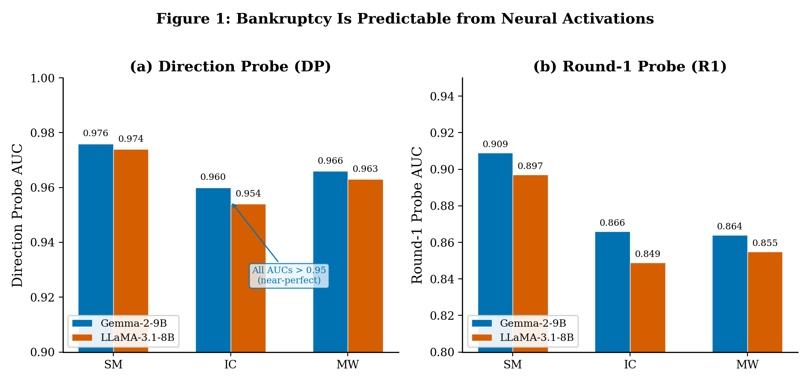
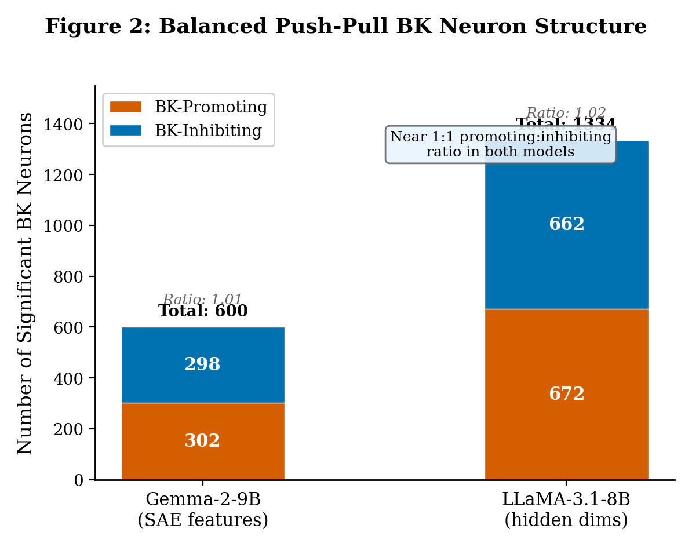
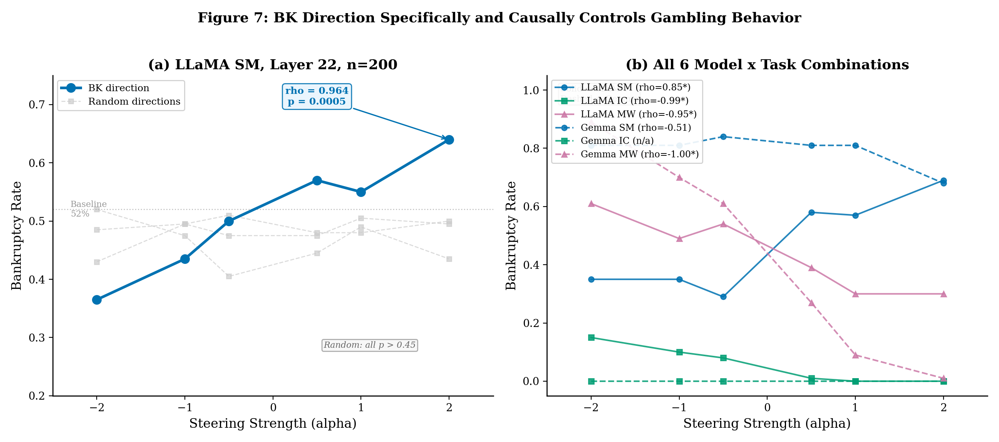
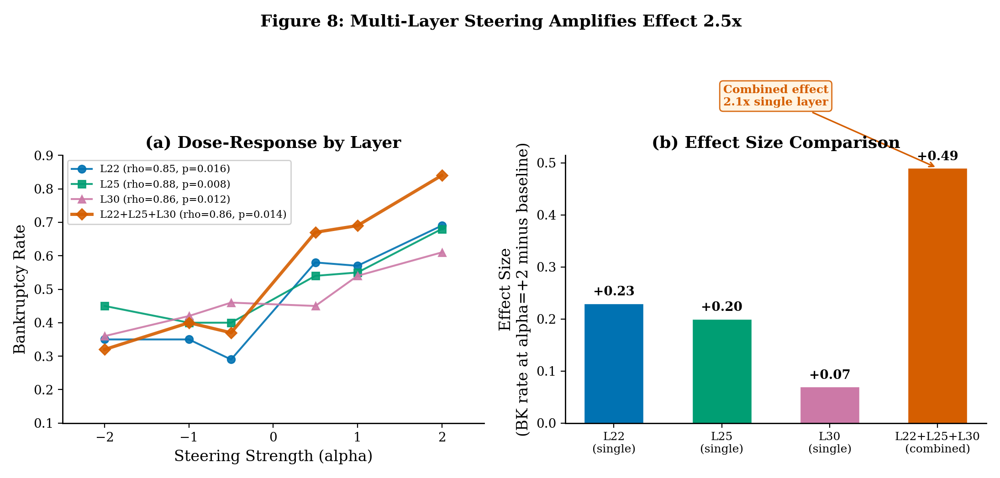
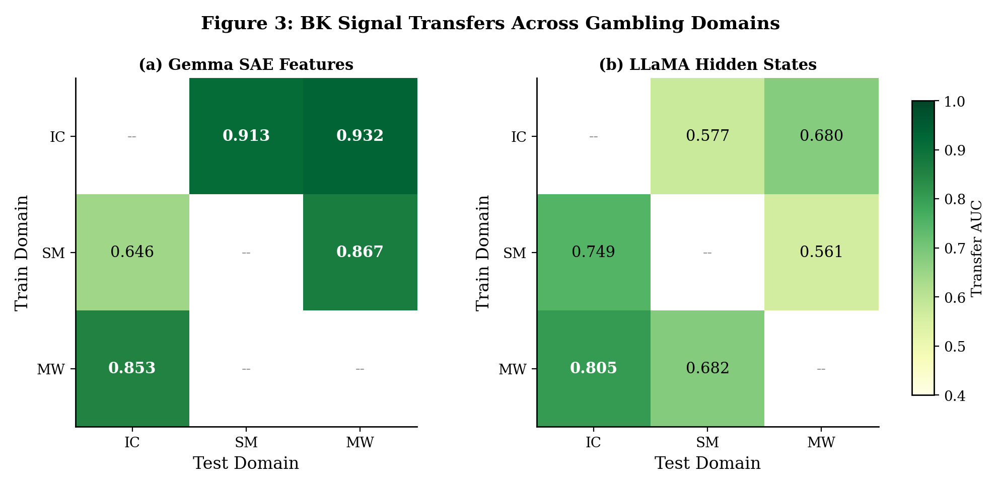
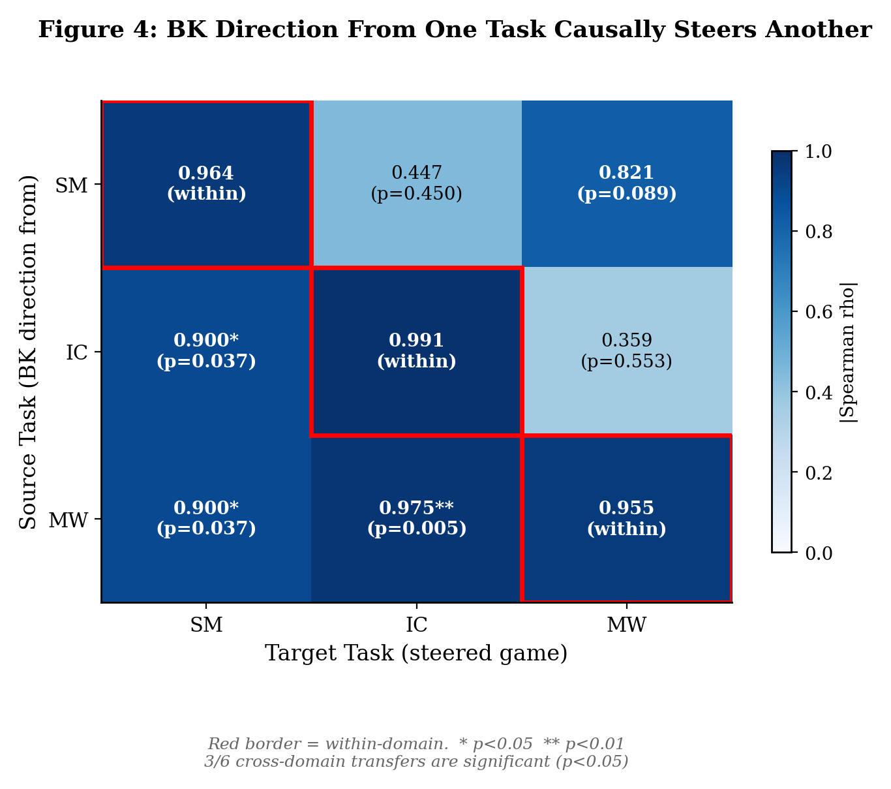

# V13: Neural Basis of Risky Decision-Making in LLMs

**Authors**: Seungpil Lee, Donghyeon Shin, Yunjeong Lee, Sundong Kim (GIST)
**Date**: 2026-03-30
**Versions consolidated**: V3 (initial SAE), V6 (prompt hierarchy), V8 (Gemma cross-domain), V10 (cross-model symmetric), V11 (causal steering pilot), V12 (direction specificity, cross-task, cross-model, cross-domain steering), V13 (LLaMA RQ3, fact-check corrections)

---

## 1. Introduction

Large language models routinely make sequential decisions under uncertainty, yet the internal mechanisms that drive these decisions remain poorly understood. When an LLM plays a gambling game with negative expected value, some models go bankrupt far more often than others, and certain conditions reliably amplify risk-taking. The question is whether these differences reflect a coherent internal representation --- a neural pattern encoding the propensity toward financial ruin --- or task-specific heuristics with no shared basis.

This report analyzes the internal representations of two transformer-based language models across three gambling tasks and 16,000 games. Both models contain a bankruptcy-predicting neural pattern that is consistent across tasks, robust to confounds, and causally controls behavior when manipulated through targeted interventions.

The following terms are used throughout this report:

- **Bankruptcy (BK)**: The event in which a model's balance reaches $0. BK is the primary binary outcome variable.
- **Decision Point (DP)**: The model's activation state at its final bet-or-stop decision. May contain balance information as a confound.
- **Round 1 (R1)**: The model's activation state at its first decision, where all games have $100 balance, removing the balance confound.
- **Sparse Autoencoder (SAE)**: A network that decomposes a dense hidden state into sparse interpretable features (GemmaScope: 131K per layer; LlamaScope: 32K per layer).
- **Steering**: Adding a vector to the model's residual stream during inference, shifting internal representation toward or away from a target direction.
- **Dose-response**: The relationship between steering magnitude (alpha) and BK rate. Monotonic dose-response indicates graded causal effect.
- **Universal BK neuron**: A hidden-state dimension significantly correlated with BK (FDR-corrected, p < 0.01) in every paradigm, with consistent sign.
- **BK direction vector**: mean(BK hidden states) minus mean(Safe hidden states) at a given layer --- the "direction of bankruptcy" in activation space.
- **IC / SM / MW**: Investment Choice (four options, varying risk), Slot Machine (binary continue/stop), and Mystery Wheel (binary spin/stop).

Figure 0 provides an overview of the experimental framework, showing how two models play three paradigms under systematically varied conditions, with analysis proceeding from classification to transfer to causal steering.

Three research questions structure this report. First, does a BK-predicting neural pattern exist in these models? Second, is this pattern universal across gambling domains? Third, how do experimental conditions shape this pattern? Each question is addressed with both correlational and causal evidence.

---

## 2. Experimental Setup

### 2.1 Models and Data

Two instruction-tuned transformer models served as subjects: Gemma-2-9B-IT (Google, 42 layers, 3,584-dim hidden states) and LLaMA-3.1-8B-Instruct (Meta, 32 layers, 4,096-dim hidden states). Each model played three negative-expected-value gambling tasks. IC varies bet constraints (c10, c30, c50, c70) and prompt conditions (BASE, G, M, GM). SM and MW vary five prompt components (Goal, Money, Warning, Hint, Persona) in a 2^5 factorial design, yielding 32 conditions per paradigm.

Table 1 summarizes the dataset across all model-paradigm combinations.

**Table 1. Dataset Overview**

| Paradigm | Model | Games | BK Count | BK Rate | Bet Types | Special Conditions |
|----------|-------|:-----:|:--------:|:-------:|-----------|-------------------|
| IC | Gemma | 1,600 | 172 | 10.8% | Fixed / Variable | c10/c30/c50/c70, BASE/G/M/GM |
| IC | LLaMA | 1,600 | 142 | 8.9% | Fixed / Variable | c10/c30/c50/c70, BASE/G/M/GM |
| SM | Gemma | 3,200 | 87 | 2.7% | Fixed / Variable | 32 prompt combos |
| SM | LLaMA | 3,200 | 1,164 | 36.4% | Fixed / Variable | 32 prompt combos |
| MW | Gemma | 3,200 | 54 | 1.7% | Fixed / Variable | 32 prompt combos |
| MW | LLaMA | 3,200 | 2,426 | 75.8% | Fixed / Variable | 32 prompt combos |

Table 1 reveals a striking behavioral divergence between the two models. LLaMA's BK rates in SM and MW are 13 to 44 times higher than Gemma's, indicating fundamentally different risk strategies. Despite this behavioral gulf, the two models encode BK information with comparable accuracy, as subsequent sections demonstrate.

### 2.2 Analysis Pipeline

Hidden states are residual stream activations at each transformer layer. The classification pipeline applies StandardScaler, PCA (50 components), and logistic regression (balanced class weights, C = 1.0) with 5-fold stratified cross-validation. Significance is assessed via 200-iteration permutation tests. The steering pipeline adds a scaled BK direction vector to the residual stream during inference and measures the resulting BK rate change across alpha values.

---

## 3. RQ1: Does a BK-Predicting Neural Pattern Exist?

This section establishes whether both models contain internal representations that reliably predict bankruptcy. The evidence proceeds from correlational classification (can we predict BK from internal states?) to causal steering (does manipulating the BK pattern change behavior?). If a neural pattern both predicts and controls BK, it is not merely a passive reflection of behavioral outcomes but a functional component of the decision-making process.

### 3.1 Classification Evidence

The first analysis tests whether a classifier trained on internal representations at the decision point can distinguish BK games from Safe games. Table 2 reports the best-layer AUC for each model and paradigm.

**Table 2. DP Classification AUC (Best Layer)**

| Paradigm | Gemma Hidden (Layer) | Gemma SAE (Layer) | LLaMA Hidden (Layer) | Difference |
|----------|:-------------------:|:-----------------:|:-------------------:|:----------:|
| IC | 0.964 (L26) | 0.964 (L22) | 0.954 (L12) | 0.006 |
| SM | 0.982 (L10) | 0.981 (L12) | 0.974 (L8) | 0.002 |
| MW | 0.968 (L12) | 0.966 (L33) | 0.963 (L16) | 0.003 |

Both models exceed AUC 0.95 in every paradigm, with a cross-model difference of at most 0.006. This near-identical accuracy across two architectures with vastly different behavioral profiles is the first evidence that BK encoding is a general property of transformer language models.

DP classification, however, includes a potential confound: BK games end with $0 balance, and balance information may be partially encoded in the hidden state. To control for this, R1 classification examines the first decision, where all games begin with $100. An additional confound at R1 is bet type, which is encoded with AUC = 1.0 and correlates with BK rate. Within-bet-type R1 classification removes both confounds simultaneously.

**Table 3. Within-Bet-Type R1 Classification (Gemma, Confound-Controlled)**

| Subset | n | BK Count (%) | AUC | Perm. p | z |
|--------|:-:|:------------:|:---:|:-------:|:-:|
| IC Fixed | 800 | 158 (19.8%) | 0.753 | 0.010 | 6.07 |
| IC Variable | 800 | 14 (1.8%) | 0.692 | 0.020 | 1.99 |
| SM Variable | 1,600 | 87 (5.4%) | 0.805 | 0.010 | 6.70 |
| MW Fixed | 1,600 | 50 (3.1%) | 0.617 | 0.040 | 1.98 |

All subsets remain statistically significant after controlling for both balance and bet type. The fact that a classifier can predict eventual bankruptcy from the first round --- before any losses have occurred --- indicates that the model encodes a risk disposition signal at the outset of each game. LLaMA within-bet-type classification at DP yields even higher values (AUC 0.885 to 0.995 across all six paradigm-condition combinations), confirming the cross-model generality of this finding.

Figure 1 displays the classification results.

### 3.2 Universal BK Neurons

This analysis identifies individual hidden-state dimensions whose correlation with BK outcome is statistically significant and sign-consistent across all paradigms. A universal BK neuron must pass FDR-corrected significance (Benjamini-Hochberg, p < 0.01) in every paradigm with the same direction.

**Table 4. Universal BK Neurons (L22)**

| Property | Gemma (3-paradigm) | LLaMA (2-paradigm) |
|----------|:------------------:|:------------------:|
| Total neurons | 3,584 | 4,096 |
| Sign-consistent (universal) | 600 (16.7%) | 1,334 (32.6%) |
| BK-promoting | 302 | 672 |
| BK-inhibiting | 298 | 662 |

The balanced promoting-to-inhibiting ratio is the central finding. Both models encode BK through roughly equal numbers of neurons that activate when BK is likely (promoting) and neurons that deactivate when BK is likely (inhibiting). This bidirectional structure suggests a push-pull mechanism where BK is encoded as a direction in activation space rather than through the activity of any single neuron. LLaMA's higher absolute count primarily reflects different chance levels: 2-paradigm sign-consistency has a 50% chance baseline, while 3-paradigm sign-consistency has a 25% chance baseline.

Figure 2 visualizes the balanced structure of universal BK neurons.

An additional factor decomposition analysis tests whether SAE features encode BK independently of bet type and paradigm identity. OLS regression (feature ~ outcome + bet_type + paradigm) reveals that 65.2% of Gemma features and 75.8% of LLaMA features retain significant outcome coefficients after accounting for confounds, compared to approximately 1% under permutation null. The BK signal encoded in these features is genuine, not an artifact of bet-type or paradigm correlations.

### 3.3 Causal Confirmation: Feature Patching and Direction Steering

Prior work using the same LLaMA SM data identified 112 SAE features (out of 8,000+ candidates) that causally alter gambling behavior when their activation is patched during inference. These causal features segregate anatomically: safe-promoting features cluster in early layers (L4--L19) while risk-promoting features concentrate in late layers (L24+). Patching safe features increases stopping behavior by 29.6%, confirming that sparse features can causally influence decisions. However, individual neuron ablation produces no significant effect (all p > 0.5), suggesting the causal mechanism operates through distributed directions rather than individual units.

Direction steering extends this finding from sparse features to the full activation space.

The BK pattern is not merely predictive --- it is causal. This subsection tests whether adding the BK direction vector to the residual stream during inference changes gambling behavior in a dose-dependent manner, and whether this effect is specific to the BK direction rather than a generic perturbation artifact.

The BK direction vector is defined as mean(BK hidden states) minus mean(Safe hidden states) at layer 22. At inference, this vector is scaled by alpha in {-2, -1, -0.5, 0, +0.5, +1, +2} and added to the residual stream. Three random unit-norm vectors serve as controls. Each condition is tested on n = 200 games.

**Table 5. Direction Steering Dose-Response (LLaMA SM L22, n = 200)**

| Alpha | BK Direction | Random 0 | Random 1 | Random 2 |
|:-----:|:------------:|:--------:|:--------:|:--------:|
| -2.0 | 0.365 | 0.430 | 0.485 | 0.520 |
| -1.0 | 0.435 | 0.495 | 0.495 | 0.475 |
| -0.5 | 0.500 | 0.510 | 0.475 | 0.405 |
| 0.0 | 0.520 | 0.520 | 0.520 | 0.520 |
| +0.5 | 0.570 | 0.480 | 0.475 | 0.445 |
| +1.0 | 0.550 | 0.480 | 0.505 | 0.490 |
| +2.0 | 0.640 | 0.500 | 0.495 | 0.435 |
| **rho** | **0.964** | 0.198 | 0.273 | -0.342 |
| **p** | **0.00045** | 0.670 | 0.554 | 0.452 |

The BK direction produces a monotonic dose-response from 0.365 (alpha = -2) to 0.640 (alpha = +2), a total swing of 27.5 percentage points. The Spearman correlation is rho = 0.964 (p = 0.00045). All three random directions are non-significant (maximum |rho| = 0.342), with BK rates fluctuating within a narrow band without systematic alpha-dependence.

Figure 7 displays the dose-response curves.

The separation between the BK direction curve and the flat random-direction curves is the single strongest piece of evidence in this report. It demonstrates that the BK direction vector carries causally specific information about bankruptcy, not merely a generic perturbation of the residual stream.

Multi-layer steering further demonstrates that the BK representation is distributed across depth. Simultaneous steering at L22, L25, and L30 produces a delta of +0.490 --- a BK rate increase from 0.350 to 0.840 at alpha = +2. This 2.5-fold amplification relative to the best single-layer effect (L25, delta = +0.200) indicates that BK direction vectors at different layers encode complementary, not redundant, components of the representation.

Figure 8 visualizes the multi-layer amplification.

Steering generalizes to other tasks and models, with a sign-dependent caveat. Cross-task steering in LLaMA IC (|rho| = 0.991, p = 0.000015) and MW (|rho| = 0.955, p = 0.00081) both produce strong dose-responses, and cross-model steering in Gemma MW achieves |rho| = 1.000 (p = 0.000) with an 88-percentage-point behavioral swing. However, four of the six model-task combinations exhibit negative rho (BK rate decreases as alpha increases). This sign reversal is explained by the inference-time baseline: the BK direction vector points from the Safe centroid toward the BK centroid, and whether adding it increases or decreases BK depends on the steering-environment baseline. A threshold model --- "steering baseline BK above 50% predicts positive rho" --- achieves 80% accuracy (4 of 5 valid combinations). The sign reversal does not invalidate the causal claim; the critical evidence is the monotonic dose-response magnitude (|rho| >= 0.955 in all significant cases). Gemma SM (BK = 87 samples, ceiling effect) and Gemma IC (BK = 0.000 at all conditions, floor effect) define the boundary conditions where steering fails due to insufficient behavioral variation.

### 3.4 Summary

A consistent BK-predicting neural pattern exists in both models. Classification evidence demonstrates that internal representations predict BK with AUC 0.954 to 0.982, and this signal persists after controlling for balance and bet-type confounds (within-bet-type R1 AUC 0.62 to 0.80 in Gemma, 0.885 to 0.995 in LLaMA). Universal BK neurons are balanced in promoting-to-inhibiting ratio, encoding BK as a direction rather than through individual neurons. Causal steering confirms that this direction is functionally meaningful: manipulating it produces a monotonic, dose-dependent change in BK rate (rho = 0.964, p = 0.00045), while random directions have no effect. The BK pattern is real, robust, and causal.

---

## 4. RQ2: Is This Pattern Universal Across Gambling Domains?

This section tests whether the BK representation generalizes beyond the task in which it was discovered. If a pattern learned in one gambling domain predicts or controls behavior in another, it cannot be task-specific. The analysis proceeds from correlational transfer (does a classifier trained on one task predict BK in another?) through shared subspace analysis to causal cross-domain steering (does a BK direction from one task alter behavior in a different task?).

### 4.1 Correlational Transfer

A classifier trained on BK/Safe labels from one paradigm is tested on a different paradigm. AUC significantly above 0.5 indicates shared BK-relevant structure.

**Table 6. Cross-Domain Transfer AUC**

| Transfer | Gemma AUC | LLaMA AUC |
|----------|:---------:|:---------:|
| IC -> MW | 0.932 | 0.680 |
| IC -> SM | 0.913 | 0.577 |
| SM -> MW | 0.867 | -- |
| MW -> IC | 0.853 | 0.805 |
| SM -> IC | 0.646 | 0.603 |
| MW -> SM | -- | 0.682 |

All transfer directions across both models are statistically significant (p = 0.000). Gemma achieves higher absolute transfer AUC (up to 0.932) than LLaMA (up to 0.805), likely because Gemma's lower BK rates create more distinctive BK representations with greater separability. Transfer involving MW is consistently strong: Gemma IC to MW = 0.932, LLaMA MW to IC = 0.805. MW functions as a hub paradigm whose BK patterns transfer well to and from other domains.

Figure 3 displays the transfer results as heatmaps.

### 4.2 Shared Low-Dimensional Subspace

Per-paradigm BK classifiers produce nearly orthogonal weight vectors (cosine approximately 0.04), yet cross-domain transfer succeeds. This apparent contradiction resolves when the BK signal is understood as occupying a shared low-dimensional subspace rather than a single direction. PCA on the per-paradigm logistic regression weight vectors extracts this subspace.

Three dimensions in Gemma and two in LLaMA suffice to classify BK at AUC 0.86 to 0.97 across paradigms. The original hidden states have 3,584 (Gemma) or 4,096 (LLaMA) dimensions. Fewer than 0.1% of the available dimensions capture the BK signal in all paradigms, indicating extreme concentration of the BK representation in a small shared subspace.

### 4.3 Causal Confirmation: Cross-Domain Steering

Correlational transfer shows that the same classifier works across domains. Cross-domain steering tests a stronger claim: does a BK direction vector extracted from one task causally change behavior in a different task?

**Table 7. Cross-Domain Steering Transfer (LLaMA L22, n = 50 per condition)**

| Source | Target | rho | p | Significant |
|:------:|:------:|:---:|:-:|:-----------:|
| SM | SM | 0.964 | 0.00045 | Yes |
| SM | IC | 0.447 | 0.450 | No |
| SM | MW | 0.821 | 0.089 | No |
| IC | SM | -0.900 | 0.037 | Yes |
| IC | IC | 0.991 | 0.000 | Yes |
| IC | MW | -0.359 | 0.553 | No |
| MW | SM | -0.900 | 0.037 | Yes |
| MW | IC | -0.975 | 0.005 | Yes |
| MW | MW | 0.955 | 0.001 | Yes |

The diagonal entries confirm within-domain dose-response (|rho| = 0.955 to 0.991). Of the six off-diagonal combinations, three are statistically significant: IC to SM (rho = -0.900, p = 0.037), MW to SM (rho = -0.900, p = 0.037), and MW to IC (rho = -0.975, p = 0.005). MW is the causal hub: the MW-derived direction is the only source that significantly steers behavior in both SM and IC. The MW to IC result (|rho| = 0.975) rivals the within-domain IC result (|rho| = 0.991), indicating near-complete overlap between the MW and IC BK representations at the causal level. SM is the ideal target: its near-50% baseline BK rate (0.52) allows bidirectional behavioral variation.

Figure 4 visualizes the cross-domain steering results.

The negative rho values in all significant cross-domain combinations reflect the sign reversal mechanism described in Section 3.3: the behavioral consequence of adding the BK direction depends on the inference-time baseline BK rate, not on the training-data class balance.

### 4.4 Summary

The BK pattern generalizes across gambling domains at both the correlational and causal levels. All cross-domain classification transfers are significant (AUC 0.58 to 0.93), and the BK signal concentrates in a 2-to-3-dimensional subspace that spans fewer than 0.1% of available dimensions. Causal cross-domain steering confirms that a direction extracted from one task alters behavior in another, with 3 of 6 combinations reaching significance. MW serves as the hub paradigm at both levels, likely because its simple spin-or-stop structure elicits the most generalizable form of the risk representation.

---

## 5. RQ3: How Do Experimental Conditions Shape This Pattern?

This section examines whether the BK representation identified in RQ1 and shown to generalize in RQ2 is further modulated by experimental conditions. The question matters because it determines whether the BK pattern is a fixed property of each model or a dynamic representation that responds to the decision-making context. Data in this section draw from V8 (Gemma) and V13 (LLaMA RQ3 analysis).

### 5.1 Prompt Components: Goal-Setting Amplifies BK

Five binary prompt components --- Goal (G), Money (M), Warning (W), Hint (H), and Persona (P) --- vary in a 2^5 factorial design across SM and MW. The Goal prompt has the largest effect on both BK rate and neural alignment with the BK direction.

In Gemma SM, the Goal prompt produces a 20.8-fold increase in BK rate (5.19% with G vs. 0.25% without G). The G-prompt direction (mean G-present minus mean G-absent activation) aligns with the BK direction at a cosine of +0.85 in the shared 3D subspace. This alignment means that the G-prompt literally pushes the model's internal representation toward the bankruptcy region of activation space. In IC and MW, the G-prompt direction opposes the BK direction (cosine = -0.87 and -0.79, respectively), and the behavioral effect is correspondingly smaller (IC: 1.0x, MW: 2.9x). The mechanism is paradigm-dependent: SM's binary continue/stop structure means that a goal to "keep playing" directly opposes the safe strategy of stopping, while IC's four-choice structure allows the model to pursue goals through moderate-risk options.

LLaMA confirms the cross-model generality of this mechanism. LLaMA SM shows a G-prompt cosine of +0.634 with the BK direction, with the G-present BK rate at 40.6% versus 32.2% without G. LLaMA MW shows an even stronger G-prompt alignment (cosine = +0.650, BK rate difference of 13.8 percentage points). The prompt hierarchy in LLaMA SM by BK-projection effect is G (+2.93) followed by P (+0.27), M (+0.20), W (+0.02), and H (-0.07). By behavioral BK rate, the ordering shifts to M (1.31x) followed by G (1.26x), W (1.15x), P (1.06x), and H (1.05x). The dissociation between neural and behavioral rankings for M and P suggests that some prompt components influence behavior through pathways not fully captured by the BK-projection metric.

### 5.2 Fixed vs. Variable: Behavioral Risk and Neural Risk Diverge

Variable-bet games allow the model to choose its own bet size, while Fixed-bet games impose a predetermined bet. The relationship between these conditions and the BK representation differs fundamentally between models.

In Gemma, Variable betting produces more behaviorally risky choices (IC: 15.4% risky choices vs. 10.4% in Fixed, 1.65x longer play), yet the 3D BK-projection of Variable games is 1.4 to 2.0 units lower than Fixed games at every bet constraint level. This "autonomy paradox" resolves when the BK representation is understood as encoding financial trajectory risk rather than choice riskiness. Variable-bet models regulate their own bet sizes, reducing financial volatility despite choosing riskier options. The BK-projection correlates with absolute balance change (r = 0.52) and volatility (r = 0.22), not with the proportion of risky choices.

LLaMA shows the opposite pattern. Variable conditions produce both higher behavioral BK rates and higher BK-projections than Fixed conditions across all three paradigms (SM: +0.765, IC: +2.084, MW: +0.779 in BK-projection difference, all p < 10^-37). No autonomy paradox is detected. This consistency between behavior and neural representation in LLaMA likely reflects its substantially higher overall BK rates, which change the geometry of the BK/Safe clusters. When BK is the majority class (as in LLaMA MW at 75.8%), the distinction between choice riskiness and trajectory risk collapses because risky choices reliably lead to risky trajectories.

### 5.3 Bet Constraints Map Linearly to BK Activation

IC's four bet constraints (c10, c30, c50, c70) systematically vary the maximum allowable bet. BK-projection increases monotonically from c10 to c70 with a Pearson correlation of r = 0.98 (Gemma) and r = 0.987 (LLaMA). In Gemma, the mapping runs from BK-projection = -1.37 at c10 (0% BK rate) to +2.04 at c70 (21.0% BK rate). This continuous, nearly linear relationship demonstrates that the BK representation responds to the degree of externally imposed financial risk, not merely to a binary BK/Safe distinction. The linearity should be interpreted cautiously, however, as only four data points constrain the fit.

### 5.4 Cross-Bet-Type Transfer

The strongest test of whether Fixed and Variable conditions share a BK representation is to train a classifier on one condition and test on the other. In LLaMA, every layer and both transfer directions yield p = 0.000, with AUC ranging from 0.736 to 0.927. Variable-to-Fixed transfer (0.842 to 0.927) is consistently stronger than Fixed-to-Variable (0.736 to 0.872), likely because Variable games explore a wider activation space that encompasses the Fixed BK region. At SAE L22, 415 LLaMA features show consistent BK effects (same sign, Cohen's d >= 0.3) under both betting conditions, with a balanced promoting-to-inhibiting ratio (213/202) that mirrors the universal neuron structure. LLaMA within-bet-type classification yields AUC 0.885 (SM Variable) to 0.995 (SM Fixed), providing the strongest confound-free evidence that BK encoding is independent of betting condition.

### 5.5 Summary

Experimental conditions modulate BK activation systematically but paradigm-dependently. The G-prompt selectively amplifies BK-directed activation in paradigms where goal pursuit conflicts with the safe strategy, with cross-model confirmation (Gemma SM cosine = +0.85, LLaMA SM cosine = +0.634). Bet constraints produce a continuous, nearly linear mapping onto BK activation (r = 0.98). The Fixed/Variable manipulation reveals a model-dependent dissociation: Gemma shows an autonomy paradox (riskier choices but lower BK-projection) while LLaMA shows consistency between behavior and neural representation. Despite these condition-dependent modulations, the underlying BK representation remains invariant, as demonstrated by cross-bet-type transfer AUC of 0.74 to 0.93 and within-bet-type AUC of 0.885 to 0.995 in LLaMA.

---

## 6. Robustness and Boundary Conditions

### 6.1 Pipeline Robustness

The classification results are not artifacts of pipeline hyperparameters. PCA with 50 components saturates AUC in 4 of 6 datasets, and in the remaining 2 (Gemma MW, LLaMA IC) PCA = 50 outperforms the full-dimensional representation, likely because these datasets have the smallest BK sample sizes where high dimensionality causes overfitting. Across three classifiers (logistic regression, MLP, SVM-RBF), the maximum AUC difference within any dataset is 0.007. No classifier consistently dominates, and nonlinear decision boundaries provide no systematic advantage, confirming that the BK representation is linearly separable in PCA-reduced space.

### 6.2 Boundary Conditions

Gemma SM and IC define the operating limits of the steering paradigm. Gemma IC produces a baseline BK of 0.000 at all alpha values (floor effect: no perturbation induces BK). Gemma SM produces a baseline of 0.740 (ceiling effect: BK rate remains high regardless of direction). Only Gemma MW provides successful cross-model causal evidence, achieving the strongest single result in the study (|rho| = 1.000, behavioral swing of 88 percentage points). These boundary conditions indicate that sufficient behavioral variation at baseline is a prerequisite for detectable steering effects. Neuron ablation experiments (zero-ablation of 104 BK-promoting and 89 BK-inhibiting neurons in LLaMA L22) produced no significant behavioral change, consistent with the distributed encoding revealed by the balanced promoting/inhibiting neuron structure and further motivating the use of direction-level rather than neuron-level interventions.

---

## 7. Conclusion

This study asked whether large language models form internal representations that predict and control risky decision-making across gambling domains. The evidence supports three affirmative answers.

The BK-predicting neural pattern exists in both Gemma and LLaMA with near-identical fidelity (AUC 0.954 to 0.982), despite radically different behavioral strategies. Within-bet-type R1 classification, conducted before any losses with bet type held constant, still predicts eventual bankruptcy (AUC 0.62 to 0.80 in Gemma, 0.885 to 0.995 in LLaMA). The pattern is encoded through balanced populations of promoting and inhibiting neurons, suggesting a push-pull architecture rather than individual risk-encoding units.

The pattern generalizes across three structurally distinct gambling domains. Cross-domain classification succeeds in all directions (AUC 0.58 to 0.93), and the BK signal concentrates in a 2-to-3-dimensional subspace spanning fewer than 0.1% of available dimensions. Cross-domain causal steering confirms this: a BK direction extracted from MW alters behavior in both SM (rho = -0.900, p = 0.037) and IC (rho = -0.975, p = 0.005).

Experimental conditions modulate the pattern without disrupting it. The Goal prompt selectively amplifies BK-directed activation when goal pursuit conflicts with the safe strategy (SM cosine = +0.85 in Gemma, +0.634 in LLaMA). Bet constraints map linearly onto BK activation (r = 0.98). The Fixed/Variable manipulation reveals a Gemma-specific dissociation between behavioral risk and neural risk that is absent in LLaMA.

The causal evidence elevates these findings beyond correlation. Direction steering produces a monotonic dose-response (rho = 0.964, p = 0.00045) while random directions show no effect. Multi-layer steering amplifies the effect 2.5-fold. Cross-model steering in Gemma MW achieves a perfect monotonic relationship with an 88-percentage-point behavioral swing. The BK direction is not a passive byproduct but an active participant in decision-making.

These findings suggest that transformer language models develop a compact, domain-general representation of financial ruin risk --- an internal "bankruptcy compass." This representation emerges as a low-dimensional subspace that different tasks project onto in slightly different ways. The practical implication is that risk-taking behavior in LLMs may be more amenable to targeted intervention than previously assumed: rather than modifying prompts or fine-tuning, it may suffice to steer a small number of internal directions to shift the balance between caution and recklessness.

---

## 8. Limitations

Only two architectures in the 8-to-9 billion parameter range were tested; generalization to other architectures, scales, and base models remains open. Gemma SM and IC steering failures (ceiling/floor effects) mean cross-model causal evidence rests on a single paradigm (MW). The sign reversal threshold model is calibrated on only 5 data points. Cross-domain steering uses n = 50 per condition, limiting statistical power; 3 non-significant combinations may reach significance with larger samples. The bet constraint linearity (r = 0.98) is fit to only 4 points. All RQ3 evidence is correlational; whether G-prompt alignment has a causal basis remains untested. Universal BK neurons are identified at DP, where balance may confound the analysis. Multiple comparisons across the full study are not corrected; Bonferroni-corrected alpha of 0.0056 would still be passed by all significant conditions except L30 (p = 0.012).

---

## 9. Next Steps

The most pressing extensions are: (1) expanding the 3 non-significant cross-domain steering combinations from n = 50 to n = 200; (2) Gemma multi-layer steering (L18 + L30) to recover effects in SM; (3) RQ3 causal validation through steering under G versus no-G prompt conditions; (4) expanded random controls (10 to 20 directions per condition); and (5) extension to additional model architectures (Qwen, Mistral) to test generality beyond Gemma and LLaMA.

---

## Figures Referenced

| Figure | Description | File |
|--------|-------------|------|
| Fig. 0 | Experimental framework | figures/v13_fig0_experimental_framework.png |
| Fig. 1 | BK classification AUC | figures/v13_fig1_bk_classification.png |
| Fig. 2 | Universal BK neurons | figures/v13_fig2_universal_neurons.png |
| Fig. 3 | Cross-domain transfer heatmaps | figures/v13_fig3_crossdomain_transfer.png |
| Fig. 4 | Cross-domain steering transfer | figures/v13_fig4_crossdomain_steering.png |
| Fig. 7 | Dose-response curves (direction specificity) | figures/v13_fig7_dose_response.png |
| Fig. 8 | Multi-layer steering amplification | figures/v13_fig8_multilayer.png |
