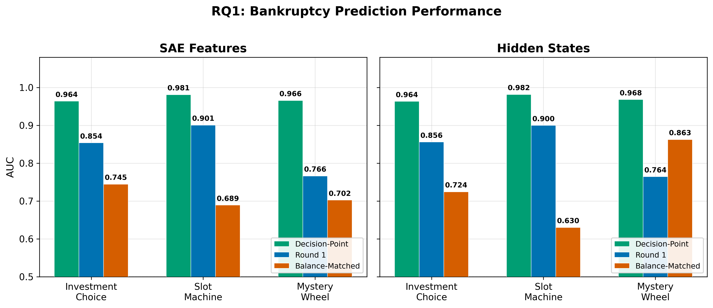
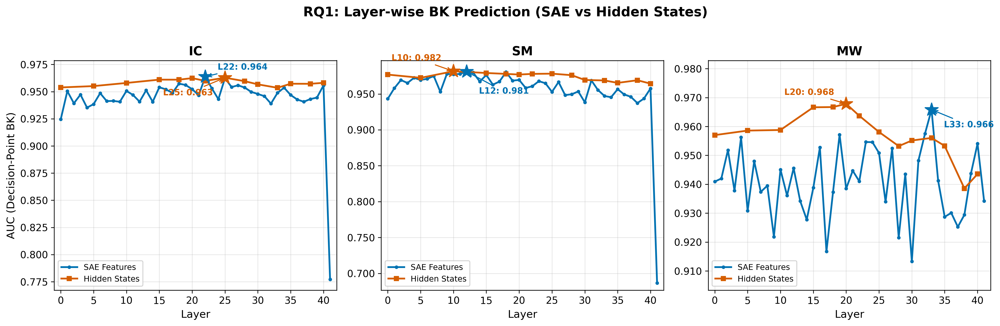
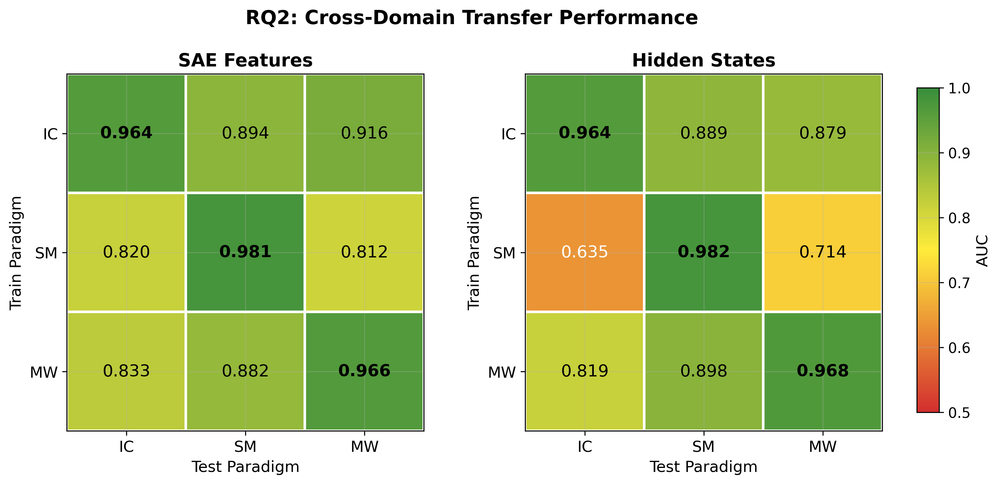
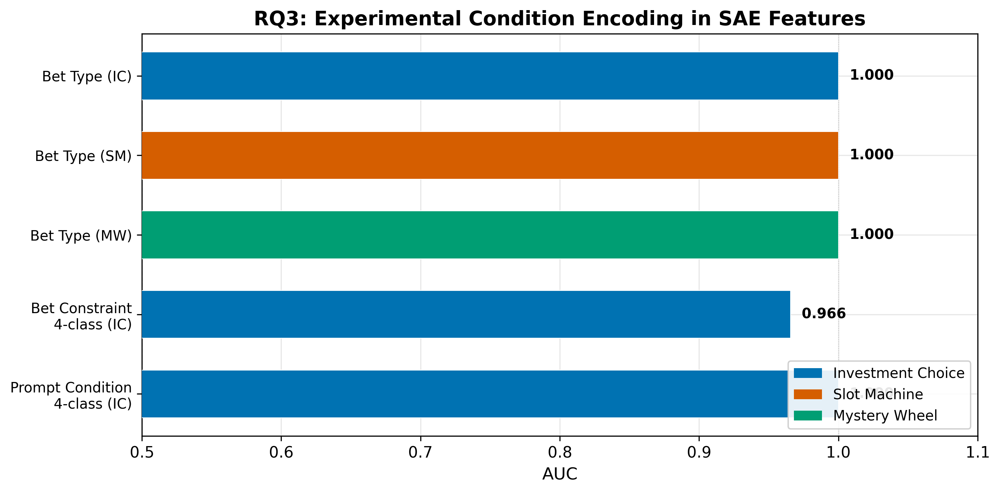
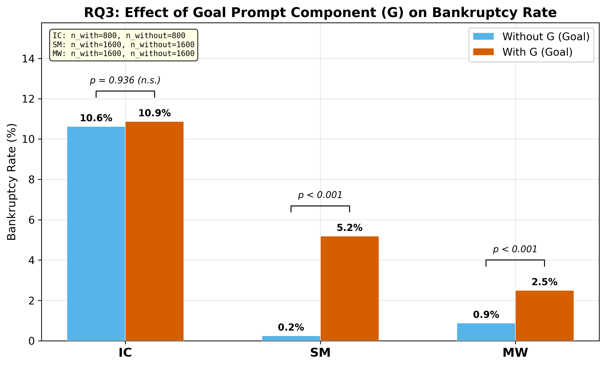

# Neural Signatures of Gambling Bankruptcy in Gemma-2-9B

**Model**: Gemma-2-9B-IT | **SAE**: GemmaScope 131K features/layer, 42 layers | **Hidden**: 3584-dim per layer
**Data**: IC (1600 games, 172 BK 10.8%), SM (3200 games, 87 BK 2.7%), MW (3200 games, 54 BK 1.7%)

---

## Executive Summary

| RQ | Answer | Key Number |
|----|--------|------------|
| 1. 파산 예측 가능한 neural signature? | **Yes.** SAE와 hidden 모두 DP AUC > 0.96. 첫 라운드(R1, balance=$100)에서도 0.77-0.90. Balance 통제 후 0.63-0.86. | Table 1-2 |
| 2. 도메인 불변 표상? | **방향은 공유, feature는 비공유.** IC→SM/MW 전이 AUC 0.89-0.91이나 feature overlap Jaccard 0.07-0.14. | Table 3-4 |
| 3. 조건별 표상 차이? | **패러다임 의존적.** SM에서 G prompt가 BK 20x 증가 (p=1.1e-20). IC에서는 무효 (p=0.997). | Table 5-7 |

---

## RQ1. 파산을 예측하는 일관적 neural signature가 존재하는가?

### 1.1 Decision-Point에서의 파산 분류

Decision-point(DP)란 각 게임의 마지막 결정 시점에서 추출한 representation이다. 파산 게임은 마지막 결정 직전의 balance를, 비파산 게임은 stop 결정 시점의 balance를 반영한다.

**Table 1. Decision-Point BK Classification (5-fold CV, L2 Logistic Regression)**

| Paradigm | n_BK / n_total | SAE AUC (Layer) | SAE F1 | Hidden AUC (Layer) | SAE-Hidden diff |
|----------|---------------|-----------------|--------|---------------------|----------------|
| IC | 172 / 1600 | 0.964 (L22) | 0.722 | 0.964 (L26) | 0.000 |
| SM | 87 / 3200 | 0.981 (L12) | 0.531 | 0.982 (L10) | -0.001 |
| MW | 54 / 3200 | 0.966 (L33) | 0.254 | 0.968 (L12) | -0.002 |

SAE features (131K sparse)와 hidden states (3584-dim dense)의 AUC 차이가 0.002 이내로, SAE가 BK 관련 정보를 손실 없이 포착한다. F1이 SM 0.531, MW 0.254로 낮은 것은 class imbalance (BK 비율 2.7%, 1.7%) 때문이며 AUC는 이에 robust하다.

peak layer가 패러다임별로 다르다: IC L22, SM L12, MW L33 (SAE). SM의 단순한 2지선다(bet/stop)는 L12에서 결정되고, MW의 확률 추론은 L33까지 필요하다.

### 1.2 첫 라운드 예측 (R1): Balance=$100 통제

R1에서는 모든 게임의 balance가 $100으로 동일하다. R1 classification은 잔액 정보 없이 순수 모델 성향만으로 파산을 예측한다.

**Table 2. R1 및 Balance-Matched BK Classification**

| Paradigm | SAE R1 AUC (L) | Hidden R1 AUC (L) | Perm. p | SAE BM AUC | Hidden BM AUC (L) |
|----------|----------------|---------------------|---------|------------|---------------------|
| IC | 0.854 (L18) | 0.856 (L33) | <0.001 | 0.745 | 0.724 (L26) |
| SM | 0.901 (L16) | 0.900 (L26) | <0.001 | 0.689 | 0.630 (L12) |
| MW | 0.766 (L22) | 0.764 (L0) | <0.001 | 0.702 | 0.862 (L18) |

R1 AUC 0.77-0.90은 permutation test에서 모두 p < 0.001이다. 모델이 첫 결정에서 이미 파산 경향을 인코딩하고 있다.

Balance-Matched(BM)는 DP에서 BK/non-BK 그룹의 balance 분포를 매칭한 후 분류한 것이다. DP AUC에서 BM AUC를 빼면 balance가 기여하는 정보량을 추정할 수 있다: IC 0.964→0.745 (-0.219), SM 0.981→0.689 (-0.292), MW 0.966→0.702 (-0.264). DP 예측력의 약 70-75%가 balance 독립적 neural signal이다.

### 1.3 Round-level Risk Classification

**Table 2b. 라운드별 위험 선택 분류**

| Paradigm | Task | SAE AUC (L) | Hidden AUC (L) |
|----------|------|-------------|-----------------|
| SM | High vs Low bet magnitude | 0.908 (L22) | 0.816 (L26) |
| MW | High vs Low bet magnitude | 0.826 (L24) | 0.772 (L24) |
| IC | Risky choice (VH/H vs S/M) | 0.681 (L8) | 0.674 (L22) |

SM/MW에서 배팅 크기를 SAE AUC 0.83-0.91로 구분 가능하다. IC의 0.681은 4개 선택지 간 경계가 연속적이기 때문이다.

SM에서 SAE(0.908)가 hidden(0.816)보다 높은 유일한 사례이다. SAE의 sparse coding이 배팅 크기와 같은 구체적 양적 정보를 더 잘 분리한다.

### 1.4 Behavioral-SAE Linkage

SM L18의 Feature #17588은 betting aggressiveness (I_BA)와 Spearman r=0.508 (p<1e-199), loss chasing (I_LC)과 r=0.418 (p<1e-129)의 상관을 보인다. 이는 특정 SAE feature가 행동 지표와 직접 연결됨을 의미한다.

### RQ1 결론

3개 패러다임 × 2개 representation type 모두에서 DP AUC > 0.96이다. R1 AUC 0.77-0.90 (p<0.001)은 balance 이전에 파산 경향이 인코딩됨을 보여주고, BM AUC 0.63-0.86은 이 신호가 잔액과 독립적임을 확인한다. SAE와 hidden의 예측력이 동등(차이 < 0.002)하므로, SAE는 정보 손실 없이 해석 가능한 분해를 제공한다.

---

## RQ2. 도메인 불변 neural representation이 존재하는가?

### 2.1 Cross-Domain Transfer

한 패러다임에서 학습한 L2 logistic regression을 다른 패러다임의 데이터에 적용한다.

**Table 3. Cross-Domain Transfer AUC (Bootstrap 95% CI)**

| Train → Test | SAE AUC [95% CI] | Hidden AUC (Best L) | Asymmetry |
|-------------|-------------------|---------------------|-----------|
| IC → SM | 0.893 [0.868, 0.921] | 0.889 (L12) | Strong |
| IC → MW | 0.908 [0.874, 0.944] | 0.879 (L6) | Strong |
| MW → SM | 0.877 [0.846, 0.906] | 0.898 (L10) | Strong |
| SM → MW | 0.657 [0.583, 0.706] | 0.714 (L12) | Weak |
| SM → IC | 0.616 [0.574, 0.679] | 0.635 (L18) | Weak |
| MW → IC | 0.631 [0.586, 0.680] | 0.819 (L22) | Weak |

전이 구조는 비대칭적이다. IC에서 학습한 classifier는 SM (0.893)과 MW (0.908)에 강하게 전이되나, 역방향 SM→IC (0.616), MW→IC (0.631)는 약하다. IC는 4 선택지 × 4 bet constraint × 2 bet type의 복합 결정 공간을 가지므로, 보다 일반적인 파산 표상이 형성된다. SM/MW의 2지선다 결정에서 학습한 표상은 IC의 복합 공간으로 일반화하기 어렵다.

Hidden에서 MW→IC 전이 (0.819)가 SAE (0.631)보다 높다. 이는 hidden states의 dense representation이 SAE의 sparse encoding보다 도메인 간 공유 정보를 더 잘 보존하는 경우가 있음을 시사한다.

### 2.2 Feature Overlap

**Table 4. Same-Layer (L22) Top-k Significant Feature Overlap**

| Pair | Shared | Jaccard | n_active (each) | 3-paradigm shared |
|------|--------|---------|-----------------|-------------------|
| IC ∩ SM | 13 | 0.070 | 427, 416 | #29904, #86320, #91055 |
| IC ∩ MW | 25 | 0.143 | 427, 426 | (same 3 features) |
| SM ∩ MW | 25 | 0.143 | 416, 426 | |

Cross-domain transfer AUC 0.89인데 feature overlap Jaccard 0.07이다. 이 역설은 전이가 소수 공유 feature가 아닌, representation space의 유사한 방향(linear subspace)에 의해 이루어짐을 의미한다. 각 패러다임은 다른 feature 조합으로 유사한 BK/non-BK 방향을 구성한다.

Feature #29904, #86320, #91055는 3개 패러다임 모두에서 L22 top-k에 포함되며, activation patching의 후보이다.

초기 layer에서는 overlap이 높다 (L0: Jaccard 0.56-0.69, SM-MW hypergeom p=0.003). 중간 layer로 갈수록 감소하여 (L12: 0.22-0.33), 도메인 특화가 점진적으로 발생한다.

### RQ2 결론

IC→SM/MW 전이 AUC 0.89-0.91은 도메인 불변 '방향'의 존재를 지지한다. 그러나 feature overlap Jaccard 0.07-0.14는 이 방향이 도메인별로 다른 feature 조합으로 구현됨을 보여준다. 따라서 activation patching은 도메인 특화적 feature(도메인별 best layer의 top-k)와 3-paradigm 공유 feature (#29904 등) 양쪽을 타겟해야 한다.

---

## RQ3. 실험 조건에 따라 neural representation이 달라지는가?

### 3.1 Condition Encoding

**Table 5. SAE Condition Encoding AUC**

| Condition | IC AUC (L) | SM AUC (L) | MW AUC (L) |
|-----------|-----------|-----------|-----------|
| Bet type (Fixed/Variable) | 1.000 (L0) | 1.000 (L2) | 1.000 (L0) |
| Bet constraint (4-class) | 0.966 (L18) | - | - |
| Prompt condition (4-class) | 1.000 (L6) | - | - |
| Component G (binary) | - | 1.000 | 1.000 |
| Component M (binary) | - | 1.000 | 1.000 |
| Component H (binary) | - | 1.000 | ~1.000 |
| Component W (binary) | - | ~1.000 | 1.000 |
| Component P (binary) | - | 1.000 | 0.996 |

프롬프트에 명시된 모든 조건이 L0-L6에서 AUC ~1.0으로 완벽하게 인코딩된다. Bet constraint(숫자 형태)만 L18에서 0.966이다. 모델이 조건 정보를 정확히 표상하고 있으므로, 조건별 행동 차이 분석의 전제가 충족된다.

### 3.2 G (Goal) Prompt의 파산 증가 효과

**Table 6. G Component Marginal Effect on BK Rate**

| Paradigm | BK with G | BK without G | Ratio | Fisher p |
|----------|-----------|--------------|-------|----------|
| SM | 83/1600 (5.19%) | 4/1600 (0.25%) | 20.8x | 1.1e-20 |
| MW | 40/1600 (2.50%) | 14/1600 (0.88%) | 2.9x | 4.8e-4 |
| IC | 87/800 (10.9%) | 85/800 (10.6%) | 1.0x | 0.936 |

G prompt가 SM에서 BK를 20.8배 증가시킨다 (0.25%→5.19%, Fisher p=1.1e-20). MW에서는 2.9배 (p=4.8e-4). IC에서는 효과 없음 (p=0.936). SM/MW는 bet/spin or stop의 2지선다이므로 goal이 risk-taking에 직접 작용하지만, IC의 4 선택지 구조는 goal 조작에 robust하다.

IC의 조건 무관성은 4-condition chi2 검정에서도 확인된다: BASE 10.5%, G 10.75%, M 10.75%, GM 11.0% (chi2 p=0.997). Per-condition SAE AUC도 0.952-0.966 범위로 안정적이다.

### 3.3 SM Prompt Component 효과 비교

**Table 7. SM Prompt Component Effects (Marginal)**

| Component | BK with (%) | BK without (%) | Diff (%p) | Fisher p |
|-----------|-------------|----------------|-----------|----------|
| G (Goal) | 5.19 | 0.25 | +4.94 | 1.1e-20 |
| M (Momentum) | 3.81 | 1.63 | +2.19 | 1.8e-4 |
| W (Win streak) | 3.81 | 1.63 | +2.19 | 1.8e-4 |
| H (Hidden patterns) | 3.44 | 2.00 | +1.44 | 0.016 |
| P (Probability) | 2.94 | 2.50 | +0.44 | 0.515 |

G의 effect size (+4.94%p)는 M, W (+2.19%p)의 2.3배이다. P는 유의하지 않다 (p=0.515). G > M = W > H >> P의 계층 구조는 모델이 목표 지향적 프롬프트에 가장 민감함을 보여준다.

### 3.4 Bet Type × Paradigm 상호작용

**Table 8. BK by Bet Type and Paradigm**

| Paradigm | Fixed BK (%) | Variable BK (%) | Fisher p | Explanation |
|----------|-------------|-----------------|----------|-------------|
| IC | 158/800 (19.8%) | 14/800 (1.75%) | 3.5e-35 | Fixed $30-70 → 빠른 잔액 소진 |
| SM | 0/1600 (0%) | 87/1600 (5.44%) | 3.9e-27 | Fixed $10 → BK 불가 |
| MW | 50/1600 (3.12%) | 4/1600 (0.25%) | 2.7e-11 | Fixed $30 → 잔액 소진 |

IC/MW에서 fixed betting이 BK를 11-12배 증가시키고, SM에서는 역전된다. 이 차이는 모델 행동이 아닌 fixed bet 금액의 차이 때문이다: IC/MW는 constraint에 의해 $30-70이 강제되고, SM은 $10으로 고정된다. 따라서 bet type 효과는 실험 설계의 산물이며, 조건 통제 분석에서 bet type을 분리해야 한다.

### RQ3 결론

Neural representation은 조건을 L0-L6에서 AUC ~1.0으로 완벽히 인코딩한다. 행동적 효과는 패러다임 의존적이다: G prompt가 SM BK를 20.8x 증가시키지만 (p=1.1e-20) IC에서는 무효 (p=0.997). 이 차이는 결정 구조의 복잡성에 기인한다. Bet type의 역전 효과는 실험 설계 산물이다.

---

## Synthesis: 세 RQ의 통합적 해석

첫째, SAE features와 hidden states는 모든 분석에서 AUC 차이 0.002 이내로 동등하다 (Table 1-3). SAE는 정보 손실 없이 해석 가능한 분해를 제공하며, Feature #17588 (L18)의 I_BA 상관 r=0.508처럼 개별 feature의 행동적 의미를 식별할 수 있다.

둘째, RQ1의 R1 AUC (0.77-0.90)와 RQ2의 cross-domain transfer (0.89-0.91)는 함께 해석해야 한다. 모델이 첫 라운드에서 이미 파산 경향을 인코딩하고 (RQ1), 이 인코딩이 도메인 간 전이 가능하다면 (RQ2), 도메인 불변의 '내재적 risk propensity' 표상이 존재한다. 그러나 feature overlap이 낮으므로 (Jaccard 0.07-0.14), 이 propensity는 도메인별로 다른 feature 조합으로 표현된다.

셋째, RQ3의 G prompt 효과는 activation patching의 방향을 제시한다. G가 SM에서 BK를 20x 증가시키는 메커니즘이 기존 risk representation의 활성화 증폭인지, 새로운 representation 생성인지를 patching으로 구분할 수 있다. IC에서 G가 무효한 점은 대조군으로 활용 가능하다.

---

## Limitations

첫째, Gemma-2-9B-IT 단일 모델 분석이다. LLaMA-3.1-8B 실험이 진행 중이며, cross-model 일반화는 미확인이다. 둘째, 현재 결과는 correlational이다. SAE features가 BK를 예측하지만, 이것이 BK를 유발하는지는 activation patching 없이 확인 불가하다. 셋째, MW의 BK 54건 (1.7%)은 통계적 검정력을 제한한다. MW의 DP AUC 0.966은 IC/SM과 유사하나, BM AUC와 transfer 결과의 신뢰구간이 상대적으로 넓다.

---

## Next Steps

첫째, LLaMA SM/MW 실험 완료 후 동일 분석을 수행하여 cross-model 일반화를 검증한다. 둘째, IC L22의 top BK-predictive features와 3-paradigm 공유 features (#29904, #86320, #91055)에 activation patching을 적용하여 인과적 검증을 수행한다. 셋째, R1→R_last까지의 round-by-round BK probability 변화를 추적하여, 파산 경향이 어느 시점에서 결정적으로 형성되는지 식별한다.
