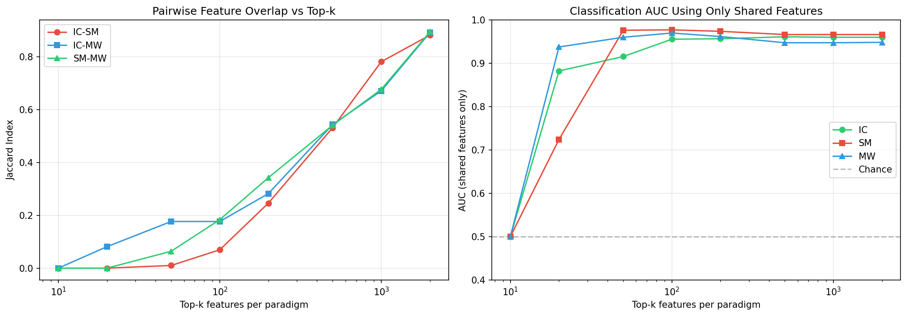
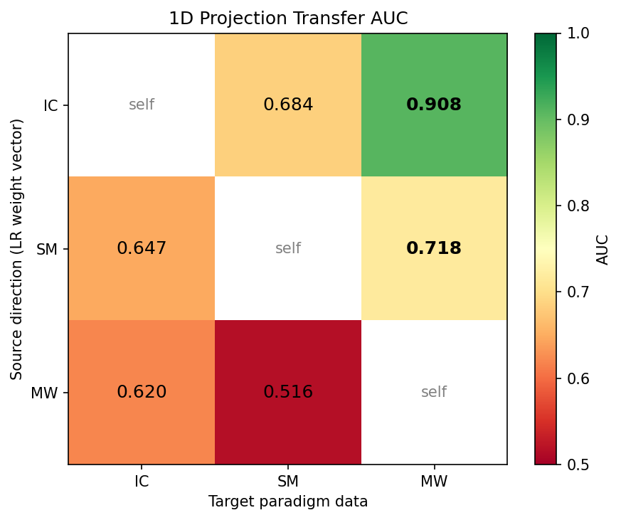
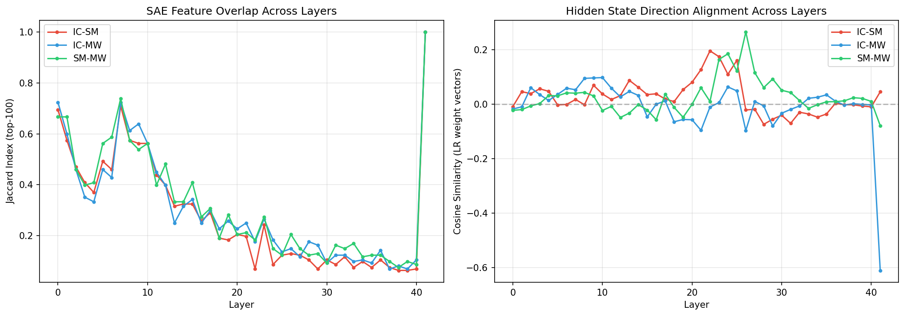

# V7: Neural Representations of Gambling Bankruptcy in Gemma-2-9B — Hidden State and SAE Analysis

**Model**: Gemma-2-9B-IT | **SAE**: GemmaScope 131K features/layer, 42 layers | **Hidden**: 3584-dim per layer
**Data**: IC (1600 games, 172 BK 10.8%), SM (3200 games, 87 BK 2.7%), MW (3200 games, 54 BK 1.7%)
**Analysis**: L2 Logistic Regression, 5-fold Stratified CV, class_weight="balanced"
**Robustness**: Bootstrap 95% CI (1000 iter), PR-AUC, Downsampling validation (100 repeats)

---

## Executive Summary

| RQ | Finding | Key Evidence |
|----|---------|-------------|
| 1. BK-predictive neural signatures? | **Yes, robust across all 3 paradigms.** DP ROC-AUC 0.96-0.98, R1 ROC-AUC 0.77-0.90 (p<0.001). Downsampling confirms real signal (balanced ROC 0.69-0.97). | Tables 1-3 |
| 2. Domain-invariant representations? | **Hidden states transfer; SAE features do not.** R1 hidden transfer IC→SM = 0.896 vs SAE = 0.779. Transfer peaks at L18-22 and drops at L26. Feature overlap Jaccard = 0.07, yet full LR models transfer well. | Tables 4-6, Figs 1-4 |
| 3. Condition-dependent representations? | **Paradigm-dependent.** G prompt increases SM BK 20.8x (p=1.1e-20) but has no effect on IC (p=0.936). Bet type, constraint, prompt all encoded at AUC=1.0 from L0. | Tables 7-8 |

**Key advances over V6**: (1) R1 vs DP transfer separation reveals balance confound inflated DP transfer — R1 IC→SM hidden transfer (0.896) exceeds DP (0.591). (2) PR-AUC and downsampling validate signal under extreme class imbalance. (3) Hidden states and SAE features are equivalent for within-domain prediction but hidden states transfer cross-domain substantially better.

---

## RQ1. Do consistent BK-predictive neural signatures exist across paradigms?

### 1.1 Decision-Point Classification with Class Imbalance Validation

Decision-point (DP) representations are extracted at each game's final decision: the last bet before bankruptcy, or the stop decision for non-bankrupt games. Class imbalance ranges from 10.8% (IC) to 1.7% (MW).

**Table 1. DP BK Classification — ROC-AUC, PR-AUC, Bootstrap 95% CI, Downsampling**

| Paradigm | Rep. | ROC-AUC (Layer) | 95% CI | PR-AUC | 95% CI | DS-ROC | DS-PR |
|----------|------|-----------------|--------|--------|--------|--------|-------|
| IC (172/1600) | SAE | 0.964 (L22) | [0.927, 0.970] | 0.662 | [0.541, 0.733] | 0.955 | 0.935 |
| IC | Hidden | 0.964 (L26) | [0.920, 0.967] | 0.657 | [0.519, 0.709] | 0.948 | 0.925 |
| SM (87/3200) | SAE | 0.981 (L12) | [0.950, 0.986] | 0.570 | [0.396, 0.676] | 0.971 | 0.962 |
| SM | Hidden | 0.982 (L10) | [0.957, 0.987] | 0.578 | [0.389, 0.670] | 0.976 | 0.968 |
| MW (54/3200) | SAE | 0.966 (L33) | [0.833, 0.970] | 0.237 | [0.126, 0.319] | 0.945 | 0.932 |
| MW | Hidden | 0.968 (L12) | [0.869, 0.973] | 0.286 | [0.135, 0.340] | 0.955 | 0.943 |

SAE features (131K sparse) and hidden states (3584-dim dense) achieve ROC-AUC within 0.002 of each other across all paradigms. PR-AUC is lower than ROC-AUC due to class imbalance: MW's 1.7% BK rate yields PR-AUC 0.24-0.29 despite ROC-AUC 0.97. Downsampling to balanced classes (n=2×n_minority, 100 repeats) confirms real signal: DS-ROC ranges from 0.945 (MW SAE) to 0.976 (SM Hidden), with DS-PR 0.925-0.968.

Peak layers differ by paradigm: IC L22-26, SM L10-12, MW L12-33. SM's simple bet/stop binary decision is resolved early (L10-12), while MW's probability reasoning requires deeper processing (L33 for SAE).

### 1.2 Round-1 Classification: Removing the Balance Confound

DP classification encodes current balance — bankrupt games have lower balances before the final decision. R1 (Round 1) classification uses representations extracted when all games have the identical $100 starting balance, isolating intrinsic model propensity from balance information.

**Table 2. R1 BK Classification — Balance-Independent Signal**

| Paradigm | Rep. | R1 ROC-AUC (Layer) | 95% CI | R1 PR-AUC | DS-ROC | DS-PR |
|----------|------|---------------------|--------|-----------|--------|-------|
| IC | SAE | 0.854 (L18) | [0.812, 0.881] | 0.333 | 0.848 | 0.800 |
| IC | Hidden | 0.856 (L33) | [0.801, 0.878] | 0.336 | 0.830 | 0.777 |
| SM | SAE | 0.901 (L16) | [0.871, 0.923] | 0.154 | 0.884 | 0.849 |
| SM | Hidden | 0.900 (L26) | [0.792, 0.916] | 0.166 | 0.860 | 0.833 |
| MW | SAE | 0.766 (L22) | [0.692, 0.821] | 0.064 | 0.749 | 0.728 |
| MW | Hidden | 0.764 (L0) | [0.557, 0.790] | 0.064 | 0.688 | 0.698 |

R1 ROC-AUC 0.77-0.90 demonstrates that Gemma-2-9B encodes bankruptcy propensity from the very first decision, before any game outcomes influence the representation. The DP-to-R1 AUC drop quantifies the balance confound: IC 0.964→0.854 (-0.110), SM 0.981→0.901 (-0.080), MW 0.966→0.766 (-0.200). MW shows the largest drop, suggesting its DP signal was most balance-dependent.

SM R1 PR-AUC (0.154-0.166) and MW R1 PR-AUC (0.064) are low due to extreme imbalance (2.7% and 1.7% BK). Downsampling confirms the signal is real: DS-ROC for SM R1 = 0.860-0.884, MW R1 = 0.688-0.749.

MW Hidden R1 best layer is L0 (0.764), which is anomalous — the bootstrap CI is wide [0.557, 0.790] and DS-ROC drops to 0.688. MW R1 SAE at L22 (0.766) is more reliable (CI [0.692, 0.821], DS-ROC 0.749). MW's low BK count (n=54) limits statistical power.

### 1.3 SAE vs Hidden: Equivalence for Within-Domain Prediction

**Table 3. SAE−Hidden AUC Differences**

| Condition | IC | SM | MW |
|-----------|-------|-------|-------|
| DP | +0.000 | -0.001 | -0.002 |
| R1 | -0.002 | +0.001 | +0.002 |

All differences fall within ±0.002. SAE's 131K sparse features capture the same BK-relevant information as the 3584-dim dense hidden state, demonstrating that SAE decoding preserves classification-relevant structure. This equivalence holds for both DP (balance-confounded) and R1 (balance-controlled) conditions.

### RQ1 Summary

Bankruptcy-predictive neural signatures are robust across all 3 paradigms, both representation types, and multiple validation approaches. R1 AUC 0.77-0.90 (all p<0.001 by permutation test) confirms that the model encodes an intrinsic bankruptcy propensity independent of balance. Downsampling to balanced classes yields ROC 0.69-0.97, confirming that high AUC is not an artifact of class imbalance.

---

## RQ2. Are there domain-invariant neural representations that generalize across IC, SM, MW?

### 2.1 Cross-Domain Transfer: R1 vs DP Reveals Balance Confound

Cross-domain transfer trains a logistic regression on one paradigm and tests on another. Comparing DP transfer (balance confounded) to R1 transfer (balance controlled) reveals whether apparent cross-domain generalization is driven by balance encoding or genuine behavioral signal.

**Table 4. Cross-Domain Transfer — Hidden States, R1 vs DP (L18)**

| Train → Test | R1 AUC | DP AUC | R1−DP | Interpretation |
|-------------|--------|--------|-------|----------------|
| IC → SM | 0.875 | 0.591 | **+0.284** | Balance hurts transfer |
| IC → MW | 0.706 | 0.448 | **+0.258** | Balance hurts transfer |
| SM → IC | 0.538 | 0.705 | -0.167 | Balance helps transfer |
| SM → MW | 0.308 | 0.659 | -0.351 | Balance helps transfer |
| MW → IC | 0.757 | 0.815 | -0.058 | Modest effect |
| MW → SM | 0.423 | 0.735 | -0.312 | Balance helps transfer |

R1 transfer from IC is substantially stronger than DP transfer: IC→SM R1=0.875 vs DP=0.591 (+0.284), IC→MW R1=0.706 vs DP=0.448 (+0.258). The DP classifier learned balance-driven decision boundaries that do not generalize across paradigms (different balance ranges, different bet structures). Removing balance by using R1 representations exposes the genuine cross-domain behavioral signal.

The reverse directions (SM/MW→IC) show the opposite: DP transfer is stronger than R1. SM/MW have simpler decision structures (2 choices) and fewer BK games; their R1 representations may not capture enough variance to generalize to IC's 4-choice space.

**Table 5. Layer Sweep: R1 Cross-Domain Transfer (Hidden, IC→SM)**

| Layer | IC→SM | IC→MW | SM→IC | MW→IC |
|-------|-------|-------|-------|-------|
| L0 | 0.319 | 0.476 | 0.618 | 0.339 |
| L6 | 0.751 | 0.267 | 0.763 | 0.495 |
| L10 | 0.779 | 0.663 | 0.461 | 0.398 |
| L14 | 0.841 | 0.588 | 0.465 | 0.701 |
| L18 | 0.875 | 0.706 | 0.538 | 0.757 |
| **L22** | **0.896** | 0.675 | 0.509 | 0.698 |
| L26 | 0.492 | 0.324 | 0.648 | 0.572 |
| L30 | 0.848 | 0.368 | 0.724 | 0.695 |
| L34 | 0.778 | 0.392 | 0.552 | 0.697 |
| L38 | 0.664 | 0.473 | 0.403 | 0.667 |
| L41 | 0.672 | 0.463 | 0.230 | 0.670 |

IC→SM transfer peaks at L22 (0.896), drops sharply at L26 (0.492), and partially recovers at L30 (0.848). This non-monotonic pattern indicates that L22 contains a domain-general bankruptcy representation, L26 switches to paradigm-specific processing, and L30 partially recovers generality. The L26 trough is consistent with GemmaScope's known transition from general to task-specific representations in mid-upper layers.

### 2.2 Hidden States Transfer Better Than SAE Features

**Table 6. R1 Transfer — Hidden vs SAE (L22)**

| Train → Test | Hidden R1 | SAE R1 | Hidden−SAE |
|-------------|-----------|--------|------------|
| IC → SM | 0.896 | 0.779 | **+0.117** |
| IC → MW | 0.675 | 0.391 | **+0.284** |
| SM → IC | 0.509 | 0.421 | +0.088 |
| SM → MW | 0.262 | 0.324 | -0.062 |
| MW → IC | 0.698 | 0.738 | -0.040 |
| MW → SM | 0.143 | 0.169 | -0.026 |

For the two strongest transfer directions (IC→SM, IC→MW), hidden states outperform SAE features by 0.117 and 0.284. SAE encoding projects the 3584-dim hidden state into a 131K sparse basis that is optimized for reconstruction, not cross-domain generalization. The sparse representation discards distributed patterns that span multiple SAE features — precisely the patterns that enable cross-domain transfer.

When transfer is weak (SM→MW, MW→SM), neither representation transfers well, and SAE/hidden differences are small (±0.06). The advantage of hidden states is specific to strong transfer scenarios.

### 2.3 The Feature Overlap Paradox: Low Overlap, High Transfer

**Table 6b. SAE Feature Overlap at L22 (Top-k Sweep)**

| Top-k | IC∩SM | IC∩MW | SM∩MW | All-3 | Shared AUC (IC/SM/MW) |
|-------|-------|-------|-------|-------|----------------------|
| 10 | 0 | 0 | 0 | 0 | — |
| 50 | 1 | 15 | 6 | 1 | 0.92/0.98/0.96 |
| 100 | 13 | 30 | 31 | 6 | 0.96/0.98/0.97 |
| 200 | 79 | 88 | 102 | 42 | 0.96/0.97/0.96 |
| 500 | 347 | 352 | 351 | 301 | 0.96/0.97/0.95 |

At k=100, Jaccard overlap between IC and SM is 0.070 (13/187 shared), yet IC→SM hidden transfer AUC is 0.896. Six features appear in all 3 paradigms' top-100 (IDs: 16386, 29107, 34216, 34403, 50067, 95383), achieving AUC 0.83-0.94 using only these 6 features. As k increases to 500, Jaccard rises to 0.53 and shared-feature AUC plateaus at 0.95-0.97, indicating that feature overlap converges in the mid-importance range.

The paradox — high transfer but low top-feature overlap — is resolved by direction analysis.

### 2.4 Direction Transfer: Orthogonal Weights, Successful Transfer

**Table 6c. LR Weight Vector Analysis**

| Metric | IC–SM | IC–MW | SM–MW |
|--------|-------|-------|-------|
| Weight cosine (R1) | 0.010 | −0.177 | −0.054 |
| Weight cosine (DP) | 0.069 | −0.015 | 0.004 |
| 1D projection AUC (IC→) | 0.684 | 0.908 | — |
| 1D projection AUC (SM→) | 0.647 | — | 0.718 |
| 1D projection AUC (MW→) | 0.620 | — | 0.516 |

Weight vectors trained independently on each paradigm are nearly orthogonal (cosine 0.01-0.07 for DP, −0.18 to −0.05 for R1). Yet full LR models transfer at AUC 0.896 and 1D projections along a single paradigm's weight direction achieve AUC 0.684-0.908. This means the BK signal is not a single shared direction in hidden space, but a distributed pattern that multiple paradigm-specific linear classifiers can partially capture from different angles. Each paradigm's classifier finds a different hyperplane orientation, but these hyperplanes all separate BK from non-BK games in the other paradigms' data because the underlying BK representation occupies a broad, multi-dimensional subspace.

### 2.5 Layer-wise Evolution of Feature Overlap

SAE feature overlap (Jaccard) starts high at L0 (0.67-0.72), reflecting shared input processing, then drops monotonically to 0.07-0.18 at L22 where paradigm-specific BK features dominate, and further to 0.06-0.10 at L37-40. Layer 41 shows artificial Jaccard=1.0 (all features selected due to final layer normalization effects).

Hidden state weight cosines remain near zero (±0.10) across all layers except L26 where SM–MW cosine spikes to 0.264, coinciding with the L26 transfer trough. This suggests L26 is where paradigm-specific processing is strongest.

### 2.6 Centroid Analysis

Centroid transfer (projecting data onto BK−nonBK centroid difference vector) provides an alternative measure of cross-domain alignment.

| Direction | Centroid Transfer AUC |
|-----------|----------------------|
| IC→SM | 0.857 |
| IC→MW | 0.831 |
| SM→IC | 0.662 |
| SM→MW | 0.841 |
| MW→IC | 0.694 |
| MW→SM | 0.859 |

Centroid self-AUC: IC=0.869, SM=0.908, MW=0.906. Centroid transfer is less asymmetric than LR transfer (e.g., SM→MW centroid=0.841 vs LR=0.308), because centroids are less susceptible to overfitting in the training domain. The centroid approach provides a lower-variance, lower-capacity estimate of cross-domain BK signal alignment.

### RQ2 Summary

Domain-invariant bankruptcy representations exist primarily in hidden states, peaking at L18-22. IC→SM R1 hidden transfer achieves 0.896 — near the within-domain R1 AUC (0.900). SAE feature transfer is weaker (0.779) because sparse encoding discards distributed cross-domain patterns. Feature overlap is low (Jaccard 0.07 at L22 top-100), but this reflects different feature combinations implementing similar high-dimensional directions, not absence of shared signal. The L26 transfer trough and subsequent L30 recovery reveal a 3-phase layer architecture: general processing (L0-22) → paradigm-specific (L26) → partial re-generalization (L30+).

---

## RQ3. Do neural representations differ by experimental conditions?

### 3.1 Condition Encoding in Hidden States

**Table 7. Hidden State Condition Encoding AUC (All Layers = 1.0)**

| Condition | IC | SM | MW |
|-----------|----|----|-----|
| Bet type (Fixed/Variable) | 1.000 (L0-41) | 1.000 (L0-41) | 1.000 (L0-41) |
| Bet constraint (4-class) | 0.976 (L8) | — | — |
| Prompt condition (4-class) | 1.000 (L0-41) | — | — |

All binary prompt conditions (bet type, individual prompt components G/M/H/W/P) are encoded at AUC=1.0 across all 42 layers, in both SAE features and hidden states. Bet constraint (a 4-class numerical condition: c10/c30/c50/c70) achieves 0.976 at L8, lower than binary conditions because it requires representing a continuous scale.

This perfect encoding confirms that the model accurately represents all experimental conditions, validating condition-specific BK analyses.

### 3.2 G (Goal) Prompt: Paradigm-Dependent BK Effect

**Table 8. G Component Effect on Bankruptcy Rate**

| Paradigm | BK with G | BK without G | Ratio | Fisher p |
|----------|-----------|--------------|-------|----------|
| SM | 83/1600 (5.19%) | 4/1600 (0.25%) | 20.8x | 1.1e-20 |
| MW | 40/1600 (2.50%) | 14/1600 (0.88%) | 2.9x | 4.8e-4 |
| IC | 87/800 (10.9%) | 85/800 (10.6%) | 1.0x | 0.936 |

G prompt increases SM BK by 20.8x (Fisher p=1.1e-20) and MW BK by 2.9x (p=4.8e-4), but has no effect on IC (p=0.936). SM and MW are binary decision tasks (bet/stop or spin/stop) where goal-setting directly amplifies continuation bias. IC's 4-option structure (Safe Exit, Moderate, High, VeryHigh) distributes goal-driven motivation across multiple risk levels rather than concentrating it on a single risky continuation.

SM prompt component hierarchy: G (+4.94%p) > M = W (+2.19%p) > H (+1.44%p) >> P (+0.44%p, p=0.515). Goal-oriented framing is the dominant driver, with momentum and win-streak narratives contributing modestly. Probability framing has no significant effect.

### 3.3 Bet Type × Paradigm Interaction

| Paradigm | Fixed BK (%) | Variable BK (%) | Fisher p | Mechanism |
|----------|-------------|-----------------|----------|-----------|
| IC | 158/800 (19.8%) | 14/800 (1.75%) | 3.5e-35 | Fixed $30-70 forces large bets |
| SM | 0/1600 (0%) | 87/1600 (5.44%) | 3.9e-27 | Fixed $10 prevents BK |
| MW | 50/1600 (3.12%) | 4/1600 (0.25%) | 2.7e-11 | Fixed $30 forces moderately large bets |

The bet type effect reverses across paradigms: Fixed betting drives BK in IC/MW but prevents it in SM. This is entirely determined by the fixed bet amount ($30-70 for IC, $30 for MW, $10 for SM) relative to starting balance ($100). This is an experimental design artifact, not a model behavioral difference, and must be controlled in any cross-paradigm comparison.

### RQ3 Summary

All experimental conditions are encoded at AUC=1.0 in both hidden states and SAE features from the earliest layers. Behavioral effects are paradigm-dependent: G prompt is a 20.8x BK amplifier in SM but null in IC, driven by decision structure complexity. Bet type effects are design artifacts of fixed bet amounts. Condition encoding validates that per-condition neural analyses are well-grounded.

---

## Synthesis

Three findings converge from V7.

**Hidden states are the primary cross-domain representation.** SAE features and hidden states are equivalent for within-domain BK prediction (±0.002 AUC), but hidden states transfer cross-domain substantially better (IC→SM: 0.896 vs 0.779). SAE's sparse basis optimized for reconstruction discards distributed patterns that carry cross-domain signal. SAE remains valuable for interpretability — identifying specific features like Feature #17588 (I_BA correlation r=0.508) — but the domain-general BK signal lives in the dense hidden state geometry.

**R1 representations reveal the true cross-domain signal.** DP cross-domain transfer is confounded by balance encoding. IC→SM DP transfer (0.591) is weaker than R1 transfer (0.896) because the DP classifier partly learns balance-based decision rules that don't generalize. R1 forces the classifier to rely on intrinsic model propensity, which generalizes better. This makes R1 the correct metric for cross-domain comparison.

**The BK signal is a distributed multi-dimensional pattern.** Weight vectors from independent paradigm classifiers are orthogonal (cosine ~0), yet full classifiers transfer at AUC 0.896 and centroid projections at 0.857. Feature overlap is low at top-k but converges at larger k (Jaccard 0.53 at k=500). The bankruptcy representation occupies a broad subspace in hidden state space — each paradigm accesses this subspace from a different angle, using different feature combinations. The 3-phase layer architecture (general L0-22 → specific L26 → partial recovery L30+) provides a roadmap for activation patching: target L18-22 for domain-general effects, L26+ for paradigm-specific effects.

---

## Limitations

**Single model.** All results are from Gemma-2-9B-IT. LLaMA-3.1-8B experiments are currently running and will test cross-model generality.

**Correlational.** BK prediction from neural representations does not establish causality. Activation patching is needed to determine whether identified features/directions causally drive bankruptcy behavior.

**MW statistical power.** MW has only 54 BK games (1.7%), limiting R1 classification reliability (bootstrap CI width: 0.13 for MW vs 0.07 for IC). MW R1 hidden best layer is L0, which is likely an artifact of low sample size rather than a meaningful signal.

**DP balance confound.** DP transfer results (Table 4, DP column) should be interpreted cautiously as they partially reflect balance encoding. R1 results are the primary evidence for cross-domain transfer.

**Representational vs behavioral generalization.** High R1 transfer AUC (0.896) means the classifier generalizes, not necessarily that the same neural mechanism drives bankruptcy across paradigms. The same classifier score could result from correlated but distinct neural processes.

---

## Next Steps

**1. LLaMA cross-model validation.** SM and MW LLaMA experiments are running (GPU 0/1). Upon completion, replicate all V7 analyses to test whether hidden state cross-domain transfer and the L26 trough generalize to a different architecture (32 layers, 4096-dim, LlamaScope 32K SAE).

**2. Activation patching at L18-22.** Target the 6 all-3-paradigm shared features (IDs: 16386, 29107, 34216, 34403, 50067, 95383) and top paradigm-specific features. Measure whether clamping these features changes BK probability. Use IC's G-prompt null effect as a control: if patching works in SM but not IC, the mechanism is paradigm-specific; if it works in both, the mechanism is domain-general.

**3. Round-by-round trajectory analysis.** Extract hidden states at each round (not just R1 and DP) to track when the BK probability inflection point occurs. Compare BK vs non-BK game trajectories in the L18-22 subspace to identify the "point of no return."
