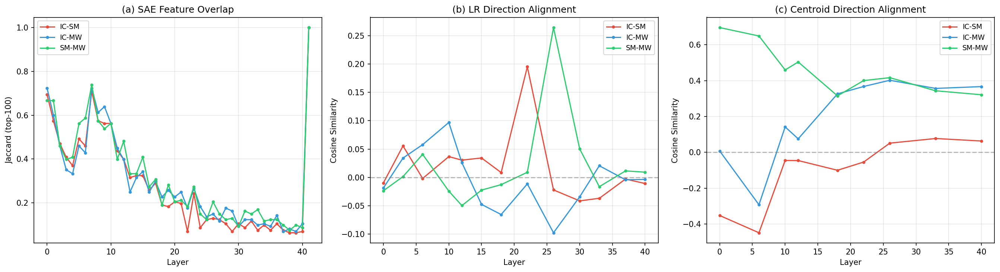
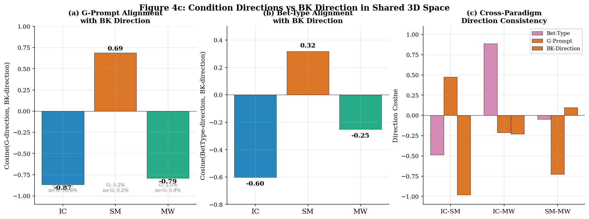
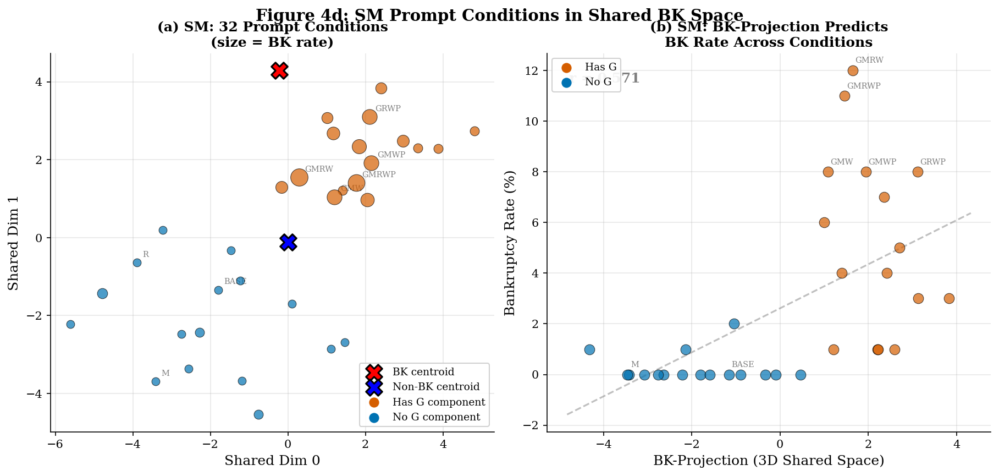
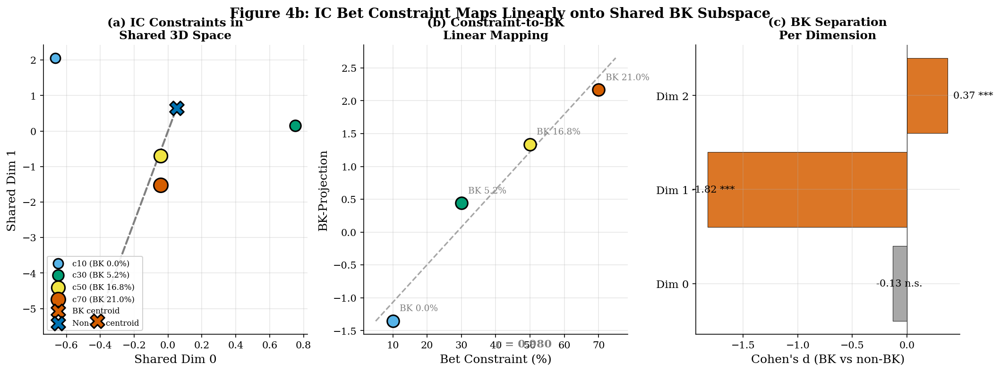
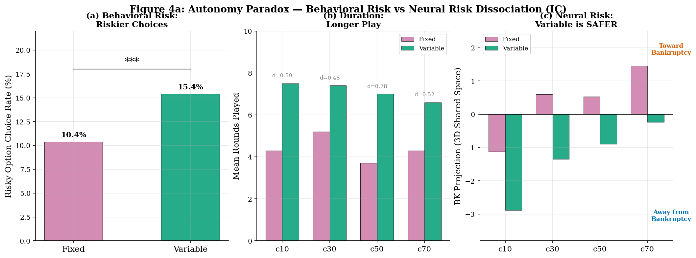

# V8: Cross-Domain Neural Features of Gambling Bankruptcy in Gemma-2-9B

**Model**: Gemma-2-9B-IT | **Hidden**: 3584-dim, 42 layers | **SAE**: GemmaScope 131K features/layer
**Data**: IC (1600 games, 172 BK 10.8%), SM (3200 games, 87 BK 2.7%), MW (3200 games, 54 BK 1.7%)
**LLaMA Status**: SM 1850/3200 (GPU 0), MW 700/3200 (GPU 1) -- in progress
**Pipeline**: StandardScaler → PCA(50) → LogReg(C=1.0, balanced) | 5-fold StratifiedKFold
**Date**: 2026-03-12

---

## Central Question

**Cross domain, round, 조건에 따라 변하지 않고 일관적인 hidden state feature가 파산을 예측하는가?**

## Executive Summary

**RQ1 — 일관된 BK feature가 존재하는가?** 3584개 neuron 중 600개(16.7%)가 3개 패러다임 모두에서 sign-consistent하게 BK를 예측한다 (L22, DP 기반). Neuron #1763이 가장 강하다 (min|r|=0.217). Within-bet-type R1에서도 분류 가능(AUC 0.62-0.80, perm p<0.05)하여, 이 신호가 bet-type이나 balance에 의존하지 않음을 확인. SAE Feature #101036이 유일한 sign-consistent cross-domain sparse feature (d=0.34-1.67).

**RQ2 — 도메인 무관한가?** IC→SM R1 전이 AUC 0.875 (bet-type이 반전됨에도). Hidden state 전이가 SAE 전이보다 0.12-0.28 높아, BK 신호는 distributed representation에 있다. 3개 LR weight vector의 PCA로 도출한 3D subspace에서 AUC 0.91-0.94.

**RQ3 — 조건별로 달라지는가?** G-prompt는 SM에서만 BK 방향과 정렬(cos=+0.69), IC/MW에서는 반대(cos=-0.87/-0.79). Bet constraint(c10→c70)는 BK-projection에 선형 매핑(r=0.98). Variable은 행동적으로 더 위험하지만(15.4% vs 10.4% risky choices), BK-projection은 더 낮다 — BK feature가 재정적 궤적을 인코딩하기 때문.

---

## 1. Setup

### 1.1 Data & Representations

| Paradigm | Games | BK | BK% | Bet Types | Constraints | Prompt Conditions |
|----------|-------|-----|------|-----------|-------------|-------------------|
| IC | 1600 | 172 | 10.8% | Fixed/Variable | c10/c30/c50/c70 | BASE/G/M/GM |
| SM | 3200 | 87 | 2.7% | Fixed/Variable | $10 fixed | 32 prompt combos |
| MW | 3200 | 54 | 1.7% | Fixed/Variable | $30 fixed | 32 prompt combos |

**Hidden states**: 42개 layer의 residual stream (3584-dim). **Decision Point (DP)**: 마지막 결정 시점. **Round 1 (R1)**: 첫 라운드 ($100 동일 잔액). **SAE**: GemmaScope 131K features/layer.

---

## 2. RQ1: 일관된 BK Feature는 존재하는가

### 2.1 600개 Universal BK Neurons (L22)

3584개 neuron 중 1,238개(34.5%)가 3개 패러다임 모두에서 유의미하며(FDR p<0.01), 이 중 **600개(16.7%)가 sign-consistent** — 3개 패러다임에서 BK와의 상관 방향이 동일하다.

**Table 1. Top-10 Universal BK Neurons (sign-consistent, ranked by min|r|)**

| Rank | Neuron | min|r| | IC r | SM r | MW r | Direction |
|------|--------|--------|------|------|------|-----------|
| 1 | **1763** | 0.217 | +0.305 | +0.248 | +0.217 | BK-promoting |
| 2 | 371 | 0.203 | -0.223 | -0.203 | -0.210 | BK-inhibiting |
| 3 | 2951 | 0.198 | -0.198 | -0.207 | -0.266 | BK-inhibiting |
| 4 | 1755 | 0.190 | -0.210 | -0.198 | -0.190 | BK-inhibiting |
| 5 | 864 | 0.182 | -0.267 | -0.182 | -0.182 | BK-inhibiting |
| 6 | 1843 | 0.182 | -0.235 | -0.182 | -0.187 | BK-inhibiting |
| 7 | 2665 | 0.180 | +0.262 | +0.180 | +0.198 | BK-promoting |
| 8 | 1255 | 0.179 | -0.269 | -0.193 | -0.179 | BK-inhibiting |
| 9 | 3436 | 0.178 | +0.197 | +0.178 | +0.208 | BK-promoting |
| 10 | 1884 | 0.178 | +0.250 | +0.178 | +0.200 | BK-promoting |

Top-10에서 BK-inhibiting(6개)이 BK-promoting(4개)보다 많다. 모델에는 본래 risk-억제 neuron이 더 풍부하며, 파산 게임에서 이들이 억제된다.

**DP confound 주의**: 이 분석은 DP 기반이므로 일부 neuron은 balance 차이를 반영할 수 있다. R1 기반 neuron-level 재검증이 필요하다 (Section 2.3 참조).

### 2.2 SAE Feature #101036: 유일한 Sign-Consistent Cross-Domain Sparse Feature

**Table 2. Top-5 Cross-Domain SAE Features (L22, geometric mean importance)**

| Feature ID | Geo-Mean | Sign Consistent? | Cohen's d (IC/SM/MW) |
|-----------|---------|-----------------|---------------------|
| 14394 | 0.698 | MIXED | -0.18 / +0.25 / -0.68 |
| **101036** | **0.606** | **YES** | **+0.34 / +1.26 / +1.67** |
| 20403 | 0.522 | MIXED | +0.08 / +1.31 / +0.60 |
| 125724 | 0.520 | MIXED | +0.70 / -0.29 / -0.43 |
| 109196 | 0.501 | MIXED | +0.20 / -0.12 / -0.01 |

Top-50 cross-domain features 중 11개(22%)만 sign-consistent. **Feature #101036이 유일한 universal BK feature**: 3개 패러다임 모두에서 positive (높은 활성화 = BK). 단, balance와 상관(SM r=-0.33, MW r=-0.45)이 있어 partial balance encoding 가능성 있음.

SAE 전체적으로는 cross-domain 신호 포착에 한계: hidden state cross-domain transfer가 SAE보다 0.12-0.28 높다 (IC→SM: hidden 0.896 vs SAE 0.779). BK 신호가 distributed representation에 있어, sparsification이 패러다임 간 coherence를 깨뜨린다.

### 2.3 R1에서도 작동하는가: Bet-Type Confound 통제

R1(Round 1)에서는 모든 게임의 잔액이 $100으로 동일하다. 그러나 bet type이 hidden state에 AUC=1.0으로 인코딩되어 있고 BK와 상관되므로, bet-type confound를 통제해야 한다.

**Table 3. Within-Bet-Type R1 Classification (Confound-Controlled)**

| Subset | n | BK (%) | Within AUC | Perm p | z |
|--------|---|--------|-----------|--------|---|
| IC Fixed | 800 | 158 (19.8%) | **0.753** | 0.010 | 6.07 |
| IC Variable | 800 | 14 (1.8%) | 0.692 | 0.020 | 1.99 |
| SM Variable | 1600 | 87 (5.4%) | **0.805** | 0.010 | 6.70 |
| MW Fixed | 1600 | 50 (3.1%) | 0.617 | 0.040 | 1.98 |

참고: 전체 R1 AUC는 0.77-0.90이지만, bet-type-alone baseline이 0.72-0.76이므로 confound를 포함한다.

Bet-type 통제 후에도 모든 subset에서 perm p < 0.05. IC Fixed(0.753, z=6.07)와 SM Variable(0.805, z=6.70)이 가장 강하다. **R1 시점에서 balance와 bet-type 모두 통제해도 BK 예측 신호가 남는다** — 이는 "risk disposition" 인코딩의 증거이다.

DP 분류(AUC 0.96-0.98)는 높지만 balance confound를 포함하므로, within-bet-type R1 AUC 0.62-0.80이 confound-free 추정치이다.

### 2.4 RQ1 종합

| 표상 수준 | 일관된 BK feature | 한계 |
|----------|------------------|------|
| Hidden neurons (L22) | 600/3584 (16.7%) sign-consistent | DP 기반, R1 재검증 필요 |
| SAE features (L22) | 1/50 sign-consistent (#101036) | Balance 상관, layer 간 overlap=0 |
| R1 (confound-free) | Within-bet-type AUC 0.62-0.80 | MW 약함 (0.617) |

BK를 일관되게 예측하는 feature는 존재하며, hidden state neuron 수준에서 가장 강하다 (600개). SAE는 cross-domain coherence를 잃어 1개만 남는다. 다만 DP 기반 neuron 분석의 R1 검증과, activation patching에 의한 인과성 확인이 필요하다.

---

## 3. RQ2: 도메인 무관한가

### 3.1 Cross-Domain Transfer

IC에서 학습한 classifier가 SM/MW에서도 작동하는가?

**Table 4. R1 Cross-Domain Transfer (Hidden States, L18)**

| Train → Test | R1 AUC | DP AUC | 해석 |
|-------------|--------|--------|------|
| IC → SM | **0.875** | 0.591 | R1에서 강한 전이 (DP는 balance confound) |
| IC → MW | **0.706** | 0.448 | R1에서 전이 |
| SM → IC | 0.538 | 0.705 | chance 수준 (유의미하지 않음) |
| MW → IC | 0.757 | 0.815 | 양방향 적절 |

IC→SM R1 전이 0.875가 가장 강한 증거: IC에서 BK의 92%가 Fixed, SM에서 BK의 100%가 Variable이므로, bet-type을 학습한 classifier라면 AUC < 0.5이어야 한다. 0.875는 bet-type을 넘어선 genuine risk signal의 전이이다. 전이의 비대칭(IC→SM/MW 강, 역방향 약)은 IC의 복합 결정 공간(4지선다 × 4 constraint)이 더 일반적인 BK 표상을 형성하기 때문이다.

Layer sweep에서 IC→SM은 L0(0.32)→L22(0.90)까지 상승 후 L26에서 0.49로 급락, L30에서 0.85로 부분 회복. L26 trough는 IC→SM 특이적이며, 다른 방향에서는 덜 명확하다.

### 3.2 3D Shared Subspace

3개 패러다임의 LR weight vector로 PCA를 수행하면, 3차원만으로 BK 분류가 가능하다.

| Paradigm | Full (PCA50) | Shared (3D) | Residual |
|----------|-------------|-------------|----------|
| IC | 0.974 | **0.941** | 0.968 |
| SM | 0.990 | **0.909** | 0.986 |
| MW | 0.986 | **0.945** | 0.982 |

이 3D 공간은 LR weight에서 도출한 수학적 구성물이며, 해석에 주의가 필요하다. 다만 3584차원 중 3차원만으로 AUC 0.91-0.94를 달성한다는 것은, BK 신호가 소수의 공유 방향에 집중되어 있음을 시사한다.

### 3.3 Hidden vs SAE: Cross-Domain 전이에서의 차이

| Train → Test | Hidden R1 | SAE R1 | Gap |
|-------------|-----------|--------|-----|
| IC → SM | 0.896 | 0.779 | +0.117 |
| IC → MW | 0.675 | 0.391 | +0.284 |

Within-domain에서는 hidden과 SAE가 동등(±0.002)하지만, cross-domain에서는 hidden이 우월하다. SAE의 sparsification이 패러다임 간 공유 distributed pattern을 개별 feature로 분해하면서 coherence를 잃는다. 이것이 Section 2.2에서 SAE sign-consistent feature가 1개뿐인 이유이기도 하다.

### 3.4 RQ2 종합

BK 신호는 도메인을 관통한다: IC→SM R1 전이 0.875 (bet-type 반전에도), 600 universal neurons, 3D shared subspace AUC 0.91-0.94. 단, 전이는 비대칭(IC→SM/MW 강, 역방향 약)이며, SAE는 이 공유 신호를 포착하지 못한다. **일관된 BK feature는 hidden state의 distributed representation에 존재하며, sparse encoding으로는 접근이 어렵다.**

---

## 4. RQ3: 조건별로 달라지는가

### 4.1 조건은 완벽하게 인코딩된다

| Condition | IC | SM | MW |
|-----------|----|----|-----|
| Bet type (Fixed/Variable) | 1.000 (L0-41) | 1.000 (L0-41) | 1.000 (L0-41) |
| Bet constraint (4-class) | 0.976 (L8) | -- | -- |
| Prompt condition (4-class) | 1.000 (L0-41) | -- | -- |

조건 정보는 embedding부터 완벽하게 인코딩된다. 문제는 이 조건이 BK feature의 activation을 어떻게 조절(modulate)하는가이다.

### 4.2 G-Prompt: SM에서만 BK 방향과 정렬

G prompt(Goal-setting)의 BK 효과는 패러다임에 따라 극적으로 다르다: SM 20.8배(5.19% vs 0.25%), MW 2.9배, IC 1.0배(무효).

3D shared subspace에서 G-prompt 방향과 BK 방향의 cosine:

| Paradigm | cos(G-dir, BK-dir) | G BK rate | no-G BK rate |
|----------|-------------------|-----------|-------------|
| SM | **+0.69** | 5.19% | 0.25% |
| MW | -0.79 | 2.50% | 0.88% |
| IC | -0.87 | 10.9% | 10.6% |

SM에서만 G가 BK 방향으로 작동한다. 원인: SM은 이항 결정(continue/stop)이므로 Goal이 "멈추지 않기"로 직결되지만, IC는 4지선다에서 moderate option으로 분산, IC의 BK는 주로 bet constraint에 의해 결정.

SM 32개 조건의 BK-projection과 BK rate: r = 0.71. G 포함 조건이 BK centroid 근처에 군집한다.

### 4.3 Bet Constraint: BK Feature Activation의 연속적 조절

IC의 4가지 bet constraint를 3D shared space에 투영하면, BK 방향으로 단조 증가한다.

| Constraint | BK Rate | BK-Projection |
|-----------|---------|---------------|
| c10 | 0.0% | -1.37 |
| c30 | 5.2% | +0.48 |
| c50 | 16.8% | +1.29 |
| c70 | 21.0% | +2.04 |

c10→c70으로의 BK-projection 증가(r=0.98)는 실험 설계의 재정적 위험도가 hidden state에 그대로 반영됨을 의미한다. BK feature의 activation이 외부 조건에 의해 연속적으로 조절된다.

### 4.4 Fixed vs Variable: 행동적 위험과 신경 표상의 해리

Variable은 행동적으로 더 위험하지만(IC: 15.4% vs 10.4% risky choices, 1.65x longer play), 3D BK-projection은 모든 constraint에서 Fixed보다 1.4-2.0 낮다(= BK에서 더 멀다).

BK-projection과 행동 지표의 상관: absolute balance change r=0.52, volatility r=0.22, rounds r=-0.10. BK feature가 인코딩하는 것은 **"선택의 위험성"이 아니라 "재정적 궤적의 위험성"**이다. Variable의 배팅 크기 자기 조절이 재정적 변동을 억제하므로, 위험한 선택에도 BK feature activation이 낮다.

파산하지 않은 게임 내에서는 BK-projection과 risky choice rate가 양의 상관(Fixed r=0.15*, Variable r=0.20**) — BK feature는 연속적 위험 스펙트럼을 인코딩하며, 파산은 그 극단이다.

### 4.5 RQ3 종합

| 조건 | BK feature에 미치는 영향 | 해석 |
|------|------------------------|------|
| G-prompt | SM에서만 BK 방향 정렬(+0.69), IC/MW 반대 | 패러다임 결정 구조에 의존 |
| Bet constraint | c10→c70 선형 매핑 (r=0.98) | 재정적 위험도가 연속 인코딩 |
| Fixed/Variable | Variable이 BK-proj 1.4-2.0 낮음 | 배팅 크기 자기 조절 → 재정적 안전 |
| Cross-paradigm bet-type direction | IC-MW cos=0.89, IC-SM cos=-0.49 | 실험 설계 차이 반영 |

BK feature의 activation은 조건에 의해 체계적으로 조절된다. 그러나 조건 효과의 방향은 패러다임 구조(이항/다지선다, 강제 배팅액)에 의존한다. **Feature 자체의 존재와 BK와의 상관 방향은 일관적이지만(RQ1-2), 그 activation 수준은 조건에 의해 변한다(RQ3).**

---

## 5. Limitations

1. **DP confound**: 600 universal neurons는 DP 기반. R1 neuron-level 분석으로 balance-free 검증 필요.
2. **Correlational**: 인과성 미검증. Activation patching으로 universal neurons의 causal role 확인 필요.
3. **Single model**: Gemma-2-9B-IT만 분석. LLaMA 진행 중 (SM 1850/3200, MW 700/3200).
4. **MW statistical power**: 54 BK (1.7%)로 R1 분석 신뢰도 제한.
5. **3D subspace 해석 주의**: LR weight PCA에서 도출한 수학적 구성물. 개별 차원에 신경학적 의미를 부여하는 것은 과해석 위험.

---

## 6. Next Steps

1. **R1 neuron-level 분석**: 600 universal neurons가 R1에서도 sign-consistent한지 검증
2. **Activation patching**: Top universal neurons/features의 causal effect 측정 (Gemma)
3. **조건별 neuron activation 직접 비교**: 600 neurons의 activation을 Fixed/Variable, G/no-G, c10-c70으로 조건 분해하여 modulation 패턴 분석
4. **LLaMA cross-model 검증**: SM/MW 완료 후 동일 pipeline 적용
5. **Round-by-round trajectory**: R1→DP까지 universal neuron activation 변화 추적

---

## Appendix A: Key Tables (Supplementary)

### DP Classification (Balance Confounded)

| Paradigm | Hidden AUC (Layer) | SAE AUC (Layer) | 95% CI |
|----------|-------------------|-----------------|--------|
| IC | 0.964 (L26) | 0.964 (L22) | [0.920, 0.970] |
| SM | 0.982 (L10) | 0.981 (L12) | [0.950, 0.987] |
| MW | 0.968 (L12) | 0.966 (L33) | [0.833, 0.973] |

### R1 Classification (전체, bet-type confound 포함)

| Paradigm | Hidden AUC (Layer) | SAE AUC (Layer) | Bet-type baseline |
|----------|-------------------|-----------------|-------------------|
| IC | 0.856 (L33) | 0.854 (L18) | 0.735 |
| SM | 0.900 (L26) | 0.901 (L16) | 0.757 |
| MW | 0.764 (L0) | 0.766 (L22) | 0.717 |

### SAE Feature Overlap (L22)

| Top-k | IC∩SM | IC∩MW | SM∩MW | All-3 |
|-------|-------|-------|-------|-------|
| 50 | 1 | 15 | 6 | 1 |
| 100 | 13 | 30 | 31 | 6 |
| 200 | 79 | 88 | 102 | 42 |

### LR Weight Cosines (L22)

| Metric | IC-SM | IC-MW | SM-MW |
|--------|-------|-------|-------|
| DP | 0.069 | -0.015 | 0.004 |
| R1 | 0.010 | -0.177 | -0.054 |

Weight vector가 거의 직교(cosine~0)인데 전이 AUC가 0.7-0.9 — BK 신호가 단일 방향이 아니라 subspace에 분산.

