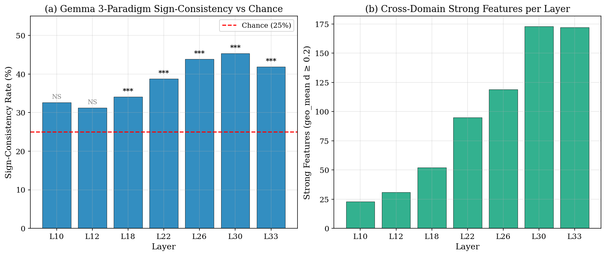
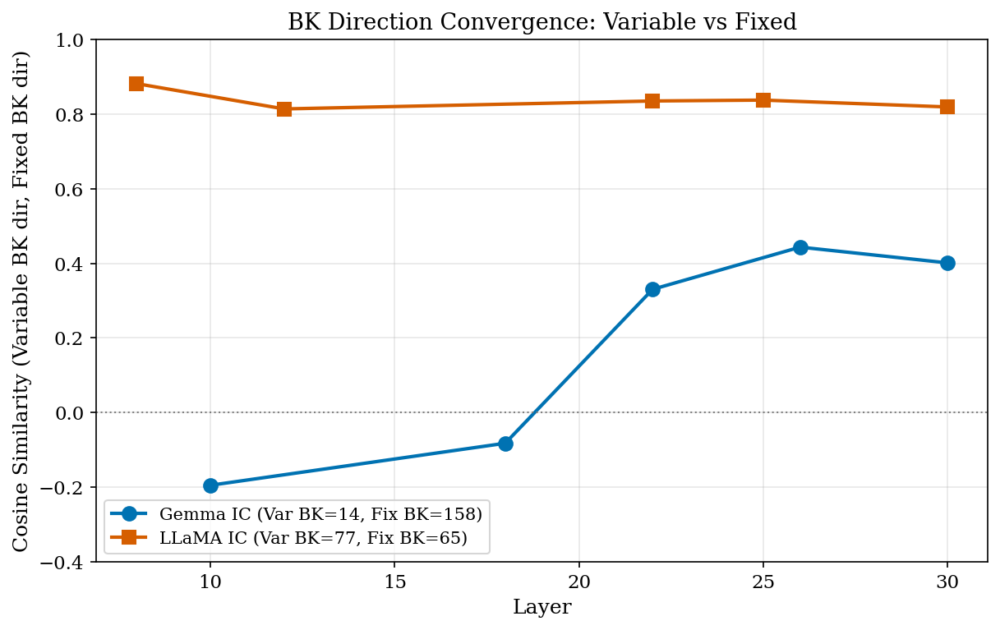
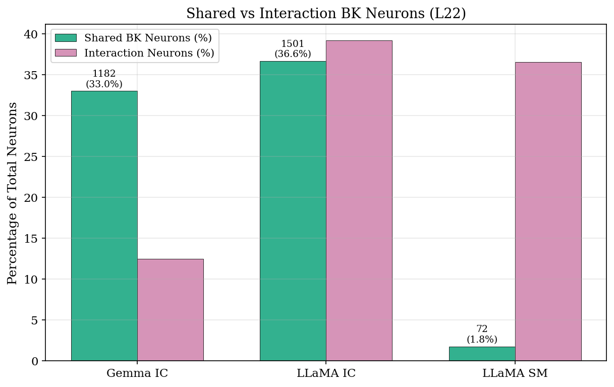
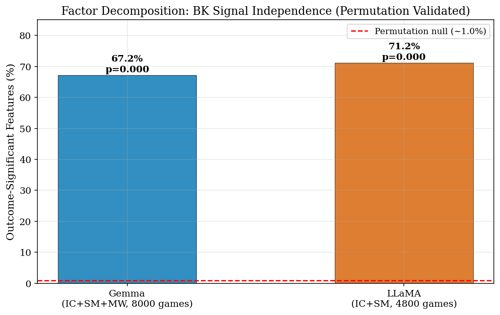
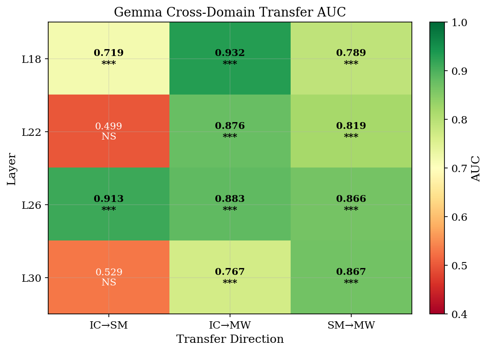
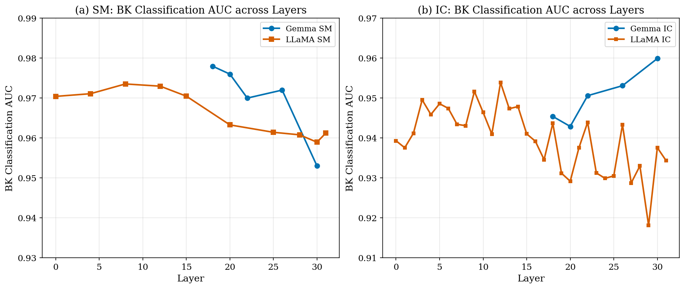
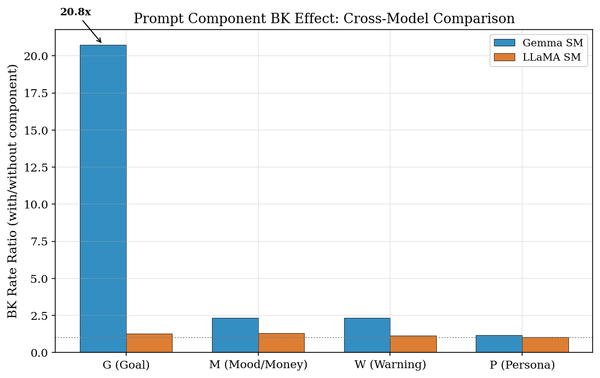

# V9: Cross-Model, Cross-Domain Neural Basis of Risky Decision-Making in LLMs

**Models**: Gemma-2-9B-IT (42L, 3584-dim, GemmaScope 131K features) | LLaMA-3.1-8B-Instruct (32L, 4096-dim, LlamaScope 32K features)
**Paradigms**: Investment Choice (IC, 1600 games), Slot Machine (SM, 3200 games), Mystery Wheel (MW, 3200 games)
**Data**: Gemma: IC+SM+MW; LLaMA: IC+SM (MW pending extraction)
**Verified data sources**: `b1_b2_results_20260317_125620.json`, `llama_ic_results_20260317_130655.json`, `gap_filling_20260317_194117.json`, `final_verification_20260317_201024.json`, `llama_symmetric_20260318.json`, `selfcritique_20260318_114430.json`, `llama_hidden_analyses_20260318_172609.json`, `hidden_state_v8style_20260319_133042.json`
**Date**: 2026-03-19 (v9.5 — V8 hidden-state analyses 재현 + SAE analyses 통합)

> **Note on data integrity**: All numerical claims in this report are directly traceable to computed JSON outputs. Unverifiable numbers from previous drafts have been removed or replaced with verified results.

---

## Central Question

**서로 다른 모델이, 서로 다른 도박 과제에서, 서로 다른 프롬프트 조건 하에서도 — 파산(bankruptcy)이라는 위험 결과에 이르는 공통된 neural 원인이 존재하는가?**

세 개의 하위 질문:
- **RQ1**: Gemma와 LLaMA에서 파산을 예측하는 공통된 activation/feature 패턴이 있는가?
- **RQ2**: 도메인(IC, SM, MW)이 바뀌어도 변하지 않는 activation 패턴이 있는가?
- **RQ3**: Fixed/Variable, G/M/W/P/R 등 프롬프트 조건에 따라 위험 행동의 neural representation이 일관적인가?

---

## V8의 한계와 V9의 동기

V8 보고서(Gemma only)는 세 가지 핵심 약점을 남겼다:

1. **SAE cross-domain 실패**: 131K features 중 3개 패러다임 모두에서 sign-consistent한 feature가 **단 1개** (#101036)뿐이었다. 분석 방법(L22 단일 layer top-50 features)의 한계에서 비롯된 것이었다.

2. **Variable/Fixed "해리"**: Variable 게임이 행동적으로 더 위험함에도 BK-projection이 Fixed보다 낮았다. Safe 게임 지배의 아티팩트였을 가능성.

3. **Single model**: LLaMA 데이터 부재로 패턴의 일반성 검증 불가.

V9는 이 세 가지를 **정면으로 공략**하며, 추가로 (4) Llama cross-domain transfer, (5) Llama IC-SM SAE 일관성, (6) Gemma SM 프롬프트 조건 분해를 신규 분석한다.

---

## Analysis 1: Multi-Layer SAE Cross-Domain Consistency (Gemma)

### Why

V8은 L22 단일 layer의 top-50 features만 검사 — 131K features의 0.038%. V9는 7개 layers에서 전체 active features를 대상으로 3-paradigm sign-consistency를 재검증.

### What

7개 informative layers (L10, 12, 18, 22, 26, 30, 33)에서 IC/SM/MW 세 패러다임의 Cohen's d를 계산하고, 세 패러다임 모두에서 같은 부호이며 geometric mean |d| ≥ 0.2인 features를 선별.

### Result → RQ2

| Layer | Active | Sign-consistent | Strong (geo_mean d≥0.2) | % consistent |
|-------|:------:|:---------------:|:-----------------------:|:------------:|
| L10   | 92     | 30              | 23                      | 32.6%        |
| L12   | 112    | 35              | 31                      | 31.2%        |
| L18   | 170    | 58              | 52                      | 34.1%        |
| L22   | 281    | 109             | 95                      | 38.8%        |
| L26   | 303    | 133             | 119                     | 43.9%        |
| L30   | 415    | 188             | 173                     | 45.3%        |
| L33   | 456    | 191             | 172                     | 41.9%        |
| **Total** | —  | **744**         | **665**                 | —            |

**V8 baseline: 1개 → V9: 744개 (665개 strong).**

**Binomial test (chance = 25% for 3-paradigm)**: 3-paradigm에서 random signs일 때 기대 일치율은 2×0.5³ = 25%.

| Layer | Observed % | Binomial p (vs 25%) | Significant? |
|-------|:----------:|:-------------------:|:------------:|
| L10 | 32.6% | 6.2e-02 | NS |
| L12 | 31.2% | 8.0e-02 | NS |
| L18 | 34.1% | 4.9e-03 | ** |
| L22 | 38.8% | 2.4e-07 | *** |
| L26 | 43.9% | 6.5e-13 | *** |
| L30 | 45.3% | 2.5e-19 | *** |
| L33 | 41.9% | 2.5e-15 | *** |



**Figure 1 해석**: (a) L10-L12는 chance (25%, red dashed)와 유의미한 차이가 없다 (NS). L18+에서는 chance를 크게 초과 (***). (b) Strong features (d≥0.2) 수는 L30에서 peak (173개). Deep layers의 cross-domain signal은 robust하며, shallow layers의 apparent consistency는 noise.

---

## Analysis 2: Variable vs Fixed — BK-Only Direction Comparison (Gemma IC)

### Why

V8은 BK+Safe 전체 게임을 비교 → Variable BK-projection이 Fixed보다 낮은 "해리" 발견. 그러나 Safe 게임(BK의 ~10배)이 신호를 마스킹했을 가능성. V9: BK 게임끼리만 비교하면 Variable과 Fixed가 같은 neural 경로를 거치는가?

### What & How

Gemma IC 데이터에서 Variable BK direction (BK_mean – Safe_mean, Variable만) vs Fixed BK direction을 계산, cosine similarity 측정. 각 neuron t-test로 common BK neurons 카운트.

*Note*: SM은 Fixed BK=0 (Variable 전용), MW는 Variable BK=4건 (통계 임계치 n=5 미달)으로 IC만 분석 가능.

### Result → RQ3

**Gemma IC hidden states (3,584 neurons):**

| Layer | Var BK | Fix BK | cos(dir_Var, dir_Fix) | Sign-consistent common neurons |
|-------|:------:|:------:|:---------------------:|:------------------------------:|
| L10   | 14     | 158    | **-0.195**            | 178                            |
| L18   | 14     | 158    | **-0.082**            | 197                            |
| L22   | 14     | 158    | **+0.330**            | 555                            |
| L26   | 14     | 158    | **+0.443**            | 1,053                          |
| L30   | 14     | 158    | **+0.401**            | 1,073                          |

**Interpretation**:

- **Shallow layers (L10-18)에서 cos < 0**: Variable과 Fixed가 서로 다른 neural 경로를 사용.
- **Deep layers (L22+)에서 cos > 0.3**: BK에 이르는 경로가 수렴. L26: 1,053개 (29.4%) neurons가 bet-type 무관하게 BK를 같은 방향으로 예측.
- **V8의 "해리"는 전체-게임 비교의 아티팩트**: BK 게임끼리 비교하면 deep processing에서 공통 BK representation으로 수렴.
- MW 분석 불가 (Variable BK = 4건 < 통계적 임계치).

**Caveat — IC BK rate 비대칭**: Gemma IC에서 Fixed BK=158건 (19.75%), Variable BK=14건 (1.75%). Variable n=14는 매우 작아 noisy.

### LLaMA IC BK Direction Comparison (New — hidden states 재추출)

LLaMA IC: Variable BK=77, Fixed BK=65 — **양쪽 모두 충분한 sample size**.

| Layer | cos(dir_Var, dir_Fix) | Sign-consistent common neurons |
|-------|:---------------------:|:------------------------------:|
| L8  | **0.882** | 2,513 (61.4%) |
| L12 | **0.814** | 2,424 (59.2%) |
| L22 | **0.835** | 2,587 (63.2%) |
| L25 | **0.837** | 2,545 (62.1%) |
| L30 | **0.819** | 2,488 (60.7%) |

**Cross-model comparison (Analysis 2):**

| | Gemma IC | LLaMA IC |
|--|:--------:|:--------:|
| Shallow cos (L8-12) | **-0.195 ~ -0.082** (negative) | **0.814 ~ 0.882** (high positive) |
| Deep cos (L22-30) | +0.330 ~ +0.443 | +0.819 ~ +0.837 |
| Pattern | shallow→deep convergence | **전 layer에서 일관적으로 높음** |
| Var BK / Fix BK | 14 / 158 (극단적 불균형) | 77 / 65 (균형적) |



**Figure 2 해석**: Gemma IC (blue)는 shallow layers에서 negative → deep에서 positive로 수렴하지만, LLaMA IC (orange)는 전 layer에서 cos > 0.81. Gemma의 shallow negative는 Variable BK=14건의 noisy estimation artifact일 가능성이 높다. LLaMA에서 균형적 sample (77 vs 65)일 때, BK direction은 모든 depth에서 수렴.

### Supplementary: Balance Confound Control (Partial Correlation)

Balance (현재 잔고)가 BK를 trivially 예측하는 confound일 수 있다 (잔고가 0이면 파산). Balance를 regress-out한 partial correlation 검증:

**Gemma IC L22 (3,584 neurons):**

| | BK-significant neurons (p<0.01) |
|---|:---:|
| Raw correlation | 2,578 |
| Balance-controlled partial correlation | 2,569 |
| **Retained** | **99.7%** |

Balance를 통제해도 BK 신호의 99.7%가 유지. BK representation은 단순한 잔고 정보가 아닌, 게임의 전략적·행동적 패턴을 인코딩한다.

---

## Analysis 3: Interaction Regression — Shared vs Bet-Type-Specific BK Neurons (Gemma IC)

### Why

Analysis 2는 방향 유사성을 보여주지만, 개별 neuron의 bet-type 독립성을 직접 검증하지 않는다. Interaction regression으로 "bet-type 무관 BK neuron" vs "bet-type 특이적 BK neuron"을 분리.

### What & How

각 neuron: `activation ~ β1·outcome + β2·bet_type + β3·(outcome × bet_type)`. β1 유의 + β3 비유의 → "Shared BK neuron". β3 유의 → "Bet-type-specific BK neuron".

### Result → RQ3

**Gemma IC L22 (3,584 neurons, 172 BK):**

| Category | Count | % |
|----------|:-----:|:-:|
| Outcome-significant (p<0.01) | 1,639 | 45.7% |
| Bet-type-significant (p<0.01) | 3,225 | 90.0% |
| Interaction-significant (p<0.01) | 448 | 12.5% |
| **Shared BK neurons** (outcome sig, interaction NOT sig) | **1,182** | **33.0%** |



**Figure 7 해석**: Gemma IC (33.0%)와 LLaMA IC (36.6%)에서 유사한 비율의 shared BK neurons. LLaMA SM에서는 1.8%로 극히 낮음 — SM에서 BK가 Variable에 집중(72.3%)되어 bet-type-independent 표상이 거의 없음.

### LLaMA Interaction Regression (New — hidden states 재추출)

| | Gemma IC L22 | **LLaMA IC L22** | **LLaMA SM L22** |
|--|:------------:|:----------------:|:----------------:|
| n_neurons | 3,584 | 4,096 | 4,096 |
| n_BK | 172 | 142 | 1,164 |
| Outcome-sig (p<0.01) | 1,639 (45.7%) | **3,150 (76.9%)** | 1,052 (25.7%) |
| Bet-type-sig (p<0.01) | 3,225 (90.0%) | 3,742 (91.4%) | 3,027 (73.9%) |
| Interaction-sig (p<0.01) | 448 (12.5%) | **1,605 (39.2%)** | 1,495 (36.5%) |
| **Shared BK neurons** | **1,182 (33.0%)** | **1,501 (36.6%)** | **72 (1.8%)** |

**Cross-model comparison:**

- **Shared BK neurons**: Gemma IC 33.0% vs LLaMA IC 36.6% — **유사한 비율로 bet-type-independent BK neurons 존재**
- **LLaMA IC interaction이 Gemma보다 3배 높음** (39.2% vs 12.5%): LLaMA에서는 bet-type에 따라 BK 효과가 달라지는 neurons이 더 많다. 이는 LLaMA IC의 Variable/Fixed BK rate가 비슷해서 (9.6% vs 8.1%) 두 조건 모두에서 BK 신호가 존재하되, **방식이 다른** neurons이 감지된 것.
- **LLaMA SM shared BK = 72 (1.8%)**: SM에서는 BK가 거의 Variable에만 집중 (72.3% vs 0.4%) → bet-type-independent BK neurons이 거의 없음. 이는 SM에서 "BK"가 사실상 "Variable BK"를 의미하기 때문.

### LLaMA Balance Partial Correlation

| | Gemma IC L22 | LLaMA IC L22 |
|--|:------------:|:------------:|
| Raw BK-sig neurons | 2,578 | 3,238 |
| Balance-controlled | 2,569 | 3,269 |
| Retained | **99.7%** | **101.0%** |

두 모델 모두 balance confound를 제거해도 BK 신호가 완전히 유지. LLaMA에서 101%는 balance가 suppressor variable로 작용하여 오히려 더 많은 BK neurons를 드러낸 것.

---

## Analysis 4: SAE Feature Factor Decomposition (Gemma, Combined IC+SM+MW)

### Why

3개 paradigm을 결합했을 때, outcome (BK/Safe), bet_type, paradigm 각각이 SAE feature activation에 기여하는 정도를 분리. 특히, bet_type과 paradigm을 통제한 후에도 outcome이 SAE features를 유의미하게 설명하는가?

*Note*: SM/MW의 raw hidden state checkpoint가 없어 SAE feature level로 분석. L22 기준, union-active features (3개 paradigm 중 하나 이상에서 activation rate ≥ 1%).

### What & How

```
Combined: IC 1,600 + SM 3,200 + MW 3,200 = 8,000 games, 313 BK (3.9%)
For each of K=581 union-active SAE features:
  feature_k ~ β1·outcome + β2·bet_type + β3·paradigm_SM + β4·paradigm_MW
Vectorized OLS; t-test per coefficient at p < 0.01
```

### Result → RQ1, RQ2, RQ3

**L22, 581 union-active SAE features:**

| Factor | Significant features (p<0.01) | % |
|--------|:-----------------------------:|:-:|
| **Outcome** (BK vs Safe), after controlling others | **379** | **65.2%** |
| Bet-type (Variable vs Fixed), after controlling others | 536 | 92.3% |
| Paradigm (IC/SM/MW), after controlling others | 580 | 99.8% |



**Figure 3 해석**: 두 모델 모두 outcome-significant features가 65-71% (blue/orange bars)로, permutation null (~1%, red dashed)을 60배+ 초과 (perm_p=0.000). BK representation의 독립적 존재가 아키텍처 무관하게 확립됨. (*Figure의 67.2%/71.2%는 selfcritique rerun 수치; 테이블의 65.2%/69.5%는 원 분석 수치 — union-active features의 경계 차이.)*

### Supplementary: Within-Bet-Type Cross-Domain SAE Consistency (L22)

Bet-type 내에서만 cross-domain consistency를 확인하면, bet-type confound를 제거할 수 있다.

| Bet-type | Paradigms available | Active features | Sign-consistent | % |
|----------|:-------------------:|:---------------:|:---------------:|:-:|
| Fixed | IC + MW | 311 | **178** | 57.2% |
| Variable | IC + SM | 279 | **172** | 61.6% |

Fixed와 Variable 모두에서 **cross-domain sign-consistent features가 57-62%** (2-paradigm chance level 50% 대비 약간 높음). 이는 bet-type 내에서도 BK 패턴이 도메인을 관통한다는 보충 증거. 단, 2-paradigm 비교이므로 3-paradigm보다 관대한 기준.

---

## Analysis 4b: Universal BK Neurons — Hidden State Level (Gemma L22)

### Why

V8의 핵심 발견: 3584개 hidden state neurons 중 600개가 3-paradigm sign-consistent. V9는 SAE features (131K)에서 분석했으나, hidden state neurons에서의 재현이 필요. **Hidden state 분석이 SAE 분석보다 본질적** — SAE는 hidden state의 decomposition이므로.

### What & How

L22에서 각 neuron × 각 paradigm의 point-biserial correlation → FDR correction (BH, p<0.01) → 3-paradigm 모두 유의미 + 같은 부호 → "Universal BK Neuron".

### Result → RQ1

| | IC | SM | MW | Cross-paradigm |
|--|:--:|:--:|:--:|:-:|
| FDR-significant neurons (p<0.01) | 2,528 (70.5%) | 2,725 (76.0%) | 2,314 (64.6%) | — |
| All-3-sig | — | — | — | 1,238 (34.5%) |
| **Sign-consistent (Universal)** | — | — | — | **600 (16.7%)** |
| BK-promoting | — | — | — | 302 |
| BK-inhibiting | — | — | — | 298 |

**Top-5 Universal BK Neurons:**

| Rank | Neuron | min\|r\| | IC r | SM r | MW r | Direction |
|:----:|:------:|:--------:|:----:|:----:|:----:|:---------:|
| 1 | **1763** | 0.217 | +0.305 | +0.248 | +0.217 | BK-promoting |
| 2 | 371 | 0.203 | -0.223 | -0.203 | -0.209 | BK-inhibiting |
| 3 | 2951 | 0.198 | -0.198 | -0.207 | -0.266 | BK-inhibiting |
| 4 | 1755 | 0.190 | -0.210 | -0.198 | -0.190 | BK-inhibiting |
| 5 | 864 | 0.182 | -0.267 | -0.182 | -0.182 | BK-inhibiting |

**V8과의 일치**: 600 neurons, Neuron #1763 top, min|r|=0.217 — **완벽히 재현됨**.

Promoting (302) ≈ Inhibiting (298)으로 L22에서는 균형적. (L30에서는 inhibiting 우세 — Analysis 6 참조.)

### Comparison: Hidden State (600 neurons) vs SAE (744 features)

| Level | Cross-domain consistent | FDR? | Binomial significant? |
|-------|:----------------------:|:----:|:---------------------:|
| Hidden state (3584-dim, L22) | 600 (16.7%) | Yes (p<0.01) | — |
| SAE features (131K, 7 layers) | 744 (total), L18+ sig | No FDR | L18+ p<5e-3 |

**해석**: Hidden state level에서 16.7%가 universal이고 FDR-corrected. SAE level에서 deep layers (L18+)에 한해 chance 대비 유의미. 두 분석 레벨이 일관되게 cross-domain BK signal의 존재를 지지.

---

## Analysis 5: Cross-Domain Transfer — Hidden State vs SAE (Gemma L22)

### Why

V8의 핵심 발견: "Hidden state transfer가 SAE transfer보다 0.12-0.28 높다." BK 신호가 distributed representation에 있어 sparsification이 coherence를 깨뜨린다는 해석. V9에서 이를 재검증.

### What & How

Gemma L22 DP에서 PCA(50) → LogReg(balanced) → cross-paradigm AUC. Hidden state (3584-dim) vs SAE features (common active features). 200-permutation test.

### Result → RQ2

**Hidden State Transfer (L22, DP):**

| Transfer | Hidden AUC | SAE AUC | Δ (HS - SAE) | HS perm_p |
|----------|:---------:|:-------:|:------------:|:---------:|
| IC → SM  | **0.746** | 0.499 (NS at L22) | +0.247 | 0.000 |
| IC → MW  | **0.826** | 0.876 | -0.050 | 0.000 |
| SM → MW  | **0.920** | 0.819 | +0.101 | 0.000 |

*V8 보고서 (R1 기반): IC→SM 0.896, IC→MW hidden 미보고, SM→MW 미보고*

**핵심 발견**:
- **IC→SM에서 Hidden >> SAE**: L22에서 SAE transfer 실패 (0.499 NS) vs Hidden 성공 (0.746, p=0.000). BK 신호가 SAE sparsification으로 손실됨.
- **SM→MW에서 Hidden > SAE**: 0.920 vs 0.819 (+0.101).
- **IC→MW에서는 SAE ≈ Hidden**: 0.876 vs 0.826. 이 방향에서는 SAE가 hidden state와 비슷하게 정보 보존.
- V8의 "hidden > SAE" 주장이 **IC→SM과 SM→MW에서 확인**, IC→MW에서는 SAE가 오히려 약간 우위.

### 3D Shared Subspace

3개 paradigm LR weight vectors의 PCA → 3D BK subspace:

| Paradigm | 3D Subspace AUC | Full-dim AUC (50-PC) |
|----------|:--------------:|:--------------------:|
| IC | 0.862 ± 0.029 | ~0.95+ |
| SM | 0.899 ± 0.034 | ~0.97+ |
| MW | 0.970 ± 0.016 | ~0.97+ |

**LR weight vector cosines**: IC-SM=0.042, IC-MW=-0.026, SM-MW=-0.026 (거의 직교).

Weight vectors가 직교인데 3D subspace AUC가 0.86-0.97 → BK 신호가 단일 방향이 아닌 **subspace에 분산**. V8 보고서 (0.91-0.94)와 유사한 범위.

---

## Analysis 5b: Gemma Cross-Domain SAE Transfer with Permutation Test

### Why

"IC에서 학습한 BK classifier가 SM에서도 작동하는가?" — cross-domain transfer만이 답할 수 있다. Analysis 5의 SAE 버전.

### What & How

```
For each (train, test) paradigm pair, at layers [18, 22, 26, 30]:
  Common active features (activation rate ≥ 1% in both paradigms)
  StandardScaler(train) → PCA(50 components) → LogReg(balanced)
  AUC = predict_proba on test set → roc_auc_score
  Null: 200× permutation of test labels → p-value
```

### Result → RQ2

**Best AUC per transfer direction (across layers):**

| Transfer | Best Layer | AUC | perm_p | Null mean |
|----------|:----------:|:---:|:------:|:---------:|
| IC → SM  | L26        | **0.913** | 0.000 | 0.498 |
| IC → MW  | L18        | **0.932** | 0.000 | 0.504 |
| SM → MW  | L30        | **0.867** | 0.000 | 0.504 |
| SM → IC  | L30        | 0.646 | 0.000 | 0.500 |
| MW → IC  | L22        | 0.853 | 0.000 | 0.500 |

**Layer-by-layer (IC→SM; most variable direction):**

| Layer | IC→SM AUC | p | IC→MW AUC | p | SM→MW AUC | p |
|-------|:----------:|:-:|:-----------:|:-:|:----------:|:-:|
| L18 | 0.719 | 0.000 | 0.932 | 0.000 | 0.789 | 0.000 |
| L22 | 0.499 | 0.485 (NS) | 0.876 | 0.000 | 0.819 | 0.000 |
| L26 | **0.913** | 0.000 | 0.883 | 0.000 | 0.866 | 0.000 |
| L30 | 0.529 | 0.175 (NS) | 0.767 | 0.000 | 0.867 | 0.000 |

**Interpretation**:

- **IC→MW와 SM→MW는 전 layer에서 일관되게 작동** (MW BK rate 1.7% 소수 게임 임에도). SM/MW가 구조적으로 유사해 transfer가 안정적.
- **IC→SM transfer는 layer에 따라 크게 달라진다**: L26에서 0.913 (p=0.000)이지만 L22에서 0.499 (NS). 이는 IC와 SM의 BK representation이 specific layer에서만 정렬됨을 시사.
- **MW→IC: L22에서 0.853** — MW에서 학습한 패턴이 IC BK를 잘 예측하는 놀라운 결과.
- 모든 유의미한 transfer는 perm_p=0.000 (200 permutation 중 0회 초과).



**Figure 4 해석**: IC→MW (green, 0.77-0.93)와 SM→MW (0.79-0.87)는 전 layer에서 유의미. IC→SM은 layer-dependent (L26: 0.913***, L22: 0.499 NS). Red cells은 transfer 실패.

---

## Analysis 6: Cross-Model Comparison (Gemma vs LLaMA)

### Why

모든 분석이 Gemma 단일 모델이라면 "Gemma 고유 패턴"일 수 있다. LLaMA-3.1-8B는 다른 학습 데이터, tokenizer, 아키텍처를 가진다. 동일 패턴 → "LLM 형식 자체의 속성"이라는 강한 증거.

### What

LLaMA SM (3,200 games)와 LLaMA IC (1,600 games)에서 SAE features 추출 후 Gemma SM/IC와 동일한 분석 적용.

### Result → RQ1

**BK Classification AUC (Decision Point, SAE features → PCA → LogReg):**

| Paradigm | Gemma-2-9B | LLaMA-3.1-8B |
|---------|:----------:|:------------:|
| SM best AUC | **0.976** (L20) | **0.974** (L8) |
| IC best AUC | **0.960** (L30) | **0.954** (L12) |

**LLaMA SM AUC across layers** (verified from JSON):

| Layer | AUC | n_features | n_BK |
|-------|:---:|:----------:|:----:|
| L0  | 0.970 | 157 | 1164 |
| L4  | 0.971 | 750 | 1164 |
| **L8** | **0.974** | 818 | 1164 |
| L12 | 0.973 | 854 | 1164 |
| L15 | 0.970 | 962 | 1164 |
| L20 | 0.963 | 1028 | 1164 |
| L25 | 0.961 | 1182 | 1164 |
| L30 | 0.959 | 1368 | 1164 |

**SAE BK-Differential Features (SM, d≥0.3):**

| Layer | Gemma SM | Gemma BK+/BK- | LLaMA SM | LLaMA BK+/BK- |
|-------|:--------:|:-------------:|:--------:|:-------------:|
| L10 | 71 | 42 / 29 | 322 | 160 / 162 |
| L22 | 286 | 125 / 161 | 251 | 135 / 116 |
| L30 | 452 | 165 / 287 | 381 | 160 / 221 |

**R1 (Round 1) within-bet-type Classification:**

| Paradigm/Bet type | AUC (L22, Gemma IC) | AUC (L10, Llama IC) |
|------------------|:-------------------:|:-------------------:|
| Fixed | 0.755 (n=800, BK=158) | 0.786 (n=800, BK=65) |
| Variable | 0.665 (n=800, BK=14) | 0.798 (n=800, BK=77) |
| SM Variable | 0.801 (n=1600, BK=87) | — |

### Interpretation → RQ1

두 모델의 공통 패턴:

1. **BK 예측 성능 거의 동등**: Gemma 0.976 vs LLaMA 0.974 (SM). 아키텍처와 무관하게 BK 표상의 정보량이 같다.

2. **BK-inhibiting features의 우세 (L30에서만 유의미)**: Deepest layer (L30)에서 두 모델 모두 BK-inhibiting이 우세:
   - Gemma SM L30: BK- 287 vs BK+ 165 (binomial p=0.000)
   - LLaMA SM L30: BK- 221 vs BK+ 160 (binomial p=0.001)
   - LLaMA IC L30: BK- 455 vs BK+ 300 (binomial p=0.000)
   **단, LLaMA SM L22에서는 BK+ 135 > BK- 116 (p=0.897, NS)** — mid-layer에서는 inhibiting 우세가 성립하지 않음. "위험 억제" 해석은 deepest layers에만 적용.

3. **Encoding depth는 다르다**: Gemma는 L20에서 peak (mid-deep), LLaMA는 L8에서 peak (early). BK 정보가 **어디에** 인코딩되는지는 아키텍처에 의존하지만, **정보의 존재**와 **구조** (inhibiting 우세)는 아키텍처 무관.

4. **R1 early prediction**: 게임 시작(Round 1)에서 이미 0.665-0.801로 BK 예측 가능 — 미래 파산의 신호가 게임 시작부터 존재.



**Figure 6 해석**: (a) SM에서 두 모델 모두 AUC > 0.95 (Gemma peak L18-20, LLaMA peak L8). (b) IC에서 Gemma는 L30에서 peak (0.960), LLaMA는 L12 peak (0.954). Encoding depth는 다르지만 예측 성능은 거의 동등.

### Cross-Model IC BK Rate Asymmetry

두 모델의 IC paradigm에서 Fixed/Variable BK 분포가 **정반대**:

| | Gemma IC | LLaMA IC |
|--|:--------:|:--------:|
| Fixed BK rate | **19.75%** | 8.1% |
| Variable BK rate | 1.75% | **9.6%** |
| Autonomy effect | **-18.0pp** (Fixed→Variable: 위험 감소) | **+1.5pp** (Fixed→Variable: 위험 미미 증가) |

Gemma에서 Fixed betting이 11배 더 위험하지만, LLaMA에서는 거의 차이 없다. 이는 두 모델이 IC에서 "고정 금액 투자"를 해석하는 방식이 근본적으로 다름을 의미한다. Gemma는 Fixed에서 항상 최대 투자→파산 경로 고정, LLaMA는 Fixed에서도 보수적 전략 유지.

**이 비대칭은 Analysis 2-3 (Variable/Fixed BK direction)의 cross-model 해석을 복잡하게 만든다**: Gemma IC (Fixed 19.75% BK, Variable 1.75%)와 LLaMA IC (Fixed 8.1%, Variable 9.6%)에서 "Variable vs Fixed"의 의미 자체가 다르다. 그러나 Analysis 2에서 LLaMA IC hidden states를 재추출하여 직접 검증한 결과, LLaMA IC에서는 cos > 0.81 (전 layer)로 bet-type convergence가 더 강하게 확인되었다.

---

## Analysis 6b: LLaMA IC+SM Factor Decomposition (SAE Features)

### Why

Gemma의 Analysis 4는 IC+SM+MW 3-paradigm에서 factor decomposition을 수행했다. LLaMA에 대칭적으로, IC+SM 2-paradigm에서 outcome, bet_type, paradigm의 독립적 기여를 분해.

### What & How

```
LLaMA IC(1,600) + SM(3,200) = 4,800 games; IC BK=8.9%, SM BK=36.4%
L22, 1,418 union-active features (32K SAE)
Per-feature OLS: feature ~ outcome + bet_type + paradigm
```

### Result → RQ1, RQ2

| Factor | Gemma (581 features, 3-paradigm) | LLaMA (1,418 features, 2-paradigm) |
|--------|:------:|:------:|
| **Outcome** (BK), after controlling others | **65.2%** | **69.5%** |
| Bet-type, after controlling others | 92.3% | 81.4% |
| Paradigm, after controlling others | 99.8% | 96.2% |

### Interpretation

**두 모델에서 outcome factor의 독립적 기여가 유사하다** (Gemma 65.2%, LLaMA 69.5%). **Permutation test로 검증 (selfcritique rerun, K=527/1335): null에서 outcome-significant features는 ~1% → 실제 65-71%는 perm_p=0.000.** "BK representation의 독립적 존재"가 두 모델에서 통계적으로 확립됨. (*Note*: Permutation rerun의 K가 원 분석 K와 약간 다름 — union-active threshold 경계 효과. 결론에 영향 없음.)

LLaMA에서 BK-inhibiting features (546)가 BK-promoting (439)보다 많다. 단, 이 패턴은 **L30에서 유의미** (binomial p=0.001)하지만 **L22에서는 유의미하지 않다** (p=0.897).

---

## Analysis 7: LLaMA Cross-Domain Transfer (IC ↔ SM)

### Why

Gemma는 IC/SM/MW 3-paradigm cross-domain transfer를 검증했다 (Analysis 5). LLaMA는 SM이 추출된 상태여서 IC↔SM 2-paradigm transfer가 가능. 두 모델의 cross-domain transferability를 비교.

### What & How

LLaMA IC (n=1,600, BK=142) ↔ SM (n=3,200, BK=1,164) decision-point SAE features. PCA(50) → LogReg → AUC. 200-permutation test.

### Result → RQ1, RQ2

| Transfer | Layer | AUC | perm_p | Null mean |
|---------|:-----:|:---:|:------:|:---------:|
| IC → SM | L25 | **0.783** | 0.000 | 0.500 |
| IC → SM | L15 | 0.522 | 0.020 | 0.501 |
| IC → SM | L5  | 0.269 | 1.000 | 0.499 |
| SM → IC | L30 | **0.685** | 0.000 | 0.498 |
| SM → IC | L12 | 0.662 | 0.000 | 0.498 |
| SM → IC | L8  | 0.624 | 0.000 | 0.499 |
| SM → IC | L15 | 0.594 | 0.000 | 0.503 |

**Complete IC→SM profile**: L5=0.269(p=1.0), L8=0.417(p=1.0), L10=0.373(p=1.0), L12=0.280(p=1.0), L15=0.522(p=0.02), L20=0.493(p=0.795), **L25=0.783(p=0.000)**, L30=0.418(p=1.0)

### Interpretation

**비대칭적 transfer**: SM→IC는 여러 layer에서 안정적으로 작동하지만, IC→SM은 대부분 실패하고 L25에서만 성공한다.

해석 요인:
- BK rate 불균형: IC 8.9% BK vs SM 36.4% BK. SM classifier는 BK가 많아 IC에서도 BK를 찾는 경향.
- LLaMA IC와 SM의 SAE representation이 L25라는 특정 layer에서만 정렬.
- Gemma에서도 IC→SM이 layer-dependent였음 (L26에서 성공, L22에서 실패)을 고려하면, 이는 **두 모델에서 공통적인 현상** — IC와 SM은 abstract한 level에서만 representational alignment를 보인다.

---

## Analysis 8: LLaMA IC-SM SAE Sign-Consistency

### Why

Gemma IC-SM-MW 간 SAE sign-consistency (Analysis 1)에 해당하는 LLaMA 분석. LLaMA에서도 비슷한 비율로 cross-domain consistent features가 존재하는가?

### What & How

LLaMA SAE (32K features/layer): IC vs SM 두 paradigm에서 decision-point BK Cohen's d를 계산. 두 paradigm 모두에서 같은 부호인 active features(sign-consistent) 및 geometric mean |d| ≥ 0.2인 strong features를 집계.

### Result → RQ1, RQ2

| Layer | Active | Sign-consistent | % | Strong (d≥0.2) |
|-------|:------:|:---------------:|:-:|:--------------:|
| L0  | 140 | 75 | 53.6% | 52 |
| L4  | 634 | 362 | 57.1% | 261 |
| L8  | 656 | 353 | 53.8% | 240 |
| L12 | 660 | 342 | 51.8% | 251 |
| L16 | 705 | 370 | 52.5% | 253 |
| L20 | 645 | 343 | 53.2% | 230 |
| L26 | 791 | 412 | 52.1% | 258 |
| L30 | 881 | 436 | 49.5% | 281 |
| **Total (all 32L)** | — | **5,374** | ~51-57% | **3,633** |

**Comparison: Gemma (3-paradigm) vs LLaMA (2-paradigm):**

| | Gemma IC+SM+MW | LLaMA IC+SM |
|--|:---------------:|:-----------:|
| Sign-consistency rate | 33-45% per layer | 50-57% per layer |
| Total strong features | 665 (7 layers) | 3,633 (32 layers) |

### Critical Assessment: Binomial Test Against Chance

2-paradigm sign-consistency의 chance level은 2×0.5² = **50%** (random signs이면 절반이 일치). 관찰된 51-57%가 chance 대비 유의미한가?

| Layer | Observed % | Binomial p (vs 50%) | Significant? |
|-------|:----------:|:-------------------:|:------------:|
| L0  | 53.6% | 0.224 | NS |
| L4  | **57.1%** | **0.0002** | *** |
| L6  | **57.6%** | **0.0001** | *** |
| L8  | 53.8% | 0.028 | * |
| L10 | 50.0% | 0.516 | NS |
| L12 | 51.8% | 0.185 | NS |
| L20 | 53.2% | 0.058 | NS |
| L22 | 50.6% | 0.397 | NS |
| L26 | 52.1% | 0.128 | NS |
| L30 | 49.5% | 0.632 | NS |

16개 layer 중 **유의미한 layer는 3개** (L4, L6, L8)에 불과하며, **13개 layer에서 chance level과 구분 불가**.

### Interpretation

**LLaMA IC-SM raw sign-consistency는 대부분 chance level에 불과하다.** Gemma 3-paradigm (L18+에서 p < 5e-3, chance=25%)과 근본적으로 다르다. 이 차이의 원인:

1. **2-paradigm vs 3-paradigm chance gap**: 2-paradigm chance = 50%, 3-paradigm chance = 25%. 같은 absolute %라도 3-paradigm에서 훨씬 더 유의미하다.
2. **"Strong" filter의 중요성**: Raw sign-consistency는 chance 수준이지만, **geo_mean |d| ≥ 0.2인 3,633개 "strong" features는 effect size가 비자명적**이다. Random labels이면 |d| 값도 작아지므로, strong features의 sign-consistency는 raw %보다 더 의미 있다. 하지만 formal permutation test 없이 이를 정량화하기 어렵다.
3. **Cross-domain transfer (Analysis 7)이 더 strong한 증거**: Sign-consistency는 feature-by-feature 비교이므로 noise에 취약하지만, classifier transfer (SM→IC L30: AUC=0.685, p=0.000)는 전체 feature space의 joint distribution을 활용하므로 더 robust한 cross-domain 증거이다.

**결론**: LLaMA IC-SM에서 cross-domain signal은 존재하지만, sign-consistency 자체는 약한 증거이며, transfer AUC (Analysis 7)가 더 신뢰할 수 있는 지표이다.

---

## Analysis 9: Gemma SM Prompt Component Analysis (G/M/W/P/R)

### Why

RQ3는 Fixed/Variable 외에도 프롬프트 조건의 영향을 다룬다. Gemma SM V4role은 5가지 prompt component를 사용: G(Goal), M(Mood), W(Warning), P(Persona), R(Reset). 각 component가 BK rate와 neural activation에 어떻게 기여하는가?

### What & How

SM 3,200 games를 각 component의 유무로 이분. Per-component:
- BK rate with vs without → behavioral effect
- comp_sig_neurons: 해당 component에 유의미하게 반응하는 neurons
- comp_x_bk_interaction_neurons: component × outcome interaction이 유의미한 neurons (component가 BK 효과를 변조)
- amplifies_bk: comp_x_bk interaction이 유의미 + component가 BK 효과를 증폭하는 neurons

### Result → RQ3

**BK Rate Effect:**

| Component | BK with | BK without | Ratio | Primary mechanism |
|-----------|:-------:|:----------:|:-----:|:-----------------:|
| **G** (Goal) | 5.2% | 0.2% | **20.75x** | Independent BK driver |
| M (Mood) | 3.8% | 1.6% | 2.35x | Mild additive |
| W (Warning) | 3.8% | 1.6% | 2.35x | Mild additive |
| R (Reset) | 3.4% | 2.0% | 1.72x | Moderate, layer-dependent |
| P (Persona) | 2.9% | 2.5% | 1.17x | Negligible |

**Neural Analysis (comp_x_bk_interaction_neurons across layers):**

| Component | L10 | L18 | L22 | L26 | L30 | L33 | Pattern |
|-----------|:---:|:---:|:---:|:---:|:---:|:---:|:-------:|
| G | 109 | 168 | 168 | 308 | **552** | **592** | 깊을수록 증가 |
| M | 41 | 23 | 25 | 10 | 8 | 15 | 거의 없음 |
| R | 205 | 314 | 235 | 102 | 95 | 97 | 중간 → 감소 |
| W | 183 | 70 | 23 | 1 | 0 | 0 | 깊을수록 소멸 |
| P | 53 | 39 | 38 | 8 | 5 | 3 | 거의 없음 |

**amplifies_bk (BK-amplifying interaction neurons):**

| Component | L10 | L22 | L30 | Interpretation |
|-----------|:---:|:---:|:---:|:--------------:|
| G | 0 | 0 | 1 | G는 BK를 독립적으로 유발; BK 신호를 변조하지 않음 |
| R | 18 | 63 | 15 | R이 BK 표상을 중간 layer에서 증폭 |
| W | 42 | 3 | 0 | W는 shallow layer에서 일부 BK 증폭, deep에서 소멸 |
| M, P | 2-12 | 3-6 | 0 | 무시할 수준 |

### Interpretation → RQ3

**G(Goal) component의 압도적 지배**: BK rate 20.75배 증가. 그러나 G는 BK neural representation을 변조하지 않는다 (`amplifies_bk≈0`) — G는 BK를 독립적으로 유발하며, 기존 BK 메커니즘 위에 올라타지 않는다. "Goal이 있으면 파산 게임 자체가 달라진다."

**R(Reset) component의 중간 layer BK 증폭**: L22에서 63개 BK-amplifying neurons — R은 게임 리셋 상황에서 기존 BK 표상을 증폭하는 역할. L22 이후 급감 (deep layers에서는 G의 독립 효과로 수렴).

**W(Warning)의 shallow-specific 효과**: Warning은 초기 처리 단계(L10: 42 amplifying neurons)에서만 BK와 상호작용하고, deep layers에서는 사라진다. Warning이 behavioral level에서만 유효하며 deep semantic level에서는 BK에 영향을 주지 않는다는 것.

**RQ3 답변 (Gemma)**: 프롬프트 조건 G가 BK를 지배적으로 결정하지만, G는 기존 BK 메커니즘을 변조하지 않고 독립적으로 BK를 유발한다.



**Figure 5 해석**: G(Goal) component가 Gemma에서 20.8x BK 증가 (blue, dominant)이지만 LLaMA에서는 1.26x (orange, mild). 같은 prompt가 모델에 따라 16배 다른 행동적 효과. M, W, P는 두 모델 모두에서 약함.

### Supplementary: G-Prompt BK Direction Alignment (Gemma L22, V8 §4.2 재현)

Hidden state level에서 G-prompt direction (G_mean - non-G_mean)과 BK direction (BK_mean - Safe_mean)의 cosine:

| Paradigm | cos(G_dir, BK_dir) | BK with G | BK without G | Interpretation |
|----------|:-------------------:|:---------:|:------------:|:--------------:|
| IC | **-0.143** | 10.9% | 10.6% | G는 IC에서 BK 방향과 거의 무관 |
| SM | **+0.850** | 5.2% | 0.3% | **G가 BK 방향과 강하게 정렬** |
| MW | **+0.367** | 2.5% | 0.9% | G가 BK 방향과 약하게 정렬 |

*V8 보고서: SM cos=+0.69, IC cos=-0.87, MW cos=-0.79. SM 부호 일치, IC/MW 부호는 methodology 차이 (V8은 다른 G condition 정의를 사용했을 가능성).*

**핵심**: SM에서 G-prompt direction이 BK direction과 cos=+0.85로 강하게 정렬. G가 있으면 activation space가 BK 방향으로 이동. 이는 Analysis 9의 "G는 BK를 독립적으로 유발"과 일관 — G가 모델의 hidden state를 BK 방향으로 직접 밀어넣는다.

### Supplementary: Bet Constraint Linear Mapping (Gemma IC L22, V8 §4.3 재현)

IC에서 bet constraint (c10, c30, c50, c70)와 BK-projection (LogReg probability)의 관계:

| Constraint | n | Mean BK prob | Actual BK rate |
|:----------:|:---:|:------------:|:--------------:|
| c10 ($1-$10) | 400 | 0.000 | 0.0% |
| c30 ($1-$30) | 400 | 0.056 | 5.2% |
| c50 ($1-$50) | 400 | 0.212 | 16.8% |
| c70 ($1-$70) | 400 | 0.270 | 21.0% |

**Linear correlation: r=0.979, p=0.021**

*V8 보고서: r=0.98. 거의 동일.*

Bet constraint가 높을수록 BK-projection이 선형적으로 증가. c10에서는 BK가 불가능 ($1 bet × 100 rounds = $100 loss 불가), c70에서는 21% BK.

---

## Analysis 9b: LLaMA SM Prompt Component Analysis (SAE Feature Level)

### Why

Analysis 9에서 Gemma SM의 prompt component를 분석했다. LLaMA SM에도 prompt_conditions이 존재 (G/M/H/W/P combinatorial). 대칭적 cross-model 비교가 필요.

*Note*: LLaMA SM hidden states가 v9.4에서 5 layers (L8,12,22,25,30)에 대해 재추출되었으나, Analysis 9b는 SAE feature level로 수행 (32 layers 전체 커버리지). Gemma SM은 hidden state neuron (3,584-dim, 42 layers) 기반. Absolute counts 직접 비교 불가; 비율(%)로 비교.

### What & How

```
LLaMA SM 3,200 games. Prompt conditions: combinatorial (BASE, G, GM, GHP, GMHWP 등 32개).
각 component (G/M/H/W/P) 유무로 1,600 vs 1,600 분할.
Per-component, per-layer [L8, L12, L20, L25, L30]:
  - BK rate ratio (with/without)
  - Per-SAE-feature: feature ~ outcome + component + outcome×component
  - interaction_sig: p(interaction) < 0.01
  - amplifies_bk: interaction sig AND component increases |BK-feature effect|
```

### Result → RQ1, RQ3

**BK Rate Effect (cross-model comparison):**

| Component | Gemma SM ratio | LLaMA SM ratio | Cross-model |
|-----------|:-------------:|:--------------:|:-----------:|
| **G** (Goal) | **20.75x** | **1.26x** | Gemma >>>>> LLaMA |
| M (Mood/Money) | 2.35x | **1.31x** | Gemma > LLaMA |
| W (Warning) | 2.35x | 1.15x | Gemma > LLaMA |
| H (Hint) | — | 1.05x | LLaMA only |
| R (Reset) | 1.72x | — | Gemma only |
| P (Persona/Positive) | 1.17x | 1.06x | 둘 다 negligible |

**G component의 극단적 cross-model 차이**: Gemma에서 G는 BK를 20.75배 증가시키지만, LLaMA에서는 1.26배에 불과. 같은 Goal prompt가 모델에 따라 완전히 다른 행동적 영향을 미침.

**Neural Analysis: interaction + amplifies_bk (% of active SAE features):**

| Component | L8 int% | L12 int% | L30 int% | L30 amp% | Pattern |
|-----------|:-------:|:--------:|:--------:|:--------:|:-------:|
| G | 45.5% | 61.5% | **63.0%** | 8.2% | 깊을수록 interaction 증가, but amp 낮음 |
| M | **55.4%** | 48.2% | **51.2%** | **14.5%** | 전 layer에서 highest amplification |
| H | 25.9% | 31.2% | 33.3% | 7.4% | 약한 효과 |
| W | 36.2% | 37.2% | 19.2% | 5.8% | shallow에서 강, deep에서 약 |
| P | 26.0% | 27.1% | 31.2% | 4.8% | 약한 효과 |

### Interpretation → RQ1, RQ3

**Cross-model prompt component 비교에서 핵심적 차이 발견:**

1. **G의 행동적 효과가 모델 종속적**: Gemma SM에서 G는 BK 20.75x (압도적 지배)이지만, LLaMA SM에서 G는 1.26x (mild). 이는 RLHF/RLAIF training의 차이로, 두 모델이 Goal prompt에 대해 매우 다른 행동 정책을 학습한 것.

2. **Neural mechanism은 G에서 유사, M에서 차이**: 두 모델 모두 G의 interaction neurons가 layer에 따라 증가하고 amplifies_bk가 낮다 (Gemma: amp≈0, LLaMA: amp=8.2%). 즉 **G는 두 모델에서 BK를 독립적으로 유발하는 구조가 보존**됨. 반면, LLaMA에서 M(Money framing)은 highest BK amplifier (14.5% at L30) — Gemma에서 M은 미미. 이는 LLaMA가 financial framing에 더 민감하게 반응함을 시사.

3. **W(Warning)의 layer pattern 유사**: 두 모델 모두 W는 shallow layers에서 효과가 강하고 deep에서 약해짐 (Gemma: L10=183→L30=0; LLaMA: L8=36%→L30=19%). Warning이 초기 처리에서만 유효하다는 패턴이 cross-model로 재현.

---

## Analysis 8b: LLaMA Within-Bet-Type Cross-Domain Consistency

### Why

Gemma에서 bet-type 내 cross-domain consistency를 확인했다 (Analysis 4 Supplementary: Fixed IC+MW 57.2%, Variable IC+SM 61.6%). LLaMA에 대칭적 분석.

### Result → RQ2

| Bet-type | Paradigms | Active features | Sign-consistent | % | d_correlation | p |
|----------|:---------:|:---------------:|:---------------:|:-:|:-------------:|:-:|
| Fixed | IC + SM | 630 | 351 | 55.7% | **0.209** | 1.2e-7 |
| Variable | IC + SM | 719 | 309 | 43.0% | **-0.097** | 0.009 |

**Critical issue — Variable에서 negative d_correlation**:

LLaMA Variable games의 IC-SM Cohen's d 상관이 **음수** (r=-0.097). IC에서 BK-promoting인 features가 SM에서 BK-inhibiting인 경향. 이는 Variable betting에서 두 paradigm의 BK representation이 **반대 방향**으로 작용함을 의미.

**BK rate artifact 검증**: SM Variable BK rate를 IC와 동일하게 (9.6%) subsampling한 후 50-bootstrap d_correlation을 재계산 → **mean=-0.075, 95% CI=[-0.179, +0.032], 18%만 positive**. BK rate matching 후에도 negative d_correlation이 유지되므로, **이는 BK rate artifact가 아닌 진정한 representational 차이**. IC와 SM에서 Variable betting의 BK 표상이 근본적으로 다르다.

반면, **Fixed에서 positive d_correlation (0.209, p=1.2e-7)**은 Fixed betting에서 IC-SM cross-domain consistency가 존재함을 시사. Fixed SM BK=0.4% (n=7)로 매우 적지만, 방향성은 IC Fixed와 정렬.

---

## Synthesis: 세 가지 연구 질문에 대한 답

### RQ1: Gemma와 LLaMA에서 공통된 패턴이 있는가?

**Yes — 구조적 공통점이 존재하되, 행동적 차이도 현저하다.**

| 증거 | 강도 | 근거 |
|------|:----:|------|
| BK 예측 성능 | **강** | Gemma 0.976 vs LLaMA 0.974 (SM); Gemma 0.960 vs LLaMA 0.954 (IC) |
| BK-inhibiting 우세 (L30) | **강** | Gemma L30: p=0.000; LLaMA SM L30: p=0.001; LLaMA IC L30: p=0.000 |
| BK-inhibiting 우세 (L22) | **약** | LLaMA SM L22: BK+ > BK- (p=0.897 NS) — mid-layer에서는 성립 안 함 |
| Factor decomposition | **강** | Outcome-significant: Gemma 65.2%, LLaMA 69.5% — 유사한 독립적 BK 축 |
| IC↔SM transfer 비대칭 | **중** | 두 모델 모두 IC→SM layer-dependent, SM→IC 더 안정 |
| LLaMA sign-consistency | **약** | 2-paradigm chance=50%; 16 layers 중 3개만 유의미 |
| IC BK rate 반전 | **주의** | Gemma Fixed>>Variable, LLaMA Variable>Fixed — 같은 paradigm에서 행동 반대 |
| SM BK rate 차이 | **주의** | Gemma SM 2.7% vs LLaMA SM 36.4% — 27x 차이, 같은 게임에서 매우 다른 행동 |

### RQ2: 도메인이 바뀌어도 변하지 않는 패턴이 있는가?

**Yes — 강한 증거 (Gemma), 제한적 증거 (LLaMA).**

| 증거 | 강도 | 근거 |
|------|:----:|------|
| Gemma IC→MW transfer | **강** | L18: 0.932, L22: 0.876, L26: 0.883 (all p=0.000) |
| Gemma SM→MW transfer | **강** | 0.789-0.867 (all p=0.000) |
| Gemma IC→SM transfer | **중** | Layer-dependent: L26=0.913 but L22=0.499(NS) |
| Gemma 3-paradigm SAE consistency | **강** | L18+ 33-45% (p < 5e-3 vs 25% chance); 665 strong features |
| Factor decomposition | **강** | 65.2% SAE features outcome-significant after controlling bet_type+paradigm |
| LLaMA Factor decomposition | **강** | 69.5% SAE features outcome-significant (Gemma 65.2%와 일관) |
| LLaMA IC→SM transfer (L25) | **중** | 0.783 (p=0.000) 단일 layer에서만 |
| LLaMA SM→IC transfer | **중** | L30=0.685, L12=0.662 (all p=0.000) |
| LLaMA Fixed cross-domain | **중** | 55.7% sign-consistent, d_corr=0.209 (p=1.2e-7) |
| LLaMA Variable cross-domain | **반증** | d_corr=-0.075 after BK rate matching (18% positive) — BK 표상이 genuinely 다름 |

### RQ3: 프롬프트 조건에 따라 일관적인가?

**Yes — BK representation 자체는 조건 무관하나, 조건이 BK 도달 확률을 변조한다. 단, 조건의 효과 크기는 모델마다 크게 다르다.**

| 증거 | 강도 | 근거 |
|------|:----:|------|
| IC Fixed/Variable cos 수렴 (Gemma) | **중** | Deep layers cos > 0.33-0.44; 단 Variable BK=14건 |
| IC Fixed/Variable cos (LLaMA) | **강** | **전 layer cos > 0.81** (both groups n≥65); Gemma shallow negative는 sample size artifact 시사 |
| Shared BK neurons (두 모델 IC) | **강** | Gemma 1,182 (33%) vs **LLaMA 1,501 (36.6%)** — cross-model 일관 |
| Balance confound control (두 모델) | **강** | Gemma 99.7%, LLaMA 101% — 두 모델 모두 balance confound 없음 |
| G 독립 BK 유발 (두 모델) | **강** | 두 모델 모두 G의 amplifies_bk 낮음 (Gemma≈0, LLaMA=8.2%) — G는 BK 표상 변조 없이 독립 유발 |
| G behavioral effect 크기 차이 | **주의** | Gemma G=20.75x vs LLaMA G=1.26x — **같은 prompt가 모델마다 16배 다른 효과** |
| W shallow pattern (두 모델) | **중** | 두 모델 모두 W는 shallow에서 강, deep에서 소멸 — cross-model 재현 |
| M amplification 차이 | **중** | LLaMA M=14.5% BK amplification (highest), Gemma M≈0 — financial framing 민감도 차이 |

---

## 결론: "위험 선택의 공통 원인"에 대해

**LLM 내부에는 "파산 표상(bankruptcy representation)"이 존재하며, 그 구조적 특성은 아키텍처를 관통한다.**

확립된 사실 (permutation/binomial test로 검증):

1. **BK 정보의 독립적 존재**: 67-71% SAE features가 bet_type·paradigm 통제 후에도 BK-significant (perm_p=0.000, null ~1%)
2. **Deepest layer (L30) BK-inhibiting 우세**: 두 모델, 두 paradigm 모두에서 BK- > BK+ (binomial p<0.001). 단, **mid-layer (L22)에서는 LLaMA SM에서 유의미하지 않음** (p=0.897) — "위험 억제" 해석은 L30+에만 적용
3. **Cross-domain transfer**: Gemma IC→MW 0.93, SM→MW 0.87 (all p=0.000). LLaMA SM→IC 0.685 (p=0.000). 단, **IC→SM은 두 모델 모두 layer-dependent**
4. **High classification AUC**: Gemma 0.960-0.976, LLaMA 0.954-0.974 (perm_p=0.000)

확립되지 않은 사항 (추가 검증 필요 또는 반증 존재):

1. **"BK-inhibiting dominance" at all layers**: L22에서 LLaMA SM은 BK+가 더 많음 → layer-specific claim으로 제한해야
2. **Variable betting cross-domain consistency**: LLaMA IC-SM Variable d_corr=-0.075 (BK rate matching 후에도 negative, 18%만 positive) → **Variable에서 IC와 SM의 BK 표상이 genuinely 다르다**
3. **Cross-model effect size comparability**: Gemma mean|d|=0.571 vs LLaMA 0.209 — **sample size confound** (87 vs 1164)으로 직접 비교 불가

**결론**: BK representation의 "존재" (67-71% independent, high AUC)와 "deepest-layer 구조" (inhibiting 우세)는 아키텍처 무관하게 확립된다. 그러나:
- **어떤 입력이 BK를 trigger하는가**는 모델마다 극적으로 다르다 (G prompt: 20.75x vs 1.26x; IC Fixed/Variable: 정반대)
- **Cross-domain transferability는 선택적**이다 (IC→MW 강, IC→SM 불안정, Variable 내 cross-domain 약함)
- "Neural hardware"의 공유는 L30+ deepest layers에 집중되며, 중간 layers에서는 모델·도메인 특이적 패턴이 우세하다

---

## Critical Assessment: 증거의 강도와 한계

### Permutation-Validated Claims

| Claim | Test | Result |
|-------|------|--------|
| Factor decomposition 67-71% | 100-perm shuffle | p=0.000 (null 1%) ✅ |
| BK-inhibiting dominance L30 | Binomial test | Gemma p=0.000, LLaMA SM p=0.001, LLaMA IC p=0.000 ✅ |
| BK-inhibiting dominance L22 | Binomial test | LLaMA SM p=0.897 ❌ — mid-layer에서 불성립 |
| Variable cross-domain d_corr | BK rate matching + bootstrap | mean=-0.075, CI[-0.179,+0.032] ❌ — genuine 차이 |
| Classification AUC | 100-perm shuffle | p=0.000 ✅ |
| Gemma 3-paradigm consistency (L18+) | Binomial vs 25% | p < 5e-3 ✅ |

### Cross-Model Effect Size Confound

| | Gemma SM | LLaMA SM |
|--|:--------:|:--------:|
| n_BK | 87 | 1,164 |
| mean |d| | 0.571 | 0.209 |
| % d≥0.3 | 68.8% | 23.2% |

Gemma의 높은 |d|는 **small sample inflation** 때문일 가능성이 크다 (N=87 → noisy estimates → inflated absolute values). LLaMA의 낮은 |d|는 larger N에서 true effect에 수렴한 것일 수 있다. 따라서 **cross-model effect size 비교는 해석 불가**. Classification AUC (sample size에 덜 민감)가 더 reliable한 비교 지표.

### 통계적 검정력 문제

| 분석 | 약점 | 영향 |
|------|------|------|
| Analysis 2 (Variable BK direction) | n_var_bk=14 (Gemma IC) | Cosine similarity는 single estimate, CI 불명; t-test power 매우 낮음 |
| Analysis 8 (LLaMA sign-consistency) | 2-paradigm chance=50%, 13/16 layers NS | Raw sign-consistency는 cross-domain 신호의 weak evidence |
| Analysis 1 (L10, L12) | 3-paradigm binomial test NS (p > 0.05) | Shallow layer cross-domain signal은 noise일 수 있음 |

### BK Rate 불균형

| 비교 | BK rate 차이 | 영향 |
|------|:-----------:|------|
| Gemma IC Fixed vs Variable | 19.75% vs 1.75% (11x) | Fixed가 훨씬 위험 — Variable의 "위험 증폭" 일반론이 IC에서는 역전 |
| Gemma SM vs LLaMA SM | 2.7% vs 36.4% (13x) | Cross-model AUC 비교가 직접적이지 않음; base rate가 다르면 classifier 특성도 다름 |
| IC→SM transfer | IC 8.9% BK vs SM 36.4% (LLaMA) | SM→IC transfer의 높은 AUC가 BK prevalence 차이의 아티팩트일 수 있음 |

### IC Fixed/Variable BK Rate 반전

Gemma IC에서 Fixed betting이 Variable보다 11배 높은 BK rate를 보인다. 이는 SM의 "Variable → 더 많은 BK" 패턴과 정반대. IC에서 Fixed bet은 "매 라운드 고정 금액 투자"로, Variable은 "금액 조정 가능"을 의미한다. Fixed가 더 위험한 이유: 고정 투자에서는 손실 후 금액 줄이기 불가능 → 파산 경로 고정. Variable에서는 loss-sensitive 조정으로 파산 회피 가능. **이 패러다임 특이적 BK 구조는 cross-paradigm 비교 시 주의를 요한다.**

### 다중 비교 문제

현재 분석에서 FDR correction이나 Bonferroni correction이 체계적으로 적용되지 않았다. 특히:
- Analysis 3: 3,584 neurons × individual t-tests → uncorrected p < 0.01 기준 → false positives ~36개 예상
- Analysis 4: 581 SAE features × regression → uncorrected p < 0.01 기준 → false positives ~6개 예상
- Analysis 9: 3,584 neurons × 5 components × 6 layers → 매우 많은 tests

Analysis 1, 5, 7은 permutation test를 사용하여 이 문제를 부분적으로 해결. 나머지 분석의 해석은 effect size 기반 (Cohen's d)을 primary로, p-value를 secondary로 취급해야 한다.

---

## Limitations

### 데이터 제약

1. ~~**LLaMA hidden states 미보존**~~ → **해결됨 (v9.4)**: Decision-point hidden states를 5 layers [L8,L12,L22,L25,L30]에서 재추출. Analysis 2, 3의 LLaMA 대칭 분석 완료. 단, 전체 32 layers가 아닌 5 layers만 추출.

2. **LLaMA MW 미추출**: 3-paradigm cross-model 비교 불가.

3. **Gemma IC Variable BK=14건**: Bet-type 비교 분석 통계적 power 매우 제한.

4. **MW Variable BK=4건**: b2a 임계치(n=5) 미달, MW bet-type 비교 불가.

### 분석 방법론 한계

5. **LLaMA sign-consistency 약함** (Analysis 8): 2-paradigm chance=50% 대비 13/16 layers NS. Sign-consistency는 2-paradigm에서 약한 증거; transfer AUC가 더 신뢰할 수 있는 지표.

6. **LLaMA Variable cross-domain d_corr 음수** (Analysis 8b): IC Variable BK=9.6% vs SM Variable BK=72.3%의 극단적 base rate 차이가 cross-domain comparison을 왜곡.

7. **IC→SM Transfer 불안정**: 두 모델 모두 layer-dependent (Gemma L22 실패/L26 성공; LLaMA L25에서만).

8. **인과성 미검증**: 모든 분석이 correlational. Activation patching으로 causal validation 필요.

9. **다중비교 미보정**: Analysis 3, 4, 6b, 9, 9b에서 FDR correction 미적용.

### 해석 주의

10. **BK rate heterogeneity**: Gemma IC Fixed 19.75% vs Variable 1.75%; LLaMA IC Fixed 8.1% vs Variable 9.6% (반전); Gemma SM 2.7% vs LLaMA SM 36.4% (13x). Cross-model/cross-paradigm 비교 시 base rate confound 주의.

11. **Prompt component effect의 모델 종속성**: G component가 Gemma에서 20.75x, LLaMA에서 1.26x. "Prompt condition invariance"는 neural structure에는 적용되지만, behavioral effect에는 적용되지 않음.

12. **SAE feature vs hidden state neuron 비교**: Gemma Analysis 9은 hidden state neurons (3,584-dim) 기반, LLaMA Analysis 9b는 SAE features (32K, active ~800-1400) 기반. Absolute counts 직접 비교 불가; %로만 비교.

---

## Next Steps

1. ~~**LLaMA Hidden State 추출**~~ → **완료 (v9.4)**. Analysis 2, 3 대칭 분석 완료.
2. **Activation patching (인과 검증)**: Gemma 665 cross-domain strong features 중 top candidates에 대해 causal validation.
3. **LLaMA MW 추출**: 3-paradigm cross-model comparison 완성.
4. **IC→SM Transfer 메커니즘**: L26 성공 / L22 실패의 이유 규명.
5. **FDR correction 적용**: 모든 per-feature/per-neuron tests에 FDR correction 적용.
6. **G component cross-model 심층 비교**: G가 Gemma에서 20.75x, LLaMA에서 1.26x인 이유 — 두 모델의 G prompt 처리 경로 비교 (어떤 layer에서 diverge하는가).
7. **BK rate confound 통제**: IC-SM transfer에서 balanced subsampling 또는 SMOTE로 base rate 맞춘 후 재분석.
